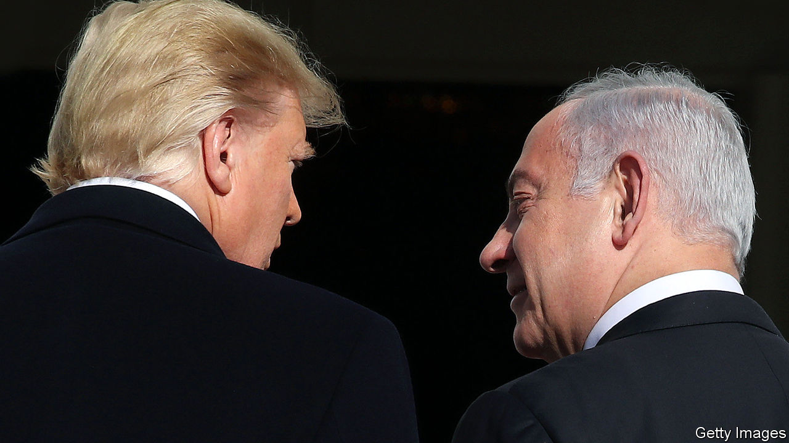
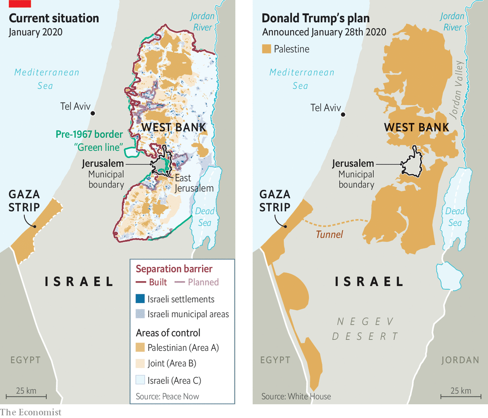

## Steal of the century

# Donald Trump gives Israel the green light to annex occupied lands

> His proposal may not bring peace, but could still have a lasting effect on the conflict

> Jan 30th 2020BEIRUT AND JERUSALEM

FOR MONTHS they said the timing was simply wrong. Members of the Trump administration, led by the president’s son-in-law, Jared Kushner, worked for two years on a plan to solve the decades-old conflict between Israel and the Palestinians, finishing last year. Then they waited for an opportune moment to release it.

On January 28th that moment arrived. Never mind that Israel was headed for its third election in less than a year, with a prime minister, Binyamin Netanyahu, facing trial for bribery, fraud and breach of trust. Or that, while Donald Trump unveiled the plan at the White House, senators at the other end of Pennsylvania Avenue listened to arguments in his impeachment trial. Or that the Palestinians had not spoken to America in two years.

The plan Mr Trump’s administration presented was unexpectedly detailed, with more than 50 pages of proposals and maps. But as a blueprint for a two-state solution it was dead on arrival. It would not give the Palestinians a sovereign state immediately; that might come only later, after they built a government that satisfied both Israel and America. They would retain only about 75% of the West Bank, divided into three cantons linked by highways; a tunnel would connect it to Gaza, and to two remote plots of land in the western Negev desert swapped in exchange for Israeli settlements, which would remain in place (see map).

Israel would keep control of the Jordan valley and most of Jerusalem. The Palestinian capital would be established in a few grim neighbourhoods, such as Abu Dis and Shuafat, that sit on the other side of a hulking concrete separation barrier. No Palestinian refugees would be allowed to return to Israel, only to Palestine or unnamed Muslim countries that would accept up to 50,000 each. Israel would commit not to build new settlements in the land allocated for a future Palestine for four years; in return, though, it received an implicit American recognition of its claims to the rest of the West Bank. Mr Netanyahu declared that Mr Trump was “puncturing this big lie” that Jewish settlements in the West Bank were illegal. His cabinet may begin voting in early February to annex some of the American-allocated land.

The Palestinians rejected the proposal outright. It will end up “in the dustbin of history”, says the president, Mahmoud Abbas. His reaction should be no surprise. There is much to criticise about the decrepit Mr Abbas, now in the 16th year of what was meant to be a four-year term. But no Palestinian leader could accept a deal that in effect cedes Jerusalem and relegates his people to further statelessness. Far from a good-faith effort to solve the conflict, Mr Trump’s plan was a sop to hawkish ideologues in Jerusalem and Washington.

Perhaps it was never meant to be more. On March 2nd Israelis will go to the polls again. The previous two elections, in April and September, left Mr Netanyahu without a majority for his coalition of right-wing and religious parties. By presenting the plan now, so close to the vote, Mr Netanyahu’s American backers hope it will dominate the campaign and energise his Likud base. He seems to need the help: polls so far show a slow but continuing erosion of his support. Hours before the plan was unveiled, Israel’s attorney-general filed formal charges against the prime minister in a Jerusalem court.

Over the next five weeks Mr Netanyahu will use the plan as his main platform (and a welcome distraction from his legal trouble). His allies are pushing for a swift vote on annexing parts of the West Bank. “What is postponed until after the election will never happen,” says the defence minister, Naftali Bennett. But legal concerns may slow the process: the cabinet plans to ask the attorney-general if an interim government can approve such a drastic step. (Mr Kushner hopes Israel waits until after the election.) The cabinet cannot vote on implementing the full Trump plan, because that calls for relinquishing territory, which under Israeli law requires a referendum.

Regardless of the delays, mere talk of annexation could benefit Mr Netanyahu politically. His main challenger, Benny Gantz, ran on a vaguely centrist platform in the past two elections, absorbing parts of Israel’s “peace camp”. That won him a plurality of seats in September, but he too failed to form a coalition. In recent weeks he has moved sharply to the right, hoping to attract disgruntled Likud voters. Mr Gantz says he too would implement the Trump plan. Some members of his Blue and White party are more cautious. If they balk at annexation, Mr Netanyahu will paint them as weak and unpatriotic, liable to miss a “historic opportunity” that he likens to David Ben-Gurion’s decision in 1948 to declare Israel’s independence.

The Palestinians see all this not as an opportunity but a disappointment, one both historic and predictable. For a time they were guardedly optimistic about Mr Trump. Despite his pro-Israel campaign rhetoric, some Palestinian officials hoped an unconventional president might take an unconventional approach to diplomacy. His special envoy at the time, Jason Greenblatt, held a well-received listening tour of the West Bank in 2017, meeting Palestinian leaders and ordinary citizens.

But the relationship suffered a lasting rupture in December 2017, when Mr Trump broke decades of precedent and announced that he was moving America’s embassy from Tel Aviv to Jerusalem. The Palestinians claim part of Jerusalem as their future capital; most countries keep their embassies in Tel Aviv, arguing that to do otherwise would prejudge the status of the city. The following year Mr Trump closed the Palestinian diplomatic mission in Washington. He has also cut all American aid to the Palestinians. Relations have not been this bad since 1987, when America labelled the Palestine Liberation Organisation a terrorist group.

Mr Kushner and his aides did not seem to mind; they came to view the Palestinians more as a nuisance than a negotiating partner. Their plan would impose immediate costs on the Palestinians, with the benefits (such as a proposed $28bn in aid, none of which has yet been pledged) coming years, perhaps decades, in the future.

Instead they proposed an “outside-in” approach: encourage other Arab states to embrace the plan, then hope they would press the Palestinian leadership to accept it. This was always a far-fetched idea. Jordan has rejected the plan. The Gulf states, which have worked hard to court Mr Trump, will not want to anger him by publicly criticising it. Ambassadors from Bahrain, Oman and the United Arab Emirates attended its release (Saudi Arabia was notably absent). But they are unlikely to do much to promote a proposal that the Palestinians have so firmly rejected.

On the eve of his inauguration, Mr Trump expressed almost preternatural confidence in his son-in-law, a property developer with no diplomatic experience. “If you can’t produce peace in the Middle East, nobody can,” he told Mr Kushner. Perhaps no one can. Mr Kushner is unlikely to bring peace, but his plan may still bring lasting change. If Israel annexes large parts of the West Bank, it will be all but impossible for the Palestinians to establish a viable state. The two-state solution, on which decades of American peacemaking had been built, has long been a fading dream; it would finally be buried. Mr Trump may yet go down in history, not for making a deal, but for making one impossible. ■