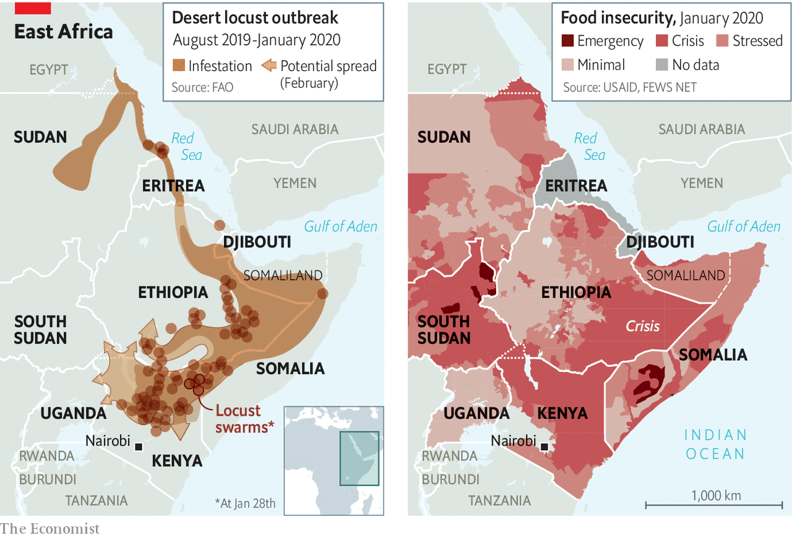

## Severe swarms

# East Africa is reeling from an invasion of locusts

> Prescient warnings failed to prevent the crisis

> Jan 30th 2020

“LET MY PEOPLE go, so that they may worship me. If you refuse to let them go, I will bring locusts into your country tomorrow.” So said God, rather vengefully, according to Moses and Aaron. But although the locust infestation wreaking havoc on east Africa is of biblical proportions, it is not a portent of end times, said experts at a press conference in Nairobi this month. Still, the finger-length bugs spell big trouble for the countries most affected.

It is the worst locust invasion in decades for Kenya, Ethiopia and Somalia. One enormous swarm, recently over north-eastern Kenya, contains nearly 200bn of the creatures and occupies a space in the sky three times the size of New York City. There are dozens of swarms in Kenya alone. And the UN’s Food and Agriculture Organisation (FAO) warns that the number of locusts could increase 500-fold by June, when it is hoped that drier weather will check their spread.

The insects eat a lot. A swarm the size of Paris consumes the same amount of food in one day as half the population of France. Crops such as millet, sorghum and maize are a big part of their diet, making life even harder for the 12m or so people in Ethiopia, Kenya and Somalia who are already hungry (see map). Northern Uganda and South Sudan are also at risk; swarms are just 200km away and moving fast.

Tempting as it may be to blame God, there are more obvious culprits. The swarms were first noticed a year and a half ago in the Arabian peninsula. Last July the FAO warned that they “could migrate from Yemen in the autumn to the Horn of Africa and reach Kenya by the end of the year, unless urgent preventive and control measures are established in the region.” They weren’t. The organisation appealed to rich countries for funds to contain the bugs. But little cash arrived.

Soon the locusts had reached Ethiopia, where some farmers lost their entire crop. In September the government there asked the FAO for help in raising $2m to control the pests. By November they were asking for $6m. Again, little arrived. As the swarms reached Kenya this month, the UN appealed for $70m to pay for, among other things, the aerial spraying of insecticide in east Africa. The cost of containment may yet prove higher.

Killing the bugs early is vital. Locusts live for just three to five months, but they multiply quickly. In favourable conditions each generation will be about 20 times larger than the last. Tracking them gets tougher, too. Swarms can travel 150km in a day. But they can be managed with surveillance and spraying, particularly if they are doused when still young and hopping, and before the population booms. At that stage spraying from cars or on foot can be reasonably effective.

Early action is also cost-effective. The last big locust crisis, in north-west Africa, lasted from 2003 to 2005 and caused an estimated $2.5bn worth of damage to harvests. Getting it under control cost almost $600m, with donors footing much of the bill. That is enough to cover preventive measures in the same region for 170 years, say experts.

But prevention does not attract much funding. “This is a Catch-22,” says Keith Cressman, the Senior Locust Forecasting Officer at the FAO. “Donors are interested in funding big emergencies, big problems.” And governments, unlike locusts, move slowly. In rich countries insurers often press governments to take preventive actions. In Africa few farms are insured, so there is less pressure. Once the swarms take flight, affected countries often lack the capacity and expertise to control them.

Preventive measures have also been hindered by conflict in Yemen and Somalia, where gaining access to some areas for spraying was deemed too dangerous. Meanwhile, extreme weather has given the locusts six legs up. Last year there were eight cyclones over the northern Indian Ocean, the most since 1976. These brought heavy rains to parts of the Arabian Peninsula and Horn of Africa. The resulting vegetation gave the insects plenty to munch on.

As the planet warms, climate models suggest that the weather in the Horn of Africa will become less predictable, making it harder to anticipate locust infestations. That seems all the more reason to invest in tracking and control measures, and to make sure that action is taken quickly. Several international organisations are building systems that trigger the release of aid from an existing pot when forecasts of drought, another bane of east Africa, grow dire. The same could be done to stop locusts before they get off the ground. ■

## URL

https://www.economist.com/middle-east-and-africa/2020/01/30/east-africa-is-reeling-from-an-invasion-of-locusts
