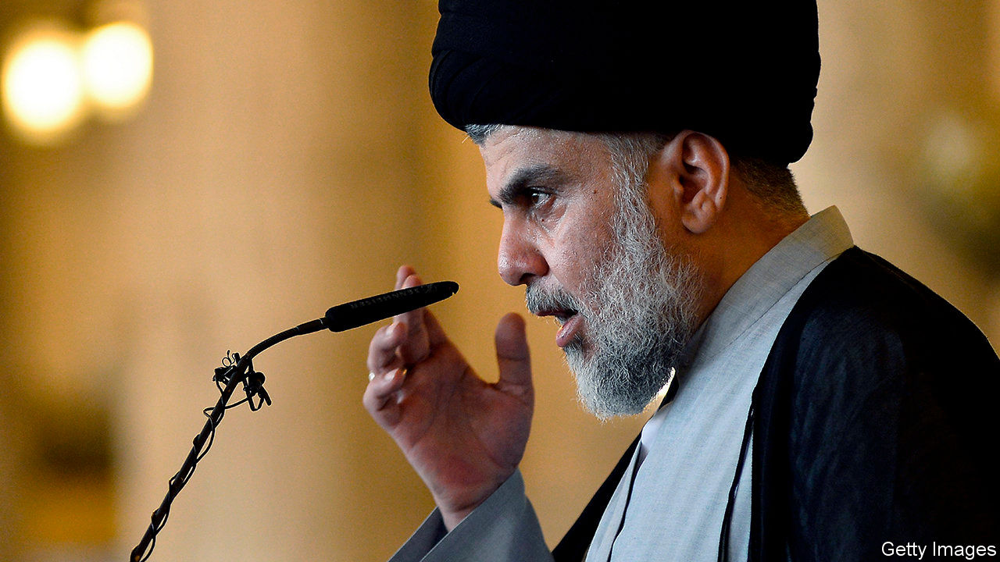

## Sadder and Sadr

# Muqtada al-Sadr, Iraq’s most volatile cleric, stakes his claim to power

> But plenty of obstacles lie in his path

> Jan 30th 2020

THE HENCHMEN of Muqtada al-Sadr, Iraq’s most capricious—and perhaps most powerful—cleric, not only participated in the anti-government protests that have rocked Baghdad and other cities for months, they defended them. Others who joined the demonstrations stood a good chance of being frisked by Mr Sadr’s men, who looked out for troublemakers. Together with the mainly Shia crowds they demanded a new political system, one not dominated by a small elite, and a fairer distribution of the country’s oil wealth.

But on January 25th Mr Sadr ordered his followers to withdraw, blaming the hostile behaviour of the protesters towards his men. A crackdown on the protesters who remained appeared imminent. Over 600 people have been killed since the unrest began in October. As expected, the police cleared the streets in some cities. The protesters, though, have not gone home. There are more now.

With Mr Sadr throwing his weight behind the establishment, Iraq’s battle lines are clearly defined. The politicians and clerics who champion Shia political Islam, and who are backed by Iran, face protesters calling for a secular, non-sectarian government free of Iranian influence. The result is stalemate and stagnation. Adel Abdul-Mahdi, the prime minister, resigned last year, but he carries on as a caretaker (unconstitutionally, say some). The ruling parties have mulled many possible successors. Each name elicits guffaws from the crowds in the street.

Mr Sadr hopes to fill the post with a loyalist. Ever since America toppled the dictatorship of Saddam Hussein in 2003, the cleric has sought power. He styles himself a local hero who endured American sanctions and Saddam, while other elites lived the high life abroad. That has given him clout on the street, which he occasionally cashes in for a seat at the table. In 2016 he led a large rabble that occupied parliament. Last year the political bloc that he leads, called Sairoun, won the most seats in parliamentary elections.

Mr Sadr is also eyeing two other important positions. The commander of the Popular Mobilisation Force (PMF), Abu Mahdi al-Mohandis, was killed in the American drone strike on Qassem Suleimani, Iran’s top commander, on January 3rd. The PMF co-ordinates Iraq’s powerful Shia armed groups; Mr Sadr would like to control it. He has been meeting PMF commanders. Last month he made a show of his strength by recalling his Mahdi Army.

But the post he most covets is head of Iraq’s clergy. Currently Grand Ayatollah Ali al-Sistani, a respected 89-year-old, sits atop the clerical establishment. Mr Sadr, half his age, has had a go at him before. The Mahdi Army seized the holy city of Najaf, the seat of Mr Sistani, in 2004—until America’s army forced it out. Today followers of Mr Sadr predict he could mount a theological challenge. Though just a hujjat al-islam, or junior cleric, he has spent over a decade in the cloisters of Qom, Iran’s clerical capital, improving his scholastic credentials and ties with Iran’s rulers.

Mr Sadr may hope to become Iraq’s version of a supreme leader. But it will be a bumpy ride to the top. Some in his ranks seethe at his betrayal of the protesters. Sheikh Asaad al-Nasari, a close associate, declared he would remain on the street. The protesters, for their part, detect disarray in the governing ranks. They sound emboldened. “Without Suleimani the militias are sheep without a shepherd,” says Faiq al-Sheikh Ali, a liberal parliamentarian who claims to be the protesters’ choice for prime minister. He wants American forces to stay in Iraq to keep Iran out.

Both sides hope to exhaust the other, but they might end up exhausting ordinary Iraqis. Business is grinding to a halt. With oil prices low, the budget deficit is widening. Fears are mounting about the government’s ability to pay salaries. Meanwhile, President Donald Trump threatens to seize Iraq’s foreign assets and impose sanctions if the government persists with its request for American troops to leave. He has allowed Iraq to bypass American sanctions on Iran and buy its gas and electricity. The waiver expires in mid-February. It might not be renewed, particularly if militias continue to lob rockets at America’s embassy in Baghdad, as they did on January 26th. Iraq is desperate for some calm. But continued unrest is more likely. ■