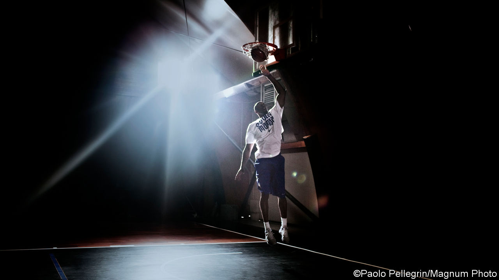

## Love story

# Kobe Bryant died on January 26th

> The five-rings champion basketball player was 41

> Feb 1st 2020

WHENEVER HE WAS asked why his whole life had been spent playing basketball, Kobe Bryant’s narrow eyes searched upwards, and his mouth trembled. The answer was simple, yet so complicated. It began with the orange ball, the smell of it, the feel of the pebbled leather grains and the perfect grooves under his hands; and its bounce, and the way it sounded different on concrete or polished hardwood. Then came the net, the shot slithering right through it with that triumphant springing whoosh, while he howled with joy. Then every movement of the game, the strategies, the dodging and feints, the squeal of sneakers on the court. Whatever had thrilled him as a child (watching his father, also a pro player, on TV, wearing his own little 76ers outfit, running and jumping along with him) still thrilled him when in 2016 he retired from the game. “Dear Basketball”, he wrote,

“My all” meant training obsessively, like a maniac. He would go to the gym and shoot for hours, all day, all night. Hundreds of times, not just taking shots, but making them, running steps and patterns, practising shots off the rebound. I ran up and down every court/After every loose ball for you. He would ponder what would make his game unstoppable and then work backwards from there, building it piece by piece, move by move, repeatedly. Then, when the actual game arrived, it was all just muscle-memory. He perfected his own works of art: the jab-step-and-pause, using unexpected footwork to pass the defender, and the fadeaway, shooting while he jumped high and backwards from the basket.

For 20 seasons, a very long time to stay with one team, he played as a shooting guard for the Los Angeles Lakers. With them he won five NBA championship rings and was most valuable player in two finals. His 81 points at home against Toronto, in 2006, was the second-highest individual score recorded in league history. By the time he retired he had the third-highest points total, 33,643, overtaken only days ago by the game’s present leading star, LeBron James. His own stardom brought him in a salary of around $30m a year, allowing him to dress in Gucci and to keep house in a gated community in Newport Beach, California. It also brought sponsorship deals, such as the one with Nike, whom he asked to design shoes with heels and midsoles that could shave precious hundredths of seconds off his reaction time. For he didn’t care so much about money, points, or the fans’ applause; they could turn against him anyway, as they did after he was accused in 2003 of sexually assaulting a woman in Colorado, a case dropped but never cleared up. He cared about being the best, winning games. Simple and plain.

His obsession could make him by turns hustling, mean and dejected. When he joined the Lakers, his dream team, in 1996, traded from the Charlotte Hornets, he was only 17, the youngest player in the NBA. He had been picked for the pro leagues straight from his suburban high school and had lived as a boy in Italy, two things that made him odd. But he came in burning with self-belief. No babying for him; he was hard, focused, a lone artist, and much of that stayed. He called himself the Black Mamba later, an assassin-snake, ruthless in the strike. Unjust foul calls and lost play-off games—especially the finals against the Detroit Pistons and the Boston Celtics—threw him into misery and vows of revenge.

On the court, lithe and nimble, he wanted every game for himself. Team-mates thought him selfish, not passing enough and shooting far too much, missing more shots in his career than anyone in NBA history. He hit back at that, since at least he stayed with one team and didn’t go off somewhere else; he wanted the glory of winning the play-offs for the purple-and-golds, not just himself. Yet he so loved the ball that it just seemed drawn towards his hands. And he went on shooting, and shooting, not least because he sometimes saved a game with a fabulous floater in the final seconds. Besides, airballs too could look and feel good, good from trajectory to follow-through, on-line, on target. Some people thought Mozart had too many notes.

As in most love affairs, he had competition. One was Michael Jordan, the greatest basketball player of the era, the Buddha on top of the mountain and winner of six rings, whom he once asked for advice while he was guarding him. Another was Shaquille O’Neal, a charming giant who also played for the Lakers, but infuriated him because he little-brothered him and did not train like he did. (No one trained like he did.) To prove he was the best of basketball’slovers, he would go on playing when he was hurt, shooting left-handed when his right hand was injured, staggering on when ankles, knees and back were all sore. If he decided he was playing, no manager or coach could do anything about it. I played through the sweat and hurt/…because YOU called me. 

He claimed to have no memory of the last game he played, though he scored 60 points in it from 50 shots. For a while his interests had been branching into multimedia, writing, film-making and setting up a Mamba Sports Academy in Thousand Oaks. But most of these still had basketball at the core. His longest film, “Muse”, was about his career, and an animated short based on “Dear Basketball” won an Academy Award. He gave motivating talks in America and Asia in which all his life-lessons were carried over from the court. At Thousand Oaks he coached his second daughter Gianna, among many others, in how to play his way.

With a lover’s impatience, he increasingly took helicopters to get to and from games, events, his office and the academy, in which case he might take Gianna with him. Carpe diem, seize the day, was his motto, learned at school in Italy; tempus neminem manet, time waits for no man. Bad weather would hardly deter him. ■

## URL

https://www.economist.com/obituary/2020/02/01/kobe-bryant-died-on-january-26th
