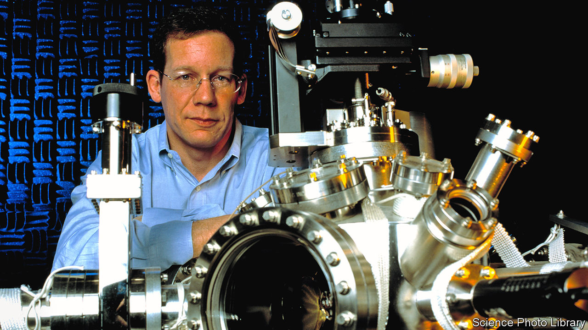

## The arrest of Charles Lieber

# An American chemist is suspected of illegal dealings with China

> He denies the allegations, but is under arrest

> Feb 1st 2020NEW YORK

IN 2013 CHARLES LIEBER, a pioneer of nanoscience who is now the chairman of Harvard University’s chemistry department, visited the Wuhan University of Technology (WUT), in China, to celebrate the founding of a lab he was credited by that university with helping to establish and oversee: the WUT-Harvard Joint Nano Key Laboratory. It was a remarkable coup. WUT is an institution of little renown. Harvard is generally regarded as the top of the academic tree. And Dr Lieber, whose research has been seen by some as a forerunner of Elon Musk’s ambitious scheme to supercharge the human brain with nanotechnology, has been seen as a potential Nobel laureate.

Harvard’s officials had not, however, approved the laboratory and did not know about it until early 2015, according to the US Department of Justice. Nor did they know that while conducting his research with grants from the Department of Defence and the National Institutes of Health (NIH), Dr Lieber was, according to federal authorities, also being paid up to $50,000 a month by WUT, plus at least $150,000 in “living expenses”, as a prized recruit in China’s Thousand Talents programme to bring foreign scientists, and return Chinese expatriates, to that country’s research laboratories.

On January 28th agents of the Federal Bureau of Investigation (FBI) arrested Dr Lieber on a charge of lying to federal authorities after his having denied his alleged participation in the Thousand Talents programme. He was jailed pending a court hearing on January 30th. Harvard placed him on administrative leave and said it was co-operating with the authorities while conducting its own review. (Dr Lieber’s lawyer did not respond to a request for comment.) The Justice Department also announced charges against two Chinese nationals who had been in Boston ostensibly as researchers. One, a lieutenant in the People’s Liberation Army (PLA) who is now in China, allegedly worked on behalf of PLA officials and has been charged with visa fraud, conspiracy and making false statements to federal investigators. The other, who is under arrest, allegedly tried in December to smuggle to China 21 vials of material stolen from a teaching hospital.

By putting one of Harvard’s superstars in handcuffs, federal authorities seek to shock America’s research institutions into greater vigilance about collaborations with Chinese counterparts. At the least the arrest is expected to have a chilling effect on research partnerships between America and China after a decade in which they have flourished. Certainly, the Trump administration would not view that as a bad thing. The Justice Department has said that more than 90% of prosecutions for economic espionage since 2011 have involved a link to China. Christopher Wray, the FBI’s director, has lamented to Congress the “naïveté” of American academia, and has cited China’s “so-called talent plans” as a vehicle for the theft of research.

One concern of federal authorities, including investigators at the NIH, has been the establishment of “shadow labs” in China run by Thousand Talents recruits in parallel with their American-funded research. Those authorities may consider the WUT-Harvard Joint Nano Key Laboratory to be such a shadow lab. In an affidavit supporting the criminal complaint against Dr Lieber, the FBI, quoting emails between him and a professor at WUT, says that in 2012 he entered into a Thousand Talents agreement that promised, in addition to his personal compensation, 11m yuan ($1.74m) from WUT and the Chinese government for development of the joint laboratory, including the recruitment of talent.

The contract called for Dr Lieber to publish “high-level articles” in renowned journals and to host international conferences “in the name of Wuhan University of Technology”, and to guide young scholars and doctoral students, helping them publish in respected international journals. In January 2013, the affidavit says, he signed a five-year contract formalising Harvard’s co-operation in the joint lab, and obliging Harvard to host researchers from WUT for two months a year.

According to the FBI, officials from Harvard said Dr Lieber did not have the authority to sign such a contract. Those officials also said they eventually became aware of the joint laboratory, and that Dr Lieber was its director, in about early 2015. When confronted, Dr Lieber told Harvard officials that WUT “was using Harvard’s name and logo without his knowledge and consent”, the affidavit says.

In 2018, the affidavit says, Dr Lieber told investigators from the defence department that he was never asked to participate in the Thousand Talents programme, but that he “wasn’t sure” how China might describe him. The FBI also says he caused Harvard to report falsely to the NIH that he was not a participant in the recruitment programme (the NIH requires disclosure of such foreign payments to grant applicants). Meanwhile, the email traffic quoted in the FBI affidavit describes the payments to Dr Lieber going into a Chinese bank account set up on his behalf and, on occasions he visited Wuhan, given to him in cash.

In return for its association with Dr Lieber, Wuhan University of Technology may have burnished its reputation in nanoscience, and developed some young scholars in the field. The lab itself was meant to focus on “nanowire-based lithium ion batteries” for electric cars, per the contract Dr Lieber allegedly signed. In recent years Dr Lieber’s research has focused on “neural lace” technology, the still-nascent field that Mr Musk is looking to develop. Mr Musk’s own paper on the topic cites Dr Lieber as well as Chinese researchers who worked in his lab at Harvard.

It is not clear how much special insight Chinese researchers gained that they would not otherwise have had. Leading scientists routinely note that in such high-level research international collaboration is increasingly common, and can happen organically. Most research is published openly for all to see. It is not certain that Chinese largesse was required to pry open the wonders of a top laboratory at the world’s most prestigious university. But the Trump administration says that was precisely the goal of the Thousand Talents programme, and that university administrators and scientists have been asleep to the threat such recruitment programmes pose. If so, no longer.■

Correction (February 6th): A previous version suggested that Dr Lieber was directly connected with Elon Musk’s brain-machine interface project. In fact Neuralink, Mr Musk’s firm, is separate from Dr Lieber’s endeavours.

## URL

https://www.economist.com/science-and-technology/2020/02/01/an-american-chemist-is-suspected-of-illegal-dealings-with-china
