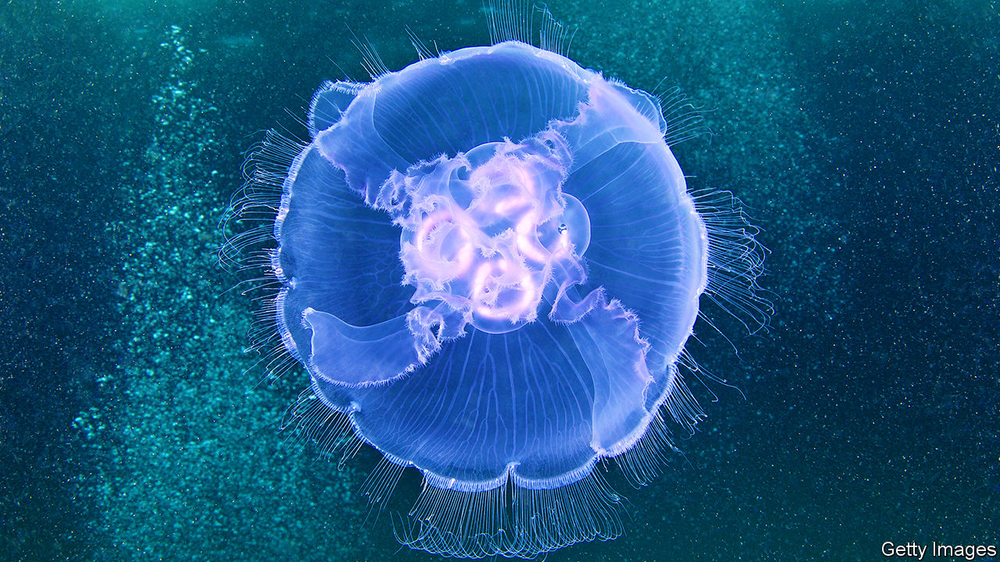

## Marine science

# Half machine, half jellyfish. The latest thing in ocean exploration

> Cyborg Cnidaria

> Jan 30th 2020

CYBORGS, PART-MECHANICAL human beings such as the Cybermen in “Doctor Who”, are a long-established feature of science fiction. But the word itself is short for “cybernetic organism”, a definition not self-evidently limited to the mechanisation of humans. Extend it to part-mechanical animals and cyborgs already exist. They have been created in the form of insects that have had chips implanted in them to bring them under the whim of human controllers, who are thus able to direct the ways that their charges either scuttle or fly.

This week sees the idea extended still further. Nicole Xu and John Dabiri, a pair of researchers at Stanford University, in California, have announced in Science Advances the creation of the first cyborg jellyfish. That might sound a joke. But it opens the possibility of using jellyfish as cheap propulsion systems for underwater probes.

Dr Xu and Dr Dabiri picked, as the chassis for their cyborg, a common species called Aurelia aurita (pictured). Like all other members of the phylum Cnidaria, Aurelia lacks a brain. Its body being radially symmetrical, its nervous system is too. In particular, the opening and closing of its bell, which propels it through the water, can be triggered by any one of eight neural pacemakers distributed around the bell’s periphery.

After an extensive study of Aurelia’s electrophysiology, Dr Xu and Dr Dabiri were able to design an artificial pacemaker that hijacked this mechanism. It has a lithium polymer battery and a small processor chip to control the pattern of the electric current generated. The whole thing weighs about ten grams—a tenth of the weight of an adult Aurelia.

Using their artificial pacemaker, Dr Xu and Dr Dabiri were able to turbocharge a jellyfish’s progress through the water. They could speed it up to almost three times its normal velocity and, surprisingly, this required only twice as much energy as normal movement.

High-speed jellyfish are unlikely, of themselves, to be much use. But if a more sophisticated prosthesis can steer the animal as well as controlling its speed, then the technology of cyborg Cnidaria will be in business. Researchers elsewhere are trying to develop swimming robots for ocean exploration. Prototypes of these, however, require between 10 and 1,000 times as much energy as the device developed by Dr Xu and Dr Dabiri because a robot’s battery must provide propulsive power as well as running the control system. A cyborg gets its energy for propulsion by feeding.

A steerable cyborg jellyfish, fitted with instruments as well as a control pack, would therefore be a boon for marine scientists. Jellyfish go everywhere. Pick the right species and you could dive to the deepest parts of the ocean. Then, once the cyborg’s mission was accomplished, it could be steered back to the surface and its instruments—and the data they contain—recovered.