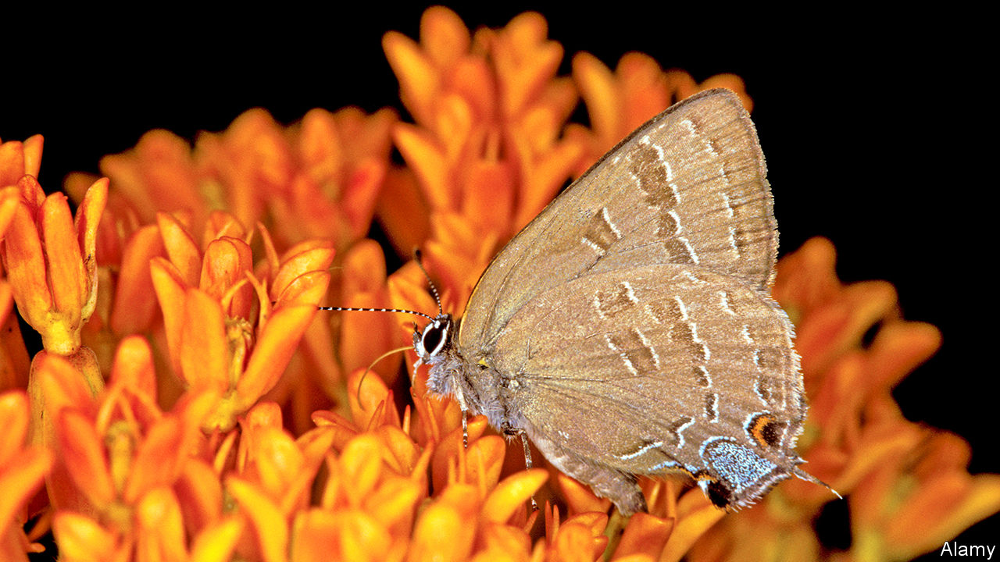

## Entomology

# There is more to a butterfly’s wing than meets the eye

> Far from being dead tissue, wings are sophisticated living organs

> Feb 1st 2020

A BUTTERFLY’S WINGS can have many jobs besides keeping the insect aloft. They may be called on to attract mates, to warn potential predators to stay away, to mimic other animals or even to provide camouflage. All of these roles, though, depend on their colouration—which is unchanging. This plays into the idea that butterfly wings are dead tissue, like a bird’s feathers or a mammal’s hair. In fact, that is not true. For example, in some species males’ wings harbour special cells that release pheromones which attract females.

Nanfang Yu, a physicist at Columbia University, in New York, has been looking into the matter. One of his interests is the optical properties of biological materials. That has led him to study butterfly wings in more detail. And, in collaboration with Naomi Pierce, a butterfly specialist at Harvard University, he has now shown, in a paper published this week in Nature Communications, that butterfly wings are, indeed, very much alive.

Initially, Dr Yu and Dr Pierce wanted to know how the insects keep their body temperatures up without their wings overheating. Unlike birds and mammals, butterflies do not generate enough internal heat to run their metabolisms at full pelt. Instead, they rely on outside heat sources—usually the sun—to bring their bodies up to speed. But their wings, being thin protein membranes, have a limited thermal capacity. Those wings can therefore overheat quickly if the insects bask too long in sunlight, or, conversely, can cool down too rapidly if they are flying through cold air.

In their experiments, the two researchers used a laser to heat up spots on the wings of dozens of butterfly species, including the painted lady and the hickory hairstreak (pictured). When the temperature of the area under the laser reached 40°C or so, the insects responded within seconds by doing things that stopped their wings heating up further. These actions included a butterfly turning around to minimise its profile to the laser, flapping its wings or simply walking away.

Butterflies engaged in all of these heat-minimising activities even when the researchers blindfolded them. That suggested the relevant sensors were on the wings themselves. Dr Yu and Dr Pierce therefore searched those wings for likely looking sensory cells. They found some, in the form of neurons that resembled heat detectors known from other insects. They also uncovered disc-shaped cells that appeared, again by resemblance, to be pressure-sensitive neurons. They speculate that these are there to detect deformation of the wing—information an insect could use to control its flight pattern.

The third discovery Dr Yu and Dr Pierce made to contradict the “dead wing” hypothesis was that some butterfly wings have a heartbeat. Anyone who has looked closely at a butterfly will know that its wings have veins. These carry a bloodlike fluid called haemolymph. For a long time, entomologists thought the only role of the veins was, by being pumped full of haemolymph, to inflate the wings to full stretch after a butterfly emerged from its chrysalis. More recently, it was discovered that haemolymph continues to flow through the veins throughout the insect’s life. Dr Yu and Dr Pierce have now found that in male hairstreaks the haemolymph shows a pulse of several dozen beats per minute. The source of this pulse appears to be the scent pad, a dark spot on the wings that produces the female-attracting pheromones. Apparently, this “wing heart” acts as a pump that helps propel haemolymph through the scent pad.

In all their experiments simulating different environmental conditions, Dr Yu and Dr Pierce consistently found that, regardless of pigmentation, the living areas of a butterfly’s wings—which cluster around the veins and are presumably nurtured by them—were always cooler, by up to 10-15°C, than the lifeless membranes between the veins. The cause, they discovered, was that different parts of the wing are covered by different sorts of scales. In particular, scales over the scent pads are penetrated by tubes. This improves their ability to radiate heat away and helps keep the living parts of a butterfly’s wing alive.■

Listen on: Apple Podcasts | [Spotify](https://www.economist.com/https://open.spotify.com/show/0BCUrdrOb3tvfIwazeLBUH) | [Google](https://www.economist.com/https://www.google.com/podcasts?feed=aHR0cHM6Ly9yc3MuYWNhc3QuY29tL3RoZWVjb25vbWlzdGJhYmJhZ2U) | [Stitcher](https://www.economist.com/http://www.stitcher.com/s?fid=142124&refid=stpr) | [TuneIn](https://www.economist.com/https://tunein.com/podcasts/News--Politics-Podcasts/The-Economist-Babbage-p401958/)

## URL

https://www.economist.com/science-and-technology/2020/02/01/there-is-more-to-a-butterflys-wing-than-meets-the-eye
