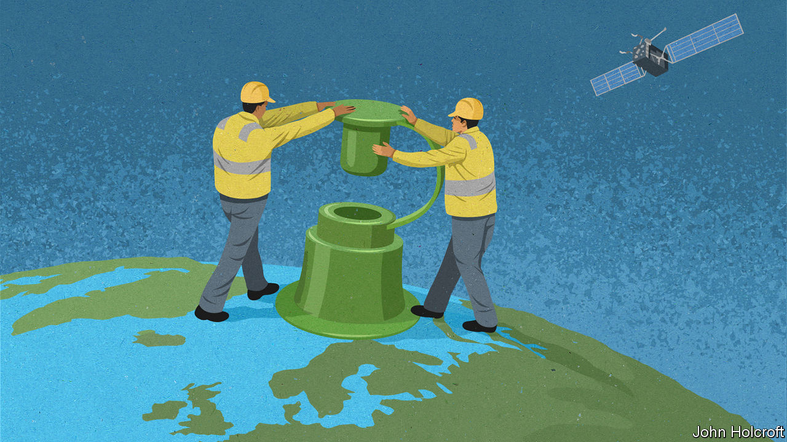

## The methane hunters

# Using satellites to spot industry’s methane leaks

> To help combat climate change

> Feb 1st 2020

WHEN SCANNING for emissions from a mud volcano in western Turkmenistan in January 2019, a satellite called Claire came across a large plume of methane drifting across the landscape. The discharge appeared to originate from a gas pipeline at the nearby Korpezhe oil and gasfield. Two more large plumes were also spotted in the area, including one from a compressor station. The company operating the satellite, GHGSat, based in Montreal, passed details via diplomats to officials in Turkmenistan, and after a few months the leaks stopped. This largely unknown incident illustrates two things: that satellites can play an important role in spotting leaks of greenhouse gases and, rather worryingly, that the extent of such leaks is often greatly underestimated.

The reason for concern is that although methane, the main constituent of natural gas, does not linger in the atmosphere for anywhere near as long as carbon dioxide does, it is a far more potent heat-trapping agent. About a quarter of man-made global warming is thought to be caused by methane. And between a fifth and a third of the methane involved is contributed by the oil and gas industry.

The data from Claire suggested the leak in Turkmenistan had been a big one. To establish just how big, Daniel Jacob of Harvard University and his colleagues studied the images obtained by this satellite along with observations made of the area at the time by the Tropospheric Monitoring Instrument (TROPOMI), which is carried by an atmospheric research satellite operated by the European Space Agency. The results, published in Geophysical Research Letters in November 2019, concluded that between February 2018 and January 2019 the three leaks would have released, between them, 142,000 tonnes of methane. This made the Turkmenistani leak far bigger than the 97,000 tonnes of methane discharged over four months by a notorious blowout at a natural-gas storage facility in Aliso Canyon, California, in 2015, which is reckoned to have been the worst natural-gas leak yet recorded in America.

There have been other big leaks, too. Last year a group of researchers led by Ilse Aben of the Netherlands Institute for Space Research studied TROPOMI images of a blowout at a natural-gas well in Belmont county, Ohio. This began on February 15th 2018 and took three weeks to control. In a paper published in the Proceedings of the National Academy of Sciences in December 2019, Dr Aben and her colleagues calculated from the images that the blowout was responsible for the equivalent of a quarter of the annual oil and gas industry’s methane emissions in the entire state of Ohio.

Methane can be detected spectroscopically. Like other gases, it absorbs light at characteristic frequencies. With a spectrometer mounted on a satellite it is possible to analyse light reflected from Earth for signs of the gas. As with the satellites that carry them, spectrometers come in many shapes and sizes. TROPOMI can also detect the spectral signs of other polluting gases, such as nitrogen dioxide, sulphur dioxide and carbon monoxide. It rides in a large bird, the Copernicus Sentinel-5P satellite, launched in October 2017, and in all weighing 980kg. The detector has an extensive view, looking at a strip of Earth 2,600km wide with a resolution that means a single pixel in the image represents an area 7km by 3.5km.

Observing things more closely is the speciality of Claire. This 15kg “nanosat”, about the size of a microwave oven, was launched in June 2016 to measure carbon dioxide and methane emissions. With a field of view 12km wide and a resolution better than 50 metres by 50 metres, Claire can spot leaks from individual industrial plants. GHGSat aims to launch two more methane-hunting nanosats later this year.

Claire surveys industrial facilities on behalf of firms that want to monitor their emissions. GHGSat’s chief executive, Stephane Germain, says employing satellites to do this is more reliable than using terrestrial methods. In November he plans to roll out a new service. This will provide a digital image of Earth which users will be able to zoom in on to explore continually updated patterns and hotspots of methane emissions. The map will have an average resolution of 2km by 2km and be free to use—although if companies want to look at things more closely they will need to pay.

Other methane-hunting satellites are coming. These include one due for launch in 2022 by MethaneSAT, an affiliate of the Environmental Defence Fund, an American non-profit organisation. The 350kg satellite will cost $88m to build and put into orbit. It will scan an area of land 200km wide with a resolution of 1km by 1km. According to MethaneSAT, it will be the most sensitive to emission levels yet, being able to detect methane concentrations as low as two parts-per-billion. Data collected by the satellite will be publicly available.

Having a number of complementary eyes-in-the sky will be an important way to help reduce methane emissions. Although Donald Trump has proposed rolling back Obama-era requirements for oil and gas companies to detect and fix methane leaks, the gas has commercial value so it does not make business sense to waste it. On top of that, for firms seeking to burnish their green credentials, plugging leaks is one of the most effective things they can do to help combat climate change.■

Listen on: Apple Podcasts | [Spotify](https://www.economist.com/https://open.spotify.com/show/0BCUrdrOb3tvfIwazeLBUH) | [Google](https://www.economist.com/https://www.google.com/podcasts?feed=aHR0cHM6Ly9yc3MuYWNhc3QuY29tL3RoZWVjb25vbWlzdGJhYmJhZ2U) | [Stitcher](https://www.economist.com/http://www.stitcher.com/s?fid=142124&refid=stpr) | [TuneIn](https://www.economist.com/https://tunein.com/podcasts/News--Politics-Podcasts/The-Economist-Babbage-p401958/)

## URL

https://www.economist.com/science-and-technology/2020/02/01/using-satellites-to-spot-industrys-methane-leaks
