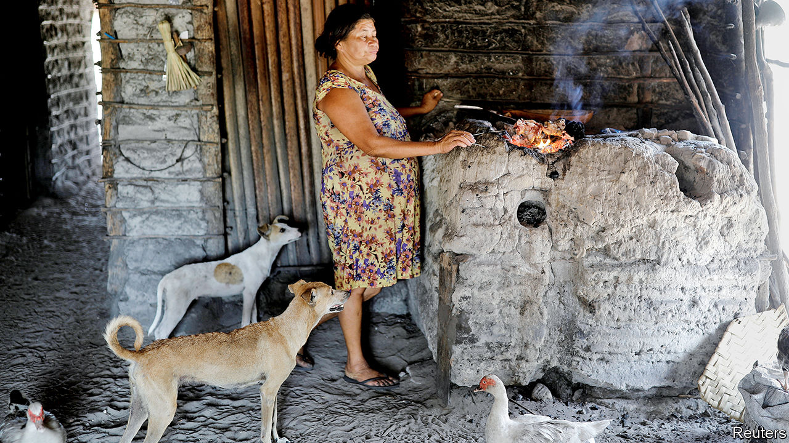
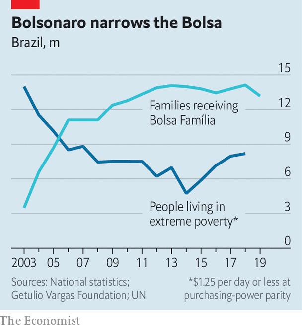

## Left behind

# Bolsa Família, Brazil’s admired anti-poverty programme, is flailing

> Economic recovery is not yet helping the poor

> Jan 30th 2020BELÁGUA, MARANHÃO

LAST YEAR Natália Ribeiro sent her five-year-old daughter to live with relatives because she could not afford to feed her. She had tried to sign up for Bolsa Família (Family Fund), a conditional cash-transfer programme that supports millions of poor Brazilians. That includes 80% of families in Belágua, a town of 7,000 people in Maranhão, the poorest state. Ms Ribeiro should have been a shoo-in. She has no income. Her three children get regular health check-ups and will go to school, she promises. That is a precondition for receiving the monthly benefits, which start at 89 reais ($21). She has been waiting since May. “I want a better life for my little ones,” says the 24-year-old, who has long eyelashes like the baby in her lap and the toddler playing with a piece of wood on the floor. 

In June last year Brazil’s populist government, which had taken office five months before, slowed the acceptance of new beneficiaries and started cancelling payments to existing ones. The number of families admitted to Bolsa Família has dropped from 275,000 a month to fewer than 2,500. The number receiving benefits has fallen by 1m. The government says that 700,000 are on the waiting list, which may be an underestimate.

To critics of Jair Bolsonaro, Brazil’s president, this is evidence of his indifference to poverty. Mr Bolsonaro once called Bolsa Família beneficiaries “ignorant wretches”. As a candidate he tried to reassure them by promising 13 “monthly” payments in 2019 (copying the Brazilian tradition whereby formal workers get an extra month’s pay at Christmas). His government did not budget for that extra payment, however, so it has had to cut the number of beneficiaries.

The economy minister, Paulo Guedes, vows to fight poverty in a different way from earlier, left-wing administrations. While trimming Bolsa Família, the government is making much bigger cuts to spending that benefits prosperous Brazilians. Smaller deficits and less debt will encourage economic growth by holding down interest rates. That will create jobs, which are better than handouts, Mr Guedes argues.

But the government’s treatment of its flagship safety-net programme raises doubts. Growth alone is unlikely to banish poverty. Nor will it reduce inequality, which has been stratospheric for over a century. In 2018 the average income of the richest 1% of Brazilians was 33.8 times that of the poorest 50%, a ratio surpassed only in Qatar. The Gini coefficient, another measure of inequality, was 0.53 in 2017, on a scale where zero is perfect equality and 1 means that one person has all the income. Among large democracies, only South Africa does worse.

It does not have to be this way. Brazil has a big state. Taxes are a third of GDP, about the average for a rich country (which Brazil is not) and far above the Latin American average of 23%. The state’s hefty resources could be used to lift up the poor. Public pensions, welfare payments and other transfers are a whopping 23% of Brazil’s GDP, even higher than in most rich countries. But unlike in Europe, where taxes and transfers greatly reduce inequality, in Brazil they are “hardly redistributive”, says Mansueto Almeida, the treasury secretary. According to data compiled by the University of Pernambuco, in 2015 taxes and transfers reduced the average Gini coefficient in OECD countries from 0.47 to 0.31. In Brazil they cut inequality by only half as much.

The reason is that handouts are skewed towards the well-off. More than four-fifths of Brazilian transfers are pension benefits, compared with half in the European Union. Public pensions in Brazil are extremely regressive: just 2.5% of the cash goes to the poorest quintile, while the richest gets more than half. That group also benefits from tax loopholes not available to the poor. Servants of the state, who earn more than private-sector workers with similar qualifications, are especially cosseted. Last year a congressman billed taxpayers 157,000 reais for cosmetic dentistry. Some judges earn more in a month than those in rich countries make in a year.

Bolsa Família, by contrast, goes directly to the poor. Under Luiz Inácio Lula da Silva, a left-wing president from 2003 to 2010, it grew into the world’s largest conditional cash-transfer programme. The benefits are paid mostly to women via a chip card. More than 30m Brazilians escaped poverty between 2003 and 2014, thanks to Bolsa Família, other pro-poor policies and a commodity boom. In Belágua, most people now eat two meals a day instead of one. Houses are made of cinder-block, not banana leaves. “You don’t see kids working in the fields anymore,” says Zé Raimundo Santos, the president of the agricultural co-operative.

Bolsa Família was especially important in rural towns like Belágua, where money had barely circulated, says Maria Ozanira da Silva e Silva of the Federal University of Maranhão. Women could buy food on credit in Belágua’s first shops. Children spent more time in school and less time sick at home. Programmes such as Minha Casa, Minha Vida (My House, My Life) subsidised the construction of 4m houses, including Ms Ribeiro’s. In the election in 2018 all but 295 voters in Belágua voted for the presidential candidate of Lula’s Workers’ Party.

But Belágua remains poor. Though its name means “beautiful water”, the road from São Luís, Maranhão’s capital, is often too muddy in the rainy season and too sandy in the dry season for ordinary cars to pass. The local government is the only employer. Some households split one job paying the minimum wage of 1,039 reais a month four ways. Most families earn a pittance grinding cassava into tapioca flour. The work is gruelling. Mr Santos looks 70 but is 50.

When Brazil’s worst-ever recession began in 2014, progress stopped and in some areas went into reverse. GDP per Brazilian dropped by 10% from 2014 to 2016. The number of unemployed nearly doubled to 14.2m, 13.7% of the workforce, from 2014 to 2017. Although the economy is recovering, 11% of the labour force remains unemployed. At the end of 2018 the number of people living on less than $1.25 a day reached 8.2m, the highest since 2007 (see chart).

Mr Bolsonaro is dismantling what Mr Guedes calls the “machine of perverse income transfers” by reforming pensions. Minimum retirement ages (of 65 for men and 62 for women) and other measures will save the government 855bn reais over ten years. Thanks to low inflation and a fall in interest rates the government will pay 100bn reais, 1.3% of GDP, less to creditors in 2020 than it did last year, says Mr Guedes. The economy grew by 0.6% between the second and third quarters of 2019, and the number of unemployed people fell below 12m for the first time since the second quarter of 2016. Mr Guedes takes this as proof that pro-growth austerity is working.

But the government has let police and army officers keep their lavish pensions. It has not touched tax breaks for privileged industries and the rich, worth 4% of GDP each year. Instead it has picked on Bolsa Família, which in 2020 will cost just 0.4% of GDP. Unlike most government spending (including salaries and the health and education budgets) it is not automatically adjusted for inflation. Since 2014, the average benefit has fallen in real terms.

In Belágua The Economist spoke to half a dozen families that have spent at least six months on the waiting list or have lost benefits. They include a family of nine; a 20-year-old mother and her underweight newborn; and three adolescents who dropped out of school because they could not afford uniforms.

In December the government suggested that it would increase Bolsa Família’s budget by 16bn reais and rename the programme “Renda Brasil” (Brazil Income). But the economy ministry balked at the cost. Perhaps the government could spare 4bn reais, it said. Under a new budget rule, any increase in spending has to be matched by a cut somewhere else.

The Bolsa Família squeeze is the most important contributor to the recent increase in inequality, according to a study by economists at Fundação Getulio Vargas, a university in São Paulo. “We pulled away the safety net when it was needed most,” says Marcelo Neri, the study’s lead author.

The government could save 9% of GDP by cutting wasteful spending further, eliminating tax breaks and narrowing the gap between public- and private-sector pay, says Arminio Fraga, a former central bank governor. It could spend that money to reduce the fiscal deficit, boost spending on infrastructure, health, education and Bolsa Família, and cut the tax burden. So there is ample room to make public spending both more progressive and more effective.

But Mr Bolsonaro seems unserious about some things that might help the poor. He dropped plans for a childhood literacy programme and recently named a sceptic of evolution to regulate universities. If the economic recovery doesn’t reach poor Brazilians quickly, they could stage mass protests, as people have in other Latin American countries, warns Flávio Dino, the left-wing governor of Maranhão.

Maria marched only as far as the welfare office in São Luís, which told her in December that her monthly Bolsa Família benefit of 360 reais had been cancelled. A computer failed to register that she and her seven children had moved in June to a new town to escape her violent boyfriend. She has been waiting for months for the government to fix the mistake. “Bolsa Família is the father of my children,” she used to say. The joke does not make her smile now. ■

## URL

https://www.economist.com/the-americas/2020/01/30/bolsa-familia-brazils-admired-anti-poverty-programme-is-flailing
