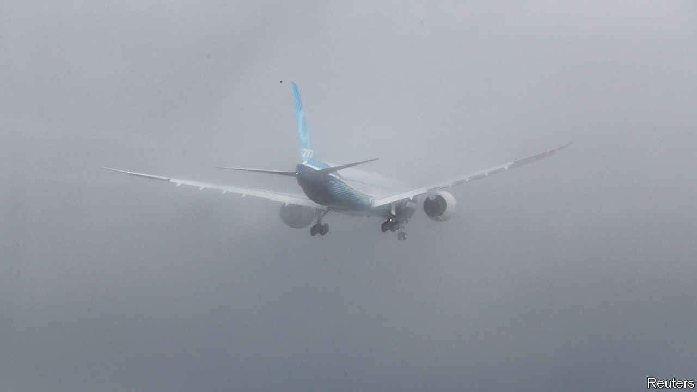
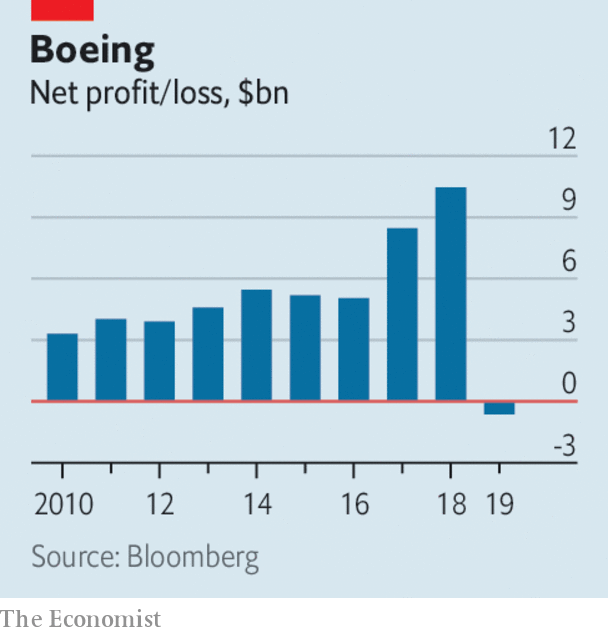

# Business this week

> Feb 1st 2020

The problems mounted at Boeing, as it more than doubled the cost it expects to incur from the grounding of the 737 MAX airliner, to $18.6bn. The aerospace company reported a net loss of $636m for 2019, its first annual loss in 22 years. The amount of debt it holds is ratcheting up. And it is cutting production of the Dreamliner. To cap it all, Boeing took a $410m charge in the fourth quarter because its Starliner unmanned spacecraft failed to dock with the International Space Station on its maiden voyage.

By contrast, Apple reported record quarterly sales and profit figures. Revenue was up by 9% in the last three months of 2019 compared with the same quarter a year earlier, to $91.8bn. That generated a net profit of $22.2bn. Sales of the iPhone rebounded after several quarters of moribund growth; Apple is expected to release its first 5G phones later this year. The company’s share price jumped, pushing its market capitalisation above $1.4trn.

Along with many other companies, Apple warned about the potential impact of the coronavirus on its business. It has mitigation plans to counter the loss of production from its suppliers in Wuhan, the centre of the virus, but is uncertain about its supply from elsewhere in China. Foxconn, which assembles most of Apple’s iPhones in China, saw its share price plunge. See [article](https://www.economist.com//node/21779144).

Jerome Powell, the chairman of the Federal Reserve, said that the spreading coronavirus would probably cause “some disruption” to the global economy, but that it was unclear how far that would extend. The Fed left its benchmark interest rate unchanged at a range of between 1.5% and 1.75%.

The Japanese government sent a strong signal that it remains committed to its programme of quantitative-easing and negative interest rates by nominating Adachi Seiji to the policy board of the Bank of Japan. Mr Adachi is an ardent reflationist, who wants to ease monetary policy even further in order to achieve the central bank’s 2% inflation target. But as in other countries, the financial industry is becoming louder in pointing out the drawbacks to its business of long-term negative rates.

McDonald’s said that like-for-like sales rose by 5.9% last year, the biggest such jump in a decade. The fast-food chain has revamped its menu and outlets, and has benefited from being included on a growing number of food-delivery apps.

Britain decided that it would not ban “high-risk vendors” from parts of its 5G network. Despite the generic language, the decision is mostly about Huawei, which will thus be able to continue supplying equipment despite an intense lobbying effort by American officials to block the Chinese firm on national-security grounds. Half-recognising that concern, Britain will monitor Huawei’s equipment and bar it from parts of the network deemed critical for security or safety. Elsewhere its market share will be limited to 35%. See [article](https://www.economist.com//britain/2020/01/28/britain-takes-a-third-way-on-5g-with-huawei).

Facebook provided details of Mark Zuckerberg’s “vision” to overhaul the oversight of content on the social-media platform. A new independent board will hear appeals from users who have had content taken down, for hate speech say. If Facebook ignores the board’s judgment it will have to explain why. The cost of spending more on privacy and security were in part to blame for a sharp rise in expenses in Facebook’s quarterly report. Revenues grew at the slowest pace since it became a public company in 2012. See [article](https://www.economist.com//node/21779156).

A bullish earnings report from Tesla delighted investors. The electric-car maker made its second consecutive quarterly profit, even if, at $105m, it was 25% lower than in the same quarter a year earlier. It also raised its production guidance and now expects to deliver 500,000 this year. The company’s share price has risen by 130% since October. See [article](https://www.economist.com//business/2020/01/30/tesla-is-proving-itself-as-a-carmaker).

Renault appointed Luca de Meo as its new chief executive, its second since the fall of Carlos Ghosn in November 2018. Until recently Mr de Meo used to run SEAT, a Spanish carmaker owned by Volkswagen. He starts his job at Renault in July.

In Britain it was announced that Northern Rail, is to be nationalised in March, following two years of chaos for passengers under the train company’s current operator. Coming soon after the bail-out of Flybe, this is the new government’s second big intervention in regional transport infrastructure. See [article](https://www.economist.com//britain/2020/02/01/britains-government-renationalises-northern-rail).

The share price of the company that owns Victoria’s Secret surged after it was reported that its chief executive might step down and possibly sell the lingerie retailer. Les Wexner has run L Brands for 57 years and is the longest-serving CEO of any S&P 500 company. Last year he faced embarrassing questions over his link to Jeffrey Epstein, a dead sex-trafficker who managed Mr Wexner’s financial assets.

## URL

https://www.economist.com/the-world-this-week/2020/02/01/business-this-week
