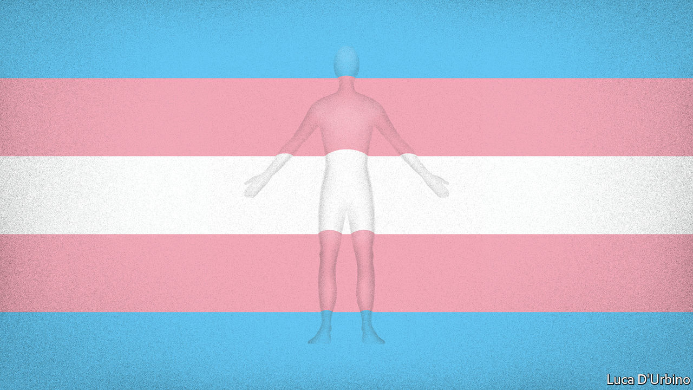

## Gender dysphoria

# A new push to ban medical treatments for transgender children

> State legislators are seeking to make puberty blockers, cross-sex hormones and gender reassignment surgery illegal

> Jan 30th 2020WASHINGTON, DC

JAMES YOUNGER’S mother believed he should wear dresses and grow his hair long because he considered himself a girl. His father claimed the seven-year-old was perfectly content with trousers, short hair and being a boy. Almost every detail of the couple’s vicious custody battle was fought over their child’s gender identity. After his mother won, culture warriors piled in.

Ted Cruz, a senator from Texas, said the child was “a pawn in a left-wing political agenda”. A host of Republican politicians shared posts from a #ProtectJamesYounger social-media campaign. In October a judge awarded James’s parents joint custody, barring them from speaking publicly about the case. Since then its effects have rippled beyond one unhappy family. Lawmakers in a number of states say the Youngers’ row has prompted them to try to pass laws banning medical interventions that bring transgender children closer to the sex with which they identify.

On January 29th South Dakota became the first state to vote for such a bill in its lower chamber. It needs to be approved by the Senate and governor to become law. At least five others have drawn up bills which would make it illegal to perform gender-reassignment surgery on children and to prescribe puberty blockers and cross-sex hormones for them.

The chief motivation of such lawmakers is political. Some cite the Texan custody case as an inspiration for their bans. But no seven-year-old child is prescribed puberty blockers or undergoes gender-reassignment surgery. To suggest as much—as some right-wing commentators have—is more rallying cry than reality check.

The danger of making trans rights an issue in the culture wars is that it prevents a discussion of the dangers of prescribing blockers and sex hormones for children who suffer from gender dysphoria, the distress caused by feeling that one’s sex at birth and gender identity do not match.

Data on all aspects of transgender medical interventions are poor. No one knows how many children have been prescribed these drugs. Little is known about how they have fared since. But in the past decade there has been a surge in the number of children treated as trans. Clinics serving them have mushroomed. In 2007 there was one. Today there are perhaps 50. Waiting lists at many are long and lengthening.

Anecdotal evidence suggests that standards of care have failed to keep pace. The biggest concern is that children put on blockers—first prescribed between the ages of 9 and 14 to suppress the action of sex hormones—and later, testosterone or oestrogen, do not first undergo sufficiently comprehensive evaluations.

Guidelines from the World Professional Association for Transgender Health say such interventions should follow “extensive exploration of psychological, family and social issues”. That seems elementary. There is no medical test for gender dysphoria. Research suggests that most children who identify as the other sex eventually grow out of it. They are also more likely to suffer from anxiety and depression. Untangling all of this and establishing whether a child is likely to go on feeling that they are in the wrong body—a guess, at best—poses significant challenges for children, parents and their doctors.

Laura Edwards-Leeper, a professor of psychology at Pacific University in Oregon who helped found America’s first transgender clinic for children in Boston, reckons the “vast majority” of children on blockers or sex hormones have not undergone proper assessments. This, she says, is because of a shortage of mental-health professionals with the necessary training and the desire of doctors to provide care for a group that has long been denied it.

This carries the obvious risk that patients will regret transitioning. No one knows how many people fall into this category. A small number of those put on blockers and sex hormones have since “detransitioned”. The most outspoken among them are lesbians who say that had they been encouraged to explore gender non-conformity—the idea, for instance, that women can be butch—rather than transgenderism, they would not have taken testosterone. Others say mental-health problems caused their gender dysphoria and cross-sex hormones were prescribed as the solution.

A second, related problem concerns the way blockers are sold to patients and their families. Developed in the 1980s to treat premature puberty, they have transformed transgender health care since they were first used for this purpose in the late 1990s. Doctors attest that they save adolescents who feel desperate about developing the “wrong” sex characteristics from enormous distress. Blockers can forestall more traumatic interventions later: the removal of breasts, or the shaving of an Adam’s apple. Their effects are largely reversible. Doctors who prescribe them routinely refer to blockers as a “conservative” measure.

Yet few children seem to step off the treatment path that blockers set them on. The great majority go on to sex hormones. Given the inadequacy of many pre-treatment evaluations, this seems unlikely to be wholly the result of sound diagnoses.

Puberty blockers also have other side-effects. Over time, they can affect bone density. This means that doctors are keen to move patients who want to continue treatment onto sex hormones within a few years. But many of the effects of these are irreversible, including infertility. Paul Hruz, an endocrinologist at Washington University School of Medicine in St Louis, says interrupting puberty may have other harmful effects. A surge of hormones during puberty may help put adolescents at ease with their birth gender. Puberty blockers would prevent that process.

Few doctors worried by these problems are prepared to speak about them openly. That is unsurprising given how inflammatory the issue has become. When Lisa Littman, a professor of behavioural and social sciences at Brown University, published a paper in 2018 in which she noted that most transgender children were teenage girls with no history of gender dysphoria—a phenomenon she called “rapid-onset gender dysphoria”—she was denounced as transphobic.

In such a polarised environment, bills proposing blanket bans of puberty blockers are likely to be counterproductive. They may push advocates for early intervention to further extremes. A better approach would be twofold. A neutral assessment of the existing data on the use of blockers, hormones and their effects would help patients and their families make decisions. Most existing research has been undertaken by those working in the field. At the same time, clinics should ensure that children in transgender clinics undergo comprehensive mental-health evaluations.

For all this to happen there needs to be an acknowledgment of the dangers of starting children on often irreversible treatments. At present, that is unimaginable.■