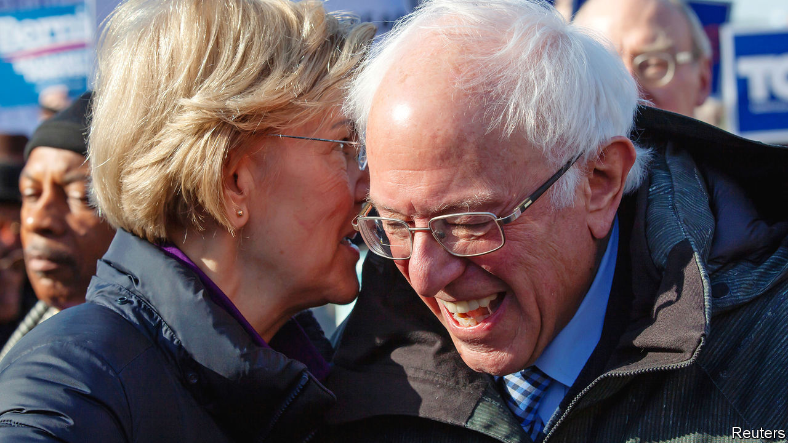

## Progressives’ dilemma

# Assessing Elizabeth Warren and Bernie Sanders in Iowa

> For all the overlap between the two candidates, they differ markedly—on the trail and off

> Feb 1st 2020CEDAR RAPIDS AND FOREST CITY

THE WEEK before Iowans caucus is inevitably frenetic. Candidates leave no hand unshaken and no corner of the state unvisited. Over bowls of (surprisingly delicious) Spam risotto, Kurt Meyer, the Democratic Party chairman of three rural counties in northern Iowa, needs two hands to count the candidates who have held events at his lovely riverside home, near the Minnesota border and precisely nothing else.

Six days before the caucus, in the county two west of Mr Meyer’s, a Bernie Sanders house party felt like a quiet church revival. The field organiser, referring frequently to “this movement”, asked the roughly 15 people attending to introduce themselves and tell the rest of the room what attracted them to Mr Sanders. More than half of them praised his “authenticity” and “consistency”. A truck driver preparing to caucus for the first time—like several others there—said that Mr Sanders “campaigns on the same principles every time…We can believe what he’s saying.”

Two days earlier in Cedar Rapids, a rally with Elizabeth Warren had the feel of a policy seminar delivered by an enthusiastic teacher to an engaged crowd. Organisers raffled off the right to ask questions. (They were deeply on-brand: “When we call your number, shout, ‘Persist!’, and we’ll get you a microphone.”) After a stump speech about her modest upbringing in Oklahoma, Ms Warren fielded questions about health care, energy policy and her viability, giving paragraph-length answers to each of them. Like Mr Sanders, she railed against “the most corrupt administration in history”. Unlike him, she also praised capitalism and free markets. For all the overlap between the two candidates, they differ markedly in their strengths, appeal, governing philosophies, bases of support and the implications of their success for the Democratic Party.

Last autumn, Ms Warren nearly overtook Joe Biden in national polls. But since releasing her “Medicare for All” plan, she has stumbled. Mr Sanders’s recent rise appears to have come at her expense. Still, they have a pragmatic detente. While Amy Klobuchar struggles to conceal her contempt for Pete Buttigieg, and Kamala Harris (now retired) kicked Mr Biden for opposing school busing, Mr Sanders and Ms Warren have consistently praised each other. They realise that if one falters, the other wants to pick up those voters with as little lingering bitterness as possible.

Although their voter pools overlap, they are not identical. Ms Warren does better among better-educated and older voters; Mr Sanders leads the Democratic pack among voters under 30, which explains his campaign’s focus in Iowa on first-time caucus-goers. Their support among black and white voters is roughly similar. Mr Sanders has a wide lead among Latinos, which augurs well for his chances in Nevada and the two biggest Super Tuesday prizes, California and Texas. Each is the top second choice for the other’s supporters, though there seem to be more Bernie-or-bust than Warren-or-bust voters.

That mirrors their relationship with the Democratic Party and politics more broadly. Ms Warren was an apolitical Republican before her work on bankruptcy pushed her leftward. She has since won two elections as a Democrat and worked closely with a Democratic administration to create a new federal agency, the Consumer Finance Protection Bureau.

Though Mr Sanders signed a pledge affirming that he is a Democrat in early 2019, just one day earlier he filed paperwork to run for Senate as an independent, which is how he has successfully contested all 11 of his federal elections. Though he aligns his positions with the Democrats’ progressive history, he calls himself a democratic socialist. That makes many in the party nervous. Although Republicans will call any Democratic nominee a “socialist”, only one—the guy who honeymooned in the Soviet Union, and who has boasted, in defiance of all electoral evidence, that Americans “would be delighted to pay more in taxes”—hangs the label on himself.

Asked how he plans to pass policies in a divided government, Mr Sanders often falls back on the rhetoric of revolution and movement-building, as though holding a few rallies in Kentucky—a state he is unlikely to win—will either force Mitch McConnell to negotiate or cause the scales to drop from his eyes. This may be partly a negotiating ploy. Ro Khanna, among his staunchest congressional supporters, insists that Mr Sanders “would take progress over the status quo”, but believes “we shouldn’t compromise with the process before it’s even begun”.

Yet exciting people with talk of revolution and then leading them into political gridlock risks creating a generation of disaffected voters. Ms Warren is also spoiling for a fight, as she rarely fails to mention, but she has a technocratic appeal that Mr Sanders lacks.

Her message and style seem to be more palatable to a broader swathe of Democrats. Barack Obama recently warned that America “is less revolutionary than it is interested in improvement…the average American doesn’t think that we have to completely tear down the system.” Mr Sanders and his supporters may disagree. But rousing those least likely to vote while alienating much of his own party—not to mention the independents and disaffected Republicans whom Democrats need to retake the White House—is a strategy with unparalleled downside risk.■

Dig deeper:Sign up and subscribe to Checks and Balance, our new [newsletter](https://www.economist.com//checksandbalance/) and [podcast](https://www.economist.com//podcasts/2020/04/24/checks-and-balance-our-weekly-podcast-on-american-politics) on American politics