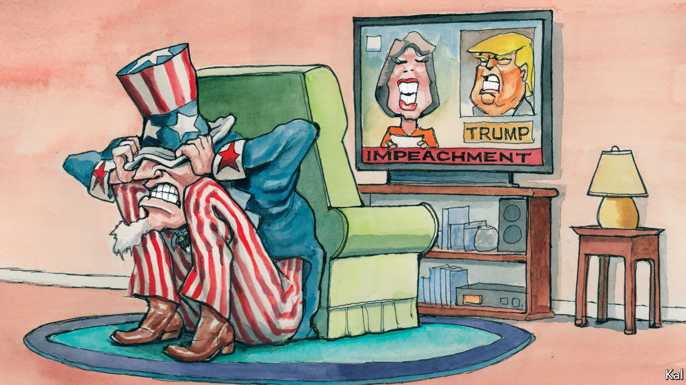

## Lexington

# Voting with their eyeballs

> The biggest indictment of Donald Trump’s sham trial is that most Americans have ignored it

> Jan 30th 2020

FOR METROPOLITAN trendsetters and the masses, the impeachment trial of Andrew Johnson was the great event of 1868. The Senate galleries were crammed for it, with “the most lovely as well as the most distinguished ladies of Washington...in daily attendance”, according to one record. Police officers meanwhile struggled to control the crowds that heaved outside the Capitol, “continually asking questions, making appeals and muttering threats”. Entering the Senate this week, by contrast, your columnist spotted a single, lonely protester wearing a sign that read: “Donald Trump is going to pee on you.”

Considering the passions that the president stirs, for and against, most Americans’ lack of interest in his trial may be its most remarkable feature. The public gallery has been half-empty for most of it. The few dozen anti-Trump protesters who have gathered outside the Senate are nothing to the hundreds who flocked to Justice Brett Kavanaugh’s confirmation hearing. The trial’s opening two days drew a modest prime-time TV audience of 7.5m. That is similar to the audience for Bill Clinton’s trial, once an increase in average viewership is factored in, though Mr Trump’s is taking place in a far more feverishly politicised environment. It is also more popular than Mr Clinton’s trial was. Only a minority of Americans thought Mr Clinton should have been impeached for lying about sex; a small majority think Mr Trump should be sacked for trying to extort personal favours from his Ukrainian counterpart.

Even Republican senators who denounce Mr Trump’s impeachment as a “political sham”, in the phrase of James Inhofe of Oklahoma, seem slightly piqued by the public’s disregard. Quizzed on the thin showing in the gallery, the Oklahoman hyper-partisan told one newspaper he was “really surprised…because this is kind of historic”. He shouldn’t have been. The reason most Americans find Mr Trump’s trial tedious is because they know how it will end: with the president, though guilty—as even some Republicans acknowledge in private—nonetheless acquitted by them.

A last-ditch wrangle—as this column went to press—over whether Mitch McConnell might allow testimony from John Bolton, a former national security adviser, would make that scarcely less likely. It raises no prospect of the requisite 20 Republicans joining the Democrats in a vote to remove Mr Trump. Immaterial to the outcome, the kerfuffle is therefore mainly indicative of the extent to which the Republican Senate leader has otherwise controlled the trial and so predetermined its outcome.

Mr McConnell claims to have modelled it on Mr Clinton’s trial, which relied almost exclusively on evidence sent up by the House of Representatives. Yet the circumstances of the two trials are quite different. The evidence against Mr Clinton was gathered during a nine-month-long criminal probe, backed by a grand jury, which allowed its investigators to secure the testimonies of nearly a hundred witnesses, thousands of documents, and a sample of the president’s blood. The evidence against Mr Trump consists of an edited White House transcript of a phone call between him and Volodymyr Zelensky, testimonies from the handful of mostly mid-level officials who were prepared to defy the administration’s non-co-operation order, and the president’s Twitter account.

Additional evidence against Mr Trump is available—including a leaked account by Mr Bolton, first reported by the New York Times, which appears to demolish the president’s defence. But, as Mr Trump’s lawyers noted this week, it is inadmissible. Testimony from the former national security adviser, a plain-speaker with a grudge against Mr Trump and a book to sell, would be more informative—and probably fraught for some, such as Vice-President Mike Pence, allegedly complicit in Mr Trump’s ruse. Yet a single explosive testimony would probably leave little mark on Mr McConnell’s whitewash. The fact that a few moderate Republicans may demand to hear from Mr Bolton should be understood in that context. Were they also to request testimony from Mr Pence, half a dozen other cabinet members and, naturally, the president, it would look like a serious bid to uncover the truth and confront their voters with it. Inviting only Mr Bolton, on the legally irrelevant basis that he is willing to testify, would look like virtue-signalling to the independent voters they fear to alienate.

It is of course no mystery why that is as much as they may be willing to contemplate. To stand against the president is suicidal in the Trump cult their party has become. Mr Bolton, a feared baby-eating bogey of the left for over three decades, has already been denounced on Fox News, his former employer, as a “tool for the left”. It should also be acknowledged, as is so often the case, that while Republicans may be setting new records for shamelessness, the Democrats are not blameless either.

Chuck Schumer is also trying to extract political benefit from the trial, by trying to force Republicans up for re-election this year to make embarrassing defences of the president. Having largely achieved this, some suspect, he may be quietly willing to bring the trial to its inevitable conclusion rather than risk damage to his party by prolonging it. In that case, neither party would be committed to its oath to try the president and hold him to account.

No wonder Americans seem disengaged from the Senate trial. Indeed, though you would not know it from the polished grandeur of its atriums, or the lofty bonhomie with which its members, of both parties, still hail each other there, the Senate is an institution hurtling towards irrelevance. Its tradition of debate is long dead. Under Mr McConnell, it barely passes bills; this Congress could be the most unproductive in half a century. And meanwhile the populist furies that propelled Mr Trump, and which he has done so much to exacerbate, are not dissipating. Dissatisfaction with democracy was reported this week to have increased by a third in America since the 1990s. It will have gathered more steam last month.■

## URL

https://www.economist.com/united-states/2020/01/30/voting-with-their-eyeballs
