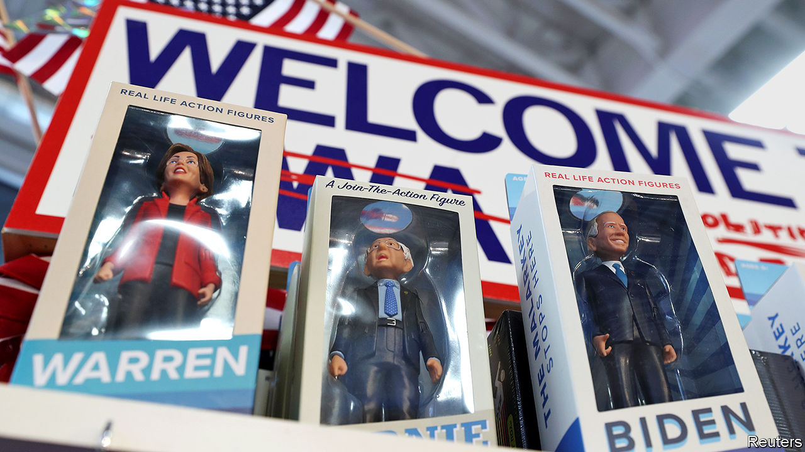
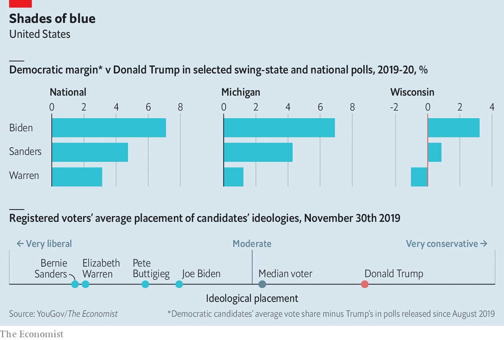

## A primary quandary

# Who will be Donald Trump’s most forceful foe?

> Data suggest that one Democratic candidate would do better than others against the president in November

> Feb 1st 2020WASHINGTON, DC

DEMOCRATS CAST their first votes in this year’s presidential primaries at caucuses in Iowa on February 3rd. Their ultimate goal is to nominate a candidate who can beat Donald Trump in November. That will not be easy. Despite much political tumult and an impeachment trial, the president still has a clear path to re-election.

Mr Trump is unpopular in national polls. Yet he is a stronger candidate than headline figures suggest. His approval ratings have hovered around ten percentage points below his disapproval ratings. Although since 1950 such an unpopular president has never won re-election, the historical relationship between a president’s approval and his share of the two-party vote suggests Mr Trump should still win about 49% of votes cast for Democrats and Republicans in November. The economy may help. The Federal Reserve forecasts GDP to grow by about 2% this year. Such an increase has been associated with past presidents winning about 50% of the vote.

Of course the electoral college, not the popular vote, determines who wins. Here, too, Mr Trump has an advantage. Because pivotal midwestern states such as Wisconsin and Michigan lean slightly more Republican than the nation as a whole, The Economist’s analysis of polling data suggests Democrats need to win the popular vote by about two-and-a-half percentage points to win the White House.

Democrats have thus placed a premium on selecting a candidate able to beat Mr Trump. Yet they disagree over who is best placed to do so. Candidates such as Elizabeth Warren and Pete Buttigieg have been at some points boosted and dogged by such questions of so-called “electability” over the course of the campaign. Joe Biden and Bernie Sanders have emerged as the top contenders in polls, their support elevated among working-class whites—the voters who swung rust-belt states toward Mr Trump and are likely to decide the election in November. But the two candidates’ electoral strategies differ significantly.

Mr Biden has taken the more traditional approach. In his view, Democrats will win by wooing back white working-class voters in midwestern states who deserted the party in 2016, while keeping black voters’ support. Mr Sanders hopes his populist message will resonate with disaffected Democrats, working-class voters and the young. Who is right? New political-science research and polling data suggest a moderate candidate popular with working-class whites would be best poised for victory.

Studies have found that ideologically extreme candidates can hurt a party’s performance. Andrew Hall and Daniel Thompson of Stanford University found that more extreme candidates for the House of Representatives between 2006 and 2014 increased turnout in their party, but galvanised the other party’s voters by four to ten percentage points more. Christopher Warshaw, a political scientist at George Washington University who has carried out similar studies, reckons that moderates hold similar advantages in presidential races.

Mr Trump may have benefited from this dynamic in 2016. According to the Co-operative Congressional Election Study (CCES), a 65,000-person poll overseen by Harvard University, voters thought Hillary Clinton was about twice as ideologically extreme as Mr Trump in 2016. This was due largely to his embrace of some positions considered unorthodox for Republicans, such as defending Social Security and Medicare.

Here, Mr Biden looks strong. YouGov’s polling reveals that Americans view him as the most moderate Democrat, on average. They perceive all the other major Democratic contenders as more extreme than Mr Trump (see chart).

Mr Trump’s support from racially conservative whites may also help him. In an article published in 2019, Tyler Reny of UCLA, Loren Collingwood of the University of California, Riverside and Ali Valenzuela of Princeton University conducted a study of the CCES data to analyse the link between voters’ self-professed attitudes towards racial minorities and their voting behaviour. The authors found that “white voters with racially conservative or anti-immigrant attitudes” switched votes to Mr Trump at a higher rate than those with more liberal views on these matters.

Mr Biden could win back some of these people. Alexander Agadjanian of MIT studied the attitudes of nearly 3,000 Democratic voters and found those with “racially resentful” views—disagreeing, for example, that slavery and discrimination have made progress difficult for African-Americans—were 27 percentage points likelier to vote for Mr Biden than for his opponents.

Mr Trump also benefited in 2016 by attacking economic and political elites. Justin Grimmer and William Marble of Stanford studied the attitudes and turnout of different voting blocs, finding that poverty and low educational achievement—proxies for the lower rungs of America’s class hierarchy—were associated with higher support for Mr Trump. According to their analysis, low-income white people living in closely contested states were more than ten percentage points more likely to vote for Mr Trump than for Mr Romney. They found that voters who had dropped out of high school were both around 20 points more pro-Republican and more likely to turn out in 2016 than in 2012. Polling data suggest that poorer Americans are likelier to harbour resentment toward political leaders. They may have been attracted to Mr Trump’s anti-elite messaging.

This presents Mr Sanders with his biggest advantage. Mr Biden’s history in Washington may evoke the same rage against elites as Mrs Clinton did in 2016. Despite years in the Senate, Mr Sanders is seen as an outsider and working-class champion. He may be less off-putting to voters looking for a candidate to reform Washington.

This research suggests, then, that Mr Biden could perform better than his competitors against Mr Trump. He is more moderate than Mr Sanders, so both more likely to attract swing voters and less likely to motivate Republicans to vote against him. His strength with both black and racially conservative white voters could make a big difference in swing states. Recent polling from the New York Times and Siena College suggests that 6% of the electorate would vote for Mr Biden—but not for Elizabeth Warren—against Mr Trump.

His advantage is evident in polls. According to The Economist’s analysis of publicly released polling data, Mr Biden performs better against Mr Trump than his competitors, nationwide and in swing states. Although polls of the general election conducted this early before a contest are not perfect, they are still helpful.

Mr Biden is not faultless. He is uninspiring on the stump and in debates. His Washington ties may inspire resentment from voters sceptical of elites. His candidacy would also represent a safety-first strategy for the Democrats at a time when many in the party desperately want to push a much more progressive economic, racial and social agenda. Yet for all that he still appears to be the Democrats’ best option in a contest against Mr Trump. ■ 

Dig deeper:Sign up and subscribe to Checks and Balance, our new [newsletter](https://www.economist.com//checksandbalance/) and [podcast](https://www.economist.com//podcasts/2020/04/24/checks-and-balance-our-weekly-podcast-on-american-politics) on American politics

## URL

https://www.economist.com/united-states/2020/02/01/who-will-be-donald-trumps-most-forceful-foe
