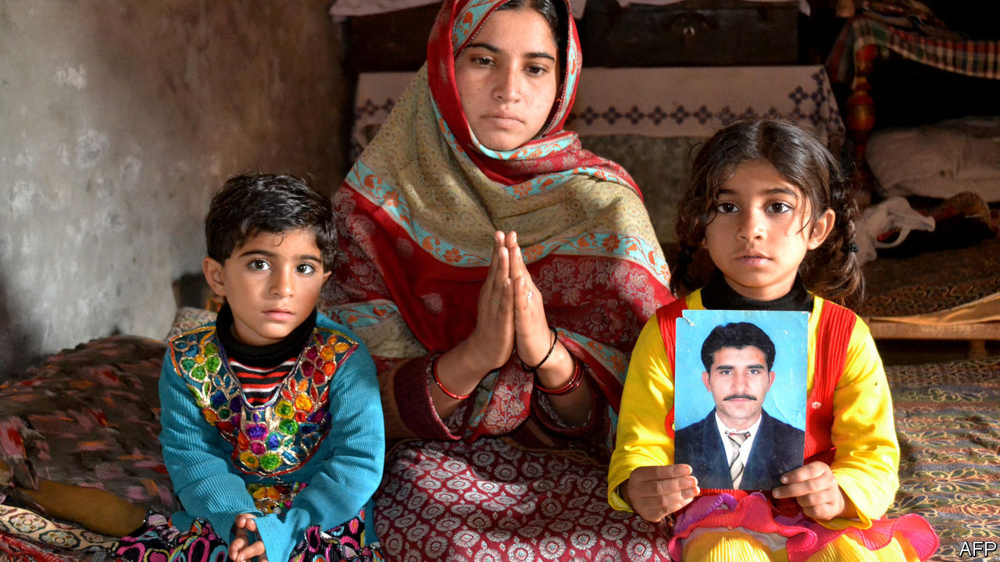

## Junk bondage

# How poor Pakistanis are tricked into becoming drug mules

> They face long prison sentences or execution if they are caught in Saudi Arabia

> Feb 6th 2020

THE LAST time Abdul Haq saw his son, the young man was bound for a new life, with a work visa in his new passport and a lucrative job awaiting. The rickshaw with which he made a living had been sold to pay for the fresh start, but no matter: he was trading the poverty of Sargodha, a city in Punjab province, for the riches of Saudi Arabia. Unfortunately, his family’s dreams of better times thanks to regular remittances lasted only days. After an unexplained silence, their son eventually called from a Saudi prison using a borrowed phone. He explained he was being held on charges of drug-smuggling. The men who arranged his visa had insisted he first travel to Karachi, where they forced him to hide a small package in his bag. When he was stopped and searched on arrival in Riyadh it turned out to contain heroin. That was ten years ago; Abdul Haq’s son is now on death row. “They just exploited our poverty,” explains the old man.

Labour is one of Pakistan’s biggest exports and Saudi Arabia has for decades offered work to poor Pakistanis. The kingdom plays host to 2.7m Pakistanis, more than any other country. Remittances from Saudi Arabia to Pakistan are projected to reach $2.6bn this year.

Yet despite the importance of these workers to the economy, campaigning lawyers say, the government is doing too little to shield them from exploitation. Some 3,200 Pakistani convicts languish in Saudi jails, many on drugs charges. Stories of coercion, entrapment in debt and deception like the one told by Abdul Haq are plentiful, says Sara Bilal of the Justice Project Pakistan (JPP), which represents vulnerable prisoners. “These people are small fish, these are people who do not know how to read, they have never left the country, they don’t know what a passport is.” Given that the government actively encourages such people to seek work abroad, she argues, it should also make sure that they are not abused.

In theory, the government regulates employment agencies that send workers to the Gulf. In practice, a network of unregistered and often unscrupulous middlemen reaches every village. Even pilgrims are not spared. Mehboob Alam says his mother was offered a place on a trip to Mecca in 2017 by a benefactor in her village in Punjab, near the Indian border. Someone hid some heroin in her luggage. She was sentenced to 15 years.

Pakistani prisoners receive little support from their government. Diplomats seldom make consular visits, says Ms Bilal, who is suing the government to force it to take better care of its citizens. But Imran Khan, the prime minister since 2018, seems more receptive to such blandishments than his predecessors, she says. The former cricketer was himself Pakistan’s most famous expatriate worker for decades, when he plied his trade in Britain. He has often bemoaned the problems of Pakistanis abroad and encouraged rich expats to invest in their homeland or send money to relatives to help shore up the balance of payments.

When Saudi Arabia’s crown prince, Muhammad bin Salman, visited Pakistan in early 2019, he promised that his government would pardon and release 2,107 Pakistani prisoners. A year on, only 579 have been freed. Moreover, JPP says the great majority of these had in fact been freed before the crown prince’s announcement. When the rest will be released remains unclear. Pakistani officials blame the delay on inertia in the Saudi bureaucracy, rather than bad faith. What is more, says Syed Zulfikar Bukhari, Mr Khan’s point man on the issue, the Pakistani government has helped to repatriate another 2,600-odd people accused of minor infractions, such as overstaying their visas.

The gravity of Abdul Haq’s son’s crime means that he is unlikely to be one of those to be released. His family has tried to pursue the men who exploited their son, with little success. His father now watches as other young men set out on the same risky journey. “Because we have poverty, everyone wants to go there, clearly, and earn some good money.” ■

## URL

https://www.economist.com/asia/2020/02/06/how-poor-pakistanis-are-tricked-into-becoming-drug-mules
