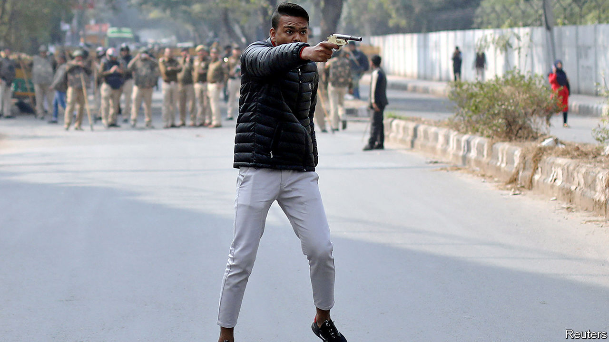

## Pish cosh

# India’s police are overstretched, poorly trained and politicised

> Politicians seem to like it that way

> Feb 6th 2020DELHI

THE PUPILS at Shaheen School in Bidar, a big country town in the state of Karnataka, are learning some unusual lessons. In recent days a group of police inspectors has taken over a classroom. They are not there for educational outreach. Rather, the officers have been interrogating dozens of 9- to 12-year-olds. The focus of their inquiries is no grisly crime, but a play that the students wrote and performed on January 21st.

The trouble started when a proud parent posted a recording of the performance on Facebook. In one part, about a controversial new law on citizenship, a nine-year-old girl draws applause by waving a slipper and declaring she will hit anyone who asks for her identity papers. This scene angered a Hindu nationalist, who tipped off police, who raided the school. They have arrested both the head teacher and the girl’s mother, an illiterate widow, charging them with sedition, endangering social harmony and insulting Narendra Modi, the prime minister. The women remain in jail. The slipper has been held as evidence.

The story is symptomatic. India’s police, despite being woefully stretched—recent surveys suggest the average officer’s workday is 14 hours, and that the national force is 23% understaffed—nevertheless devote inordinate energy to tasks far removed from their core duties. All too often, as in Karnataka, a state currently run by Mr Modi’s Bharatiya Janata Party (BJP), they seem to put pleasing politicians above serving the public. And as at the Shaheen School, which happens to be owned by Muslims (but says that 45% of its students are Hindus, many from disadvantaged backgrounds), the police often appear to be guided less by the law than by gut prejudice and popular sentiment.

Police shortcomings are not limited to remote places such as Bidar. In the capital, Delhi, a pistol-wielding youth, pictured above, recently shot into a crowd protesting the citizenship law as a line of police looked on. Delhi’s finest have also mysteriously failed to apprehend a single one of several dozen masked raiders who savagely attacked protesting students at one of the city’s main universities in early January, despite evidence that includes eyewitness testimony, incriminating social-media messages, reams of film footage and even televised confessions by some of the alleged perpetrators.

“There is a police culture of capitulation to politicians,” explains Devika Prasad, who heads a programme on police reform at the Commonwealth Human Rights Initiative, a pressure group. Although the police are notionally independent, elected officials control budgeting and recruitment and can reassign officers to the back of beyond. In a survey last year of some 12,000 officers, almost two-thirds said they had faced pressure from influential people and three-fifths reported that the most common result of resisting such pressure was to be transferred to a different post. Another survey suggests that such transfers peak during election years. Vibhuti Narain Rai, a former state police chief, notes that state governments’ authority to postpone mandatory retirement creates another means of influence, as senior officers trade favours for a prolongation of their service or a plum post-retirement sinecure.

Interfering politicians are not the only problem. The survey in 2019 found that 50% of officers across the country think that Muslims are “naturally” prone to committing crimes, and 51% believe that complaints under anti-discrimination laws by low-caste Hindus are likely to be “false and motivated”. This may explain why 21% of those imprisoned while awaiting trial are Muslim, but only 16% of convicted prisoners are—a proportion much closer to their 14% share of the population. The tendency to arrest innocent Muslims may also reflect their low numbers in the police force and stark absence among officers. In 2013 Muslims made up just 2% of the force in Delhi, and barely 1% in the state of Rajasthan. Since then the government has stopped publishing such data.

The survey also reveals rather relaxed attitudes to such things as procedures and human rights. Three-quarters of officers said police were justified in using violence against criminals, and four-fifths saw nothing wrong with beating up criminals to extract confessions.

Critics of the police often trace the force’s trouble to colonial times, when its job was to suppress unruly “natives”. The Police Act of 1861 still provides the main legal framework. Among its archaic provisions is one that stipulates that officers are permanently on duty. Only very recently have some states begun to introduce eight-hour shifts for officers. As under the British Raj, the 5,000 highly trained, centrally appointed officers of the Indian Police Service form an elite corps, superimposed on less-well-paid and disgruntled state police. More than 80% of the overall force are barely trained constables. These footsoldiers’ self-esteem is generally low: on average, they are likely to receive just one promotion in a lifetime, even as higher officers sail up the ranks gaining such perks as staff cars, housing and, all too often, the services of constables as personal orderlies.

These failings have long been recognised. Repeated commissions and public inquiries have demanded reform. The Supreme Court itself issued a detailed list of demands in 2006, following a petition by a retired officer. Mr Rai, for his part, says there is no point in tinkering: “No reforms are possible until and unless the basic structure of the police is changed.” ■

## URL

https://www.economist.com/asia/2020/02/06/indias-police-are-overstretched-poorly-trained-and-politicised
