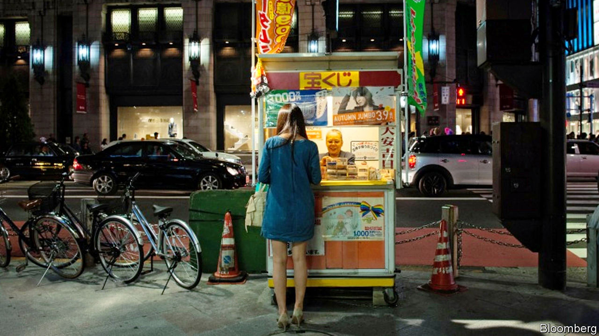

## The chips are down

# The Japanese government wants to build three flashy casinos

> Voters are not as enthusiastic

> Feb 6th 2020TOKYO

AS HE PACES the cramped cell in Tokyo where he is being held on suspicion of corruption, Akimoto Tsukasa may be wondering where it all went wrong. In 2017, while serving as the minister in charge of the government’s scheme to build Japan’s first casinos, he flew by private jet to China on a trip paid for by the boss of an online casino firm. He returned with a bag of goodies, including a pair of expensive shoes. Later, prosecutors claim, he pocketed over ¥3m ($27,000) from the same firm. He is said subsequently to have sounded out the transport ministry about building an airport for private jets in a ski resort on Hokkaido, a big northern island, to provide easier access for high-rollers. This week prosecutors filed a second charge of bribe-taking against him. What is more, since Mr Akimoto’s arrest on December 25th, the allegations have spooled out to ensnare five other politicians, all but one from the ruling Liberal Democratic Party.

Japan’s prime minister, Abe Shinzo, may also be asking himself how things came to this. In 2018 he pushed through parliament a measure allowing the construction of three “integrated resorts”: Las Vegas-style destinations for family holidays, with all sorts of wholesome attractions as well as slot machines. Before then, casinos were illegal in Japan, although betting on horse, boat and bicycle races is permitted, and local governments are allowed to run lotteries.

Mr Abe presumably thought that the promise of an influx of well-heeled tourists to regions with atrophying populations and economies would overcome popular misgivings. But even before the scandal broke, surveys found that a majority of Japanese were opposed. In Yokohama, a shrinking city on the outskirts of Tokyo seen as a potential site for a resort, 94% of residents do not want one, according to a survey conducted by the local government. Many Japanese seem to associate casinos with pachinko, a variation on pinball to which many Japanese are addicted and which attracts lots of attention from yakuza (gangsters). Last month four opposition parties asked the government to repeal the law paving the way for the resorts.

The response from local government has also been mixed. Two prefectures seen as potential sites for a casino—Hokkaido and Chiba—have ruled themselves out in recent months, saying the need to develop a detailed plan for a resort by the middle of next year would distract them from more important issues, such as disaster management. But other prefectures are eager. Hirata Ken, vice-governor of Nagasaki, says its population will shrink by 100,000 in the next decade. A resort would bring jobs and help “stem the haemorrhaging of young people to Tokyo”. Yokohama’s vice-governor, Hirahara Toshihide, is keen despite locals’ misgivings. The city does not have a single five-star hotel, he laments (wrongly). “The resort will bring them.”

Casino operators are, unsurprisingly, enthusiastic. The resorts could take in ¥1.75trn a year, according to the more bullish projections. Some of the biggest names in the business, such as Las Vegas Sands and MGM Resorts, are keen. President Donald Trump lobbied Mr Abe on behalf of American casino firms at a meeting in 2017, according to ProPublica, an investigative website. Sheldon Adelson, the boss of Las Vegas Sands, has also buttonholed him.

But the government and casino operators seem to have different ideas about how the resorts should operate. Officials talk about strenuous measures to prevent people from losing their shirts, such as a ban on cash machines on the premises, a limit on the number of visits allowed per month, and so on. A maximum of 3% of the floorspace of each resort will be devoted to gambling. Some local politicians have suggested that only foreigners should be allowed to bet. The developers, however, will want to lure as many of Japan’s well-heeled pensioners as it can, and persuade them to gamble freely. No wonder the government has not yet said on what basis it will award the three licences, or when. ■