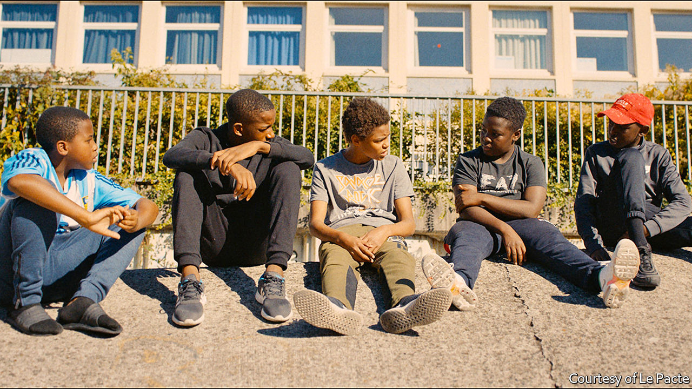

## Sounding the alarm

# A new wave of French films tackle social problems and taboos

> As “La Haine” did a quarter of a century ago, “Les Misérables” explores life in the banlieues

> Feb 6th 2020

IT IS THE long hot summer holiday in the year that an ecstatic France has celebrated victory in the football World Cup. Issa, a boy from the brutalist housing estates north of Paris who shared that joy, has been picked up by the police for theft. So far, so banal. But it turns out that Issa stole live chickens—and he took them to feed a lion cub he has snatched from a visiting circus. From this improbable, captivating incident, which reflects Issa’s boredom as much as his naivety, flow a series of devastating events that end childhood innocence and expose the muscular friction of daily life in the French banlieues.

Once in a while, a film of raw energy and emotional authenticity emerges on the big screen in France and shakes the cinematic establishment. “Les Misérables”, which was nominated for best international feature film at the Academy Awards on February 9th—and picked up the Prix du Jury at Cannes last year—is an example. Co-written and directed by Ladj Ly, a Malian-born film-maker who grew up in one of the concrete estates in Montfermeil where the movie is set, it follows a trio of cops and a band of lanky boys. The sense of tracking the action is made literal: when the run-in between Issa (played by Issa Perica) and the police goes horribly wrong, the moment is inadvertently recorded from above by Buzz (Al-Hassan Ly, the director’s son), another youngster. Buzz fills his empty days by flying a drone from the top of his high-rise.

The tension of the initial chase escalates into a fast-paced, troubled quest by the policemen to seize the video and cover up what happened. In this, Mr Ly’s touch is refreshingly even-handed. His camera hovers over his subjects and their confined neighbourhood like the boy’s drone. As the film gathers pace, les flics confront each other as well as their consciences, weighing self-preservation and team loyalty against moral misgivings. Local Muslim elders feature, but religion does not intrude. For their part, the boys (pictured) veer between youthful exuberance—sliding gleefully on plastic lids into a concrete dump, or staging water-pistol fights—and terrifying violence. In one scene, when the kids’ game collides with the cops’ patrol car, a boy who looks no older than ten chillingly holds the gaze of a policeman and draws his finger across his throat.

Inevitably, critics have compared “Les Misérables” to “La Haine”, a famously angry monochrome drama released a quarter of a century ago, which also features police violence (and few women) in the banlieues. That film opened the eyes of a generation of cinema-goers, more used to French art-house movies shot in parquet-floored apartments, to the angular bleakness and rage beyond the capital’s périphérique (ring road). Indeed, Mr Ly has acknowledged that he, like so many others, was “greatly inspired” by it. If anything, and despite moments of wry humour, “Les Misérables” is bleaker still. It dwells on the latent anger and disorientation of a younger generation of boys than its predecessor.

In some ways “Les Misérables”, which takes its name from the novel by Victor Hugo in which the former village of Montfermeil appears, is really an action flick that uses the banlieue as a backdrop. “We didn’t think of it as a banlieue film as such,” says Toufik Ayadi, one of the film’s producers, referring to the minor genre that has emerged in France since “La Haine”. Rather, says Christophe Barral, his co-producer, the idea was to draw on the human stories that happen to be so rich there. “There is a much greater imagination”, he says, “just a few kilometres from Paris.”

Yet the movie is also political, or what the French call a film engagé. Mr Ly, the first black French director to have his work nominated for the Oscars, has described it as a “warning cry”. As an aspirant film-maker, he used to record the real police violence he witnessed, and this eye lends the film its authenticity. President Emmanuel Macron is said to have been taken aback after watching a private screening at the Elysée Palace.

“Les Misérables” thus fits into a rising trend towards a new, unabashed social frankness in French film-making. Even in the wake of “La Haine”, for the most part “French auteur cinema tends to be very middle-class, looking at the Parisian microcosm,” says Ginette Vincendeau, professor of film studies at King’s College London. “When it comes to social realism, we often refer to British cinema, and the films of Ken Loach, and say that we don’t have this in France.”

Now that seems to be changing. A number of recent French films have taken a hard, often bittersweet look at contemporary social issues. As French politics has been upended by Mr Macron, film-makers seem to have spied an opportunity to make new arguments, and ask new questions, on the big screen—in an echo of the experimentation in French cinema in the 1950s and 1960s. Last year alone, such movies explored educational disadvantage (“La Vie Scolaire”, “La Lutte des Classes”), farming and rural suicide (“Au Nom de la Terre”), redundancy and factory closure (“En Guerre”) and society’s attitude to autism (“Hors Normes”).

Olivier Nakache and Éric Toledano, the pair behind “Hors Normes”, made their name with “Intouchables”, a blockbuster comedy. In their latest film they turn to the efforts of two social workers in Paris (one played by Vincent Cassel, who memorably starred in “La Haine”) to offer shelter and purpose to severely autistic youngsters whom the social-welfare system fails. When the central autistic character, Joseph (Benjamin Lesieur), pulls the alarm in the metro, it serves as a wider metaphor. “The important thing”, Mr Nakache has said, is “to break the taboo on certain subjects”.

As a movie, “Hors Normes” has touching moments, although in the end its message gets in the way of a truly compelling drama. Such is the risk with the genre. The politically engaged films made in the 1990s after “La Haine” were also of patchy quality. Nor are these politically sensitive films always simple to finance. “Les Misérables” itself struggled, initially winning no backing from official French cinematic institutions. Still, whether or not Mr Ly’s disturbing, sharply observed story claims an Oscar, in France, at least, it has already made its mark. “It’s good that French film is offering something other than bourgeois cinema,” says Mr Barral, the co-producer. “Perhaps people have had enough of that.” ■