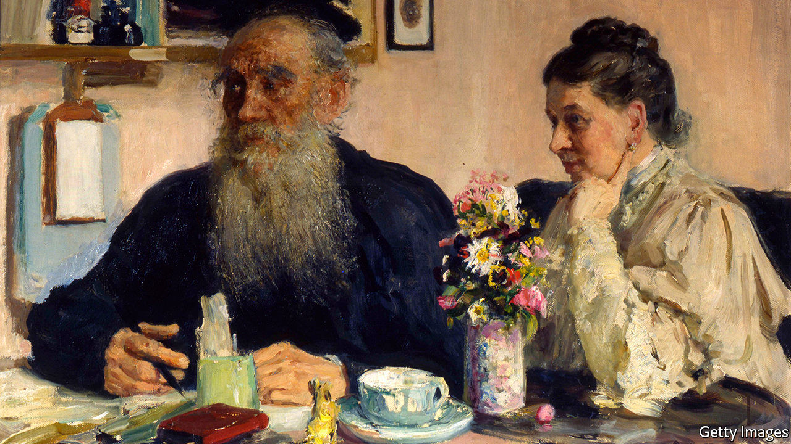

## Marriage story

# The temptations of Tolstoy, on the page and in the flesh

> Andrei Zorin’s subtle biography weaves together the novelist’s life and writing

> Feb 6th 2020

Leo Tolstoy. By Andrei Zorin. Reaktion Books; 224 pages; $19 and £11.99.

LEO TOLSTOY was an inveterate quitter. All his life, he gave up the things that mattered to him, or tried to. He bolted from university without a degree, left the army, renounced the privileges of aristocracy. He rejected the Orthodox church and abjured fiction as a vanity. He forswore the libertinism of his youth, and—eventually—fled his tortured marriage, in the fatal escape that ended at the railway station in Astapovo.

This urge to shed distractions and commitments is one of the continuities that Andrei Zorin, a cultural historian at Oxford, traces in his beautiful account of Tolstoy’s long, astonishing life. Born in 1828 at Yasnaya Polyana, a family estate, Tolstoy studied in Kazan, fought in the Caucasus, became the world’s most famous author and founded what amounted to a new religion. He was an avid farmer, an education reformer and a champion of famine relief. Strive as he might to repudiate fame, in 1910 the world’s media besieged the stationmaster’s house as he lay dying inside.

Death had preoccupied him since his service in Crimea (his depiction of the wastefulness of the war led to an early run-in with the tsarist censors). But sex preoccupied him more. Notoriously, before their wedding he made Sofia, his much younger fiancée, read the diary he began while being treated for gonorrhoea, which detailed his liaisons with prostitutes and concubines; the marriage was consummated in the carriage after the service. His libido was matched by his remorse and self-disgust. He wept beside the bed in which he lost his virginity; even his desire for Sofia came to seem “loathsome” and “criminal”. The hero of “Father Sergius”, one of his late stories that were published posthumously, is a penitent aristocrat who takes holy orders and cuts off a finger to ward off temptation.

Tolstoy’s ceaseless interrogation of Sofia’s feelings and his own helped make their relationship excruciating. In their last decades, amid a lifetime’s worth of resentments and mounting bereavements, it became intolerable. (“There is no death,” Tolstoy intoned as he trudged in the snow after the youngest of their 13 children perished in 1895.) At the end, after Tolstoy finally walked out, Sofia was banished from his deathbed in Astapovo and had to peer at him through the window. Yet it was in this agonising marriage that he produced “War and Peace” and “Anna Karenina”.

In an ingenious, seamless approach that distinguishes his biography from others, Mr Zorin treats the events of Tolstoy’s life and his writing as a single, indivisible whole. As he says, the genius of Tolstoy’s art lay in its combination of verisimilitude and depth: “from any occasion, however trivial it may seem, he is ready to derive major conclusions about humankind.” He sketches his subject’s relations with Gorky, Turgenev, Chekhov (whose plays Tolstoy thought very bad) and Dostoyevsky (over whose death Tolstoy wept, though they never met). He notes the political upheavals, above all the emancipation of the serfs, which were the novels’ wider context.

In a country where other forms of authority were discredited, writers had a special, oracular status. Still, for Tolstoy, literary acclaim came to seem meaningless. Writing fiction was not the way to improve the world; as with the pleasures of the flesh, he berated himself when he lapsed into it again. (Rereading “War and Peace”, he felt “repentance and shame…not unlike what a man experiences when he sees the remains of an orgy in which he has taken part.”) His political and moral views—anarchistic, radical, anti-modern—fused in a heretical new version of Christianity and a dissident activism, at once cranky and heroic, which made him a star all over again. His creed rejected all kinds of violence and oppression, which, for him, included the strictures of lust as well as state power.

On the eve of his death he was still inveighing against capital punishment. He was buried at Yasnaya Polyana—which, Mr Zorin observes, he left many times but, unlike many other attachments, he never abandoned—in a glade where, as a child, he hunted for a magical stick that could rid the world of evil. His unmarked, turf-covered grave has an aura of eerie calm. ■