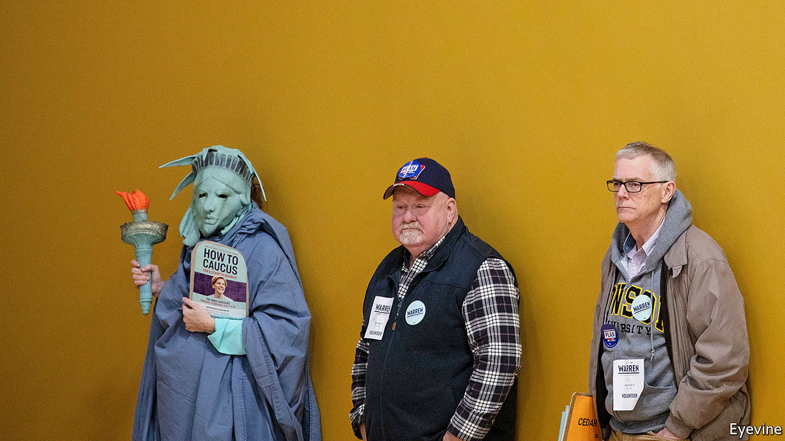
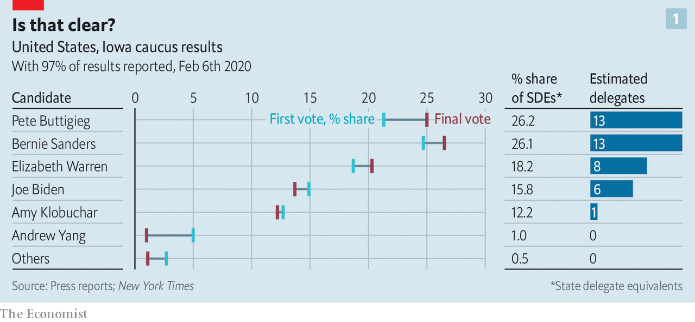
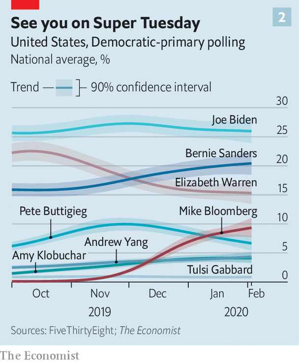
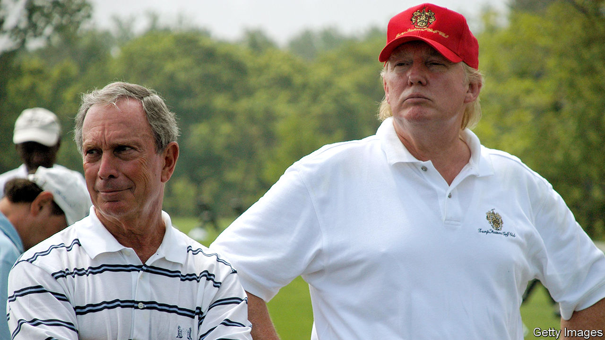

## Iowa overShadowed

# The shambolic Iowa caucuses did little to unite the Democrats

> They were good for Pete Buttigieg and Bernie Sanders, bad for Joe Biden

> Feb 8th 2020CONCORD, NEW HAMPSHIRE, INDEPENDENCE, IOWA, AND WASHINGTON DC

IN THE SMALL hours of February 4th a straggling squadron of private jets left Des Moines International Airport and headed east through a clear, cold sky, its clouds and the snowy land beneath them silvered by the light of a setting half moon. Conditions in the state the planes left behind them were far less perspicuous. A malfunctioning app made by a firm called Shadow Inc. meant that the results of the Iowa caucuses which are normally announced not much past nine o’clock in the evening, remained shrouded in mystery.

By the time Pete Buttigieg, an ex-mayor from South Bend, Indiana, heard that the first, partial release of results from Iowa showed him to have won the most “delegate equivalents” (27%) he was 2,100km (1,300 miles) away in Laconia, a lakeside town in New Hampshire. Bernie Sanders, a socialist senator from Vermont who the early results showed coming second with 25%, was an hour’s drive south in Milford. Elizabeth Warren, a senator from Massachusetts, heard of her third-place finish in the little city of Keene; in the larger city of Nashua, America’s former vice-president, Joe Biden, learned that he had managed only fourth place, with 15.6%.

Remarkably, final results had still not been published as The Economist went to press. With 97% of the count completed, Mr Buttigieg still had the edge in delegate equivalents; though Mr Sanders had slightly more actual votes, their concentration in urban areas counted against him a little. Mr Buttigieg also picked up more support than anyone else in the stage of the caucuses where votes originally cast for the less popular candidates are reallocated (see chart 1).

The Democrats have always been split, to a greater or lesser extent, between the more left-wing and the more centrist. Finding a candidate who can at least try to please both is part of the point of the primary process. Today the factions’ differences are more pronounced than usual, though—and they line up with two different approaches to what the election is about.

Democrats of all stripes say they care most about ousting President Donald Trump. But the two wings offer fundamentally different prescriptions for how to do it. Moderates offer something like a further-to-the-left version of the pre-Trump status quo. The radicals seek what Ms Warren calls “big structural change”. They want to fix the problems of concentrated power and influence they see as having led to Mr Trump in the first place. That difference could yet cost the party the election.

A nostrum from before the days of each candidate hiring their own jet held that there were only three tickets out of Iowa; candidates who did not win, place or show in the caucuses had no shot at the nomination. It would be rash to bet heavily on that rule of thumb holding. Fourth-place Mr Biden is a nationally popular figure with a long-standing lead in the polls (see chart 2). He may have a chance to redeem himself when South Carolina votes on February 29th; African-Americans, who have shown strong support for him, make up a majority of the electorate there.

Even so, Mr Biden was the only candidate who actually benefited from the slow dripping out of the results. The Super Bowl on Sunday, Mr Trump’s state-of-the-union address on Tuesday and the Senate’s acquittal of the president on Wednesday meant that the caucuses had only a small window in which to be a big story. When the results missed that window Mr Biden’s lacklustre performance—he may not have won a single delegate—got a lot less attention than it might have.

Of the people who did well out of the caucus, the most striking success belonged to Mr Buttigieg. For a young, gay local politician with a name many still struggle to pronounce, winning the most delegates was quite the coup. Some might see the fact that he spent heavily in the state—more by some accounts than any other top-tier candidate save Mr Sanders—as diminishing this achievement. But being able to raise such sums is an impressive feat in itself, and going all-in on must-win Iowa speaks well to his nous.

In high school Mr Buttigieg won a national contest with an essay praising Mr Sanders’s political courage. Today he is firmly in the party’s moderate wing. His plan to let people choose to subscribe to a public health-care insurance scheme is cheekily referred to as “Medicare for All Who Want It”, thus differentiating it from Mr Sanders’s more absolutist “Medicare for All”. He argues that subsidies for poor college students should be significantly expanded, rather than that college should be made free to all, as the radicals propose; he wants to see $700bn more spent on child care over the next ten years rather than to guarantee its free provision to everyone.

Like all the Democratic candidates, Mr Buttigieg has ambitious plans to tackle climate change. He prices his version of the “Green New Deal”—which includes a carbon tax, something orthodox economists like but many doctrinaire greens do not—at $2trn over ten years. That is a lot: the equivalent of 4.5% of federal spending at 2019 levels. But it is only marginally higher than the price tag on Mr Biden’s plan ($1.7trn) and far less than Ms Warren’s $10trn or Mr Sanders’s $16.3trn.

Along with an increase in the federal minimum wage to $15 an hour and an expansion of the earned-income tax credit—also espoused by all the other candidates—this might look like moderation in many of Europe’s political parties. It would never previously have been seen as such by the Democrats. Like Mr Biden’s, Mr Buttigieg’s agenda is considerably more progressive, and expensive, than that on which Barack Obama and Mr Biden ran in 2008, or than Hillary Clinton offered in 2016. None of them would have dreamed back then of explicitly treating their health-care plans as a step on the way to a universal single-payer scheme, as Mr Buttigieg does. Mrs Clinton’s biggest commitment on climate was costed at just $60bn.

In some ways Mr Buttigieg’s ideas are hard to distinguish from Mr Biden’s; their policies for capping the premiums sold on the Obamacare exchanges are identical down to a fraction of a percentage point. But Mr Buttigieg is more keen to be understood, at least in part, as the sort of progressive voice which his policies would have made him in every previous election since the Great Depression, not least because his youth can set a message of change apart in a field of septuagenarians.

Unlike Mr Biden, but like Mr Sanders and Ms Warren, he favours the legalisation of marijuana at the federal level. His carbon tax would be the basis of a rebate to all Americans. He is less of a free-trade fan than Mr Biden—though not as protectionist as Mr Sanders—and more hawkish on China. His plans to allow trade unions to bargain across sectors of the economy, borrowed from the Nordic countries, are far less ambitious than Ms Warren’s plans for the representation of workers on boards, but they are more achievable, and fresher than Mr Biden’s.

Mr Buttigieg is enthusiastic about the Midwest’s “strong progressive tradition” and pays tribute to William Jennings Bryan, the Nebraskan who was just 36 when oratory and populism won him the Democratic nomination in 1896. Mr Buttigieg is almost as young and widely seen as the best speaker in the current bunch, though he does not come up to Mr Obama’s standards. But he lacks Bryan’s polarising demagoguery. He is keen to build bridges to moderate Republicans—“future former Republicans”, as he likes to call them—and to convince party bosses that he can deliver their votes come November. Once happy to toy with structural reforms like eliminating the electoral college or enlarging the Supreme Court, today he talks less of such potentially divisive matters.

Elderly voters have taken a shine to Mr Buttigieg. Young voters have generally preferred the more radical camp. They favour Mr Sanders, who draws large, enthusiastic crowds and works the stage with the energy of a man half his age (which would still make him slightly older than Mr Buttigieg). He presents himself as a tribune of purity, unsullied by the politics of compromise.Polls suggest he will notch up a sizeable victory in New Hampshire’s primary on February 11th, and perhaps another in Nevada’s caucuses on February 22nd.

Some of Mr Sanders’s advantage stems from the fact that he has been running since 2015, when he first took on Mrs Clinton. His surprisingly strong showing against her revealed an appetite for policies much further to the left than the party was used to, thus shifting its centre of gravity. It also gave him the basis for a run in 2020 three years before anyone else really got into the game. He used that head start to strengthen his organisation and develop his platform.

The most famous plank in that platform is Medicare for All, which would replace the entire private health-insurance industry with a government-run programme free to all Americans (including undocumented immigrants) at the point of service. He also wants to cancel $1.6trn in student debt, guarantee jobs for all—his version of the Green New Deal is meant to provide 20m new ones—and give workers 20% of the equity in large companies.

A rough estimate suggests that Mr Sanders’s plans would cost at least $50trn over a decade. His tax rises (which include, like Ms Warren’s but unlike those of the moderates, a wealth tax) might bring in $20trn in additional revenue—which suggests that the annual deficit could triple to $3trn. The Urban Institute, a think-tank, estimates that Mr Sanders’s health-care plan alone would cost $34trn over ten years.

Unlike Ms Warren, who got into a damaging flap over costing a similar promise and has since retreated to a position of “transitioning to” Medicare for All, Mr Sanders is not fazed by such numbers. He talks in broad terms of payroll taxes on employers and tax rises for wealthy and middle-class households (which he insists would be more than offset by reduced health-care costs). But he feels little need to trouble himself with specifics.

Mr Sanders would not be able to afford such nonchalance as president. Even if he were gifted a Democratic Senate and House, they would dread putting to the test his claim that Americans “would be delighted to pay more in taxes” to cover a comprehensive health-care system. Some of his surrogates softly proclaim him open to compromise, and cast his maximalism as more of an opening position than a fixed point. This suggests that, one way or another, the supporters to whom he promises radical change (and lots of free stuff) might find the reality of a Sanders presidency a terrible disappointment.

The prospect of a generation’s unrealistic idealism curdling, though, is not what most worries other Democrats about a Sanders candidacy. What they worry about most is that, like that fiery populist William Jennings Bryan, he would lead them to defeat. Socialised medicine may not turn off voters as much as it once did; socialism, though, is still an unpopular idea outside the world of millennial urbanites.

Mr Trump would hammer Mr Sanders’s proposals for a moratorium on deporting illegal immigrants, breaking up the Immigration and Customs Enforcement—since 2002 the country’s primary immigration-enforcement agency—and decriminalising unauthorised entry into the country. In swing states that produce oil and gas—notably Pennsylvania—he would make hay with Mr Sanders’s proposed fracking ban. Some of his attacks might be odd—at a rally in Des Moines four days before the caucuses he warned that the Green New Deal would “kill our cows”—but that does not mean they would be ineffective.

Mr Sanders is hardly a sure thing. But Mr Biden, long seen as topping the league in terms of electability, has started to falter, and the lead he enjoys over Mr Sanders in The Economist’s aggregate of national primary polls was narrowing even before the caucuses. With more candidates than usual getting tickets out of Iowa, Mr Sanders’s particularly devoted fan base could improve his chances of winning a plurality, if not a majority. Betting markets have him the front-runner. His support has been inching up in South Carolina and he is in the lead in California, the biggest of the 14 “Super Tuesday” states which, along with American Samoa and Democrats Abroad, choose their candidates on March 3rd.

Mr Buttigieg, on the other hand, is currently polling sufficiently poorly in New Hampshire, South Carolina and Nevada that he will need a peculiarly bountiful Iowa bounce to win in any of them. He is doing particularly poorly with black voters. His charm and popularity might cost Mr Biden a victory without winning one for himself. To avoid this, some mainstream Democrats may turn instead towards Ms Warren, suspecting her more likely than Mr Sanders of tacking to the mainstream. That would be likely to give Wall Street a fit of the vapours.

Voters could instead look elsewhere. As the Iowa circus flew into the New Hampshire morning, none with more than a dozen or so delegates, Mike Bloomberg was on a rather longer flight from California, which has 415 delegates up for grabs on Super Tuesday, to Michigan, where the primary a week later will decide the loyalties of a further 125. All told, the polls on March 3rd and 10th will provide 43% of the pledged delegates, more than ten times as many as those that can be won in all the primaries and caucuses of February. Taking this into account, Mr Bloomberg, a media entrepreneur and former (Republican) mayor of New York, is building his campaign for the Democratic nomination on the idea that running in the early states is not necessary if you are really rich.

This makes him, for now, literally unbeatable—how can you beat someone who isn’t there? He has also avoided innumerable fish fries, town halls and other intimate settings that favour practised, glad-handing politicians over uncharismatic billionaire technocrats. This abnegation denies him the possible advantages of early victories and whatever momentum they might offer. But he thinks he can make good that lack by spending truly remarkable sums on advertising in the states where he is running: according to FiveThirtyEight, a website, he has spent $255m so far, more than the rest of the field combined.

The strategy remains widely seen as a long-shot. But it has made an impression in national polling, where pre-Iowa he had pulled clear of Mr Buttigieg, his fellow ex-mayor. The Democratic National Committee has altered the rules for its televised debates in a way that makes it possible for him to participate in one later this month. If Mr Biden’s campaign has not recovered by Super Tuesday—a situation Mr Bloomberg’s ads may encourage—he might change the contours of the race.

But as everyone else was flying around, the person who may have done best out of Iowa was tucked up in his doubtless splendid bed—or at least not tweeting. Democrats had expected that disapproval of Mr Trump would lead to much higher turnout at this year’s caucuses than 2016’s. It did not. After a year in which you couldn’t shake a corn-dog in Iowa without hitting a presidential wannabe, voters may have found the whole field rather uninspiring.

On Monday around 80 of Mr Trump’s surrogates—cabinet members, supportive legislators and his family—fanned out across Iowa where, unsurprisingly for a sitting president with no serious challengers, he won 97% of the vote. The next day the president delivered a jubilant state-of-the-union address. And in Wednesday’s vote on impeachment Republican senators backed him even more resoundingly than Iowa caucusers had. The Republicans will go into the campaign united. The Democrats have a lot of flights to take before they can promise the same. ■

Dig deeper:Sign up and listen to Checks and Balance, our new [newsletter](https://www.economist.com//checksandbalance/) and [podcast](https://www.economist.com//podcasts/2020/04/24/checks-and-balance-our-weekly-podcast-on-american-politics) on American politics