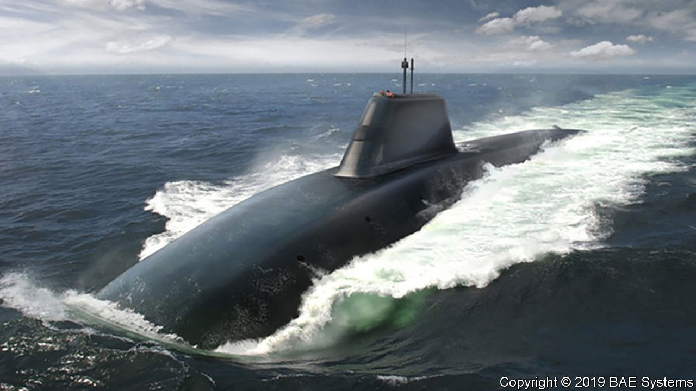

## Defence

# Botched nuclear projects put the future of Britain’s defences at risk

> Costs have ballooned as decrepit facilities remain in use

> Feb 6th 2020

FOR OVER 50 years without pause, there has always been a British submarine hidden somewhere in the depths of the world’s oceans, loaded with thermonuclear weapons. This unceasing prowl—known as a Continuous At-Sea Deterrent (CASD)—depends on a sprawling infrastructure of nuclear sites across Britain. But a report published in January by the National Audit Office (NAO), Parliament’s spending watchdog, suggests that Britain’s nuclear complex is in the throes of crisis.

The NAO reviewed three construction projects: a facility to build the Dreadnought-class submarines that are scheduled to carry British nukes from the early 2030s, another to produce their nuclear reactor cores and a third, known as MENSA, to assemble new warheads and dismantle old ones. All three have been fouled up. Costs have ballooned by £1.35bn, over twice the original estimate, with half of that caused by construction starting prematurely. Badly written contracts left the government, rather than contractors, on the hook. And MENSA is so severely delayed, by over six years, that decrepit 1960s facilities are being used long after they should have been decommissioned.

The report makes for “grim reading”, says Tom Plant, an expert at the Royal United Services Institute, a think-tank, and formerly an official at the Atomic Weapons Establishment (AWE), which builds and maintains Britain’s nuclear warheads. But the situation is even worse, he says. Two other desperately needed facilities have also been botched. AWE was supposed to have built a £634m site for handling enriched uranium—the fissile material, along with plutonium, which goes inside bombs—four years ago, but the project was put on ice years ago. The facility used instead is so rickety that it had to be shut down for safety reasons in 2012-15.

Then there is the question of designing the warheads in the first place. For over 18 years Britain’s nuclear scientists have said that they need better data from hydrodynamic experiments, which model the high pressures and shock waves that occur when fissile material implodes inside a warhead. Britain has not conducted a live nuclear test since 1991, and signed a treaty forgoing all tests in 1996. But a planned facility which would have allowed three-way X-ray photographs of implosions was canned in 2010, though not before blowing through £120m. An equivalent capability, based in France as part of an Anglo-French agreement, is not due to turn up until 2022 at the earliest.

All this could have serious implications for Britain’s status as a nuclear-armed country. Its stockpile of 200 warheads is expected to become obsolete in the late 2030s. Extending their life or making new ones (a decision is due shortly) would require modern facilities in good working order. If delays persist or the new sites are sub-par, “then clearly CASD as we currently know it would be at risk”, warns Mr Plant, “perhaps from a safety-related shutdown to an ageing programme-critical facility, or from a lack of data or components to design and produce new warheads.”

Dominic Cummings, Boris Johnson’s chief aide, is already on the warpath over mismanaged defence projects and profligate spending. The nuclear complex may be next in his sights.■

## URL

https://www.economist.com/britain/2020/02/06/botched-nuclear-projects-put-the-future-of-britains-defences-at-risk
