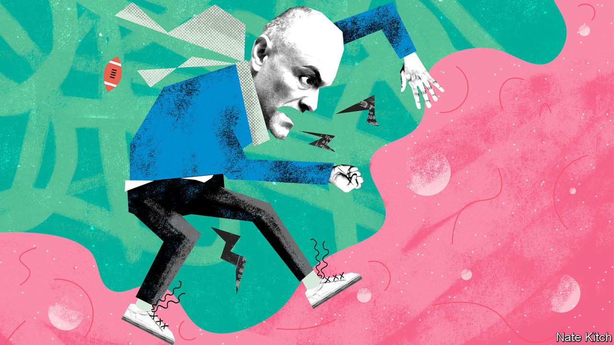

## Bagehot

# Cummings v the blob

> The prime minister’s special adviser faces a tough adversary

> Feb 6th 2020

FOR A MAN widely regarded as a cross between Machiavelli and Rasputin, Dominic Cummings has lost a lot of battles lately. The prime minister’s special adviser opposed both Huawei’s involvement in Britain’s 5G networks and the HS2 rail network (which he labelled “a disaster zone”). Boris Johnson has given the green light to the first and is shortly expected to approve the second. Mr Cummings’s plan to cut the size of the cabinet and create a super-department of business has been ditched. So have his schemes to turn Downing Street into a NASA-style mission-control centre and to ship Conservative Party headquarters to the north of the country.

He suffered yet another embarrassment this week when he tried to challenge the prerogatives of the lobby—the collection of political journalists who get special briefings from “Westminster sources”. Mr Cummings has been waging war on the media for some time, for instance by banning ministers from appearing on programmes that he regards as hostile, and he kicked the conflict up a notch on February 3rd, allowing only selected members of the lobby to attend a briefing. The rejects included a disproportionate number of journalists from left-wing publications.

Mr Cummings’s attack on the lobby was as politically inept as it was illiberal. The entire lobby walked out of Downing Street in solidarity and even the Tory-backing Daily Mail wrote an angry editorial. And rightly so: Mr Cummings offended against a basic principle of a free society that the government can’t pick and choose who gets official press briefings. Mr Cummings made his reputation as a campaigner, and campaigners can set whatever rules they like for the press. Government officials need to understand that they are accountable to the public that pays their salaries.

Yet Mr Cummings should not be written off as a spent force or serial bungler. His squabble with journalists is part of a wider war on what he likes to call “the blob”—the BBC, the universities, the quangos, the law courts and the Whitehall machine—whose functionaries slither from one comfortable berth to another regardless of who wins the general election.

Mr Cummings explains his loathing for the blob in his long and entertaining blog. He argues that it is made up of “grotesque incompetents” who managed to lose the EU referendum despite having the resources of the state at their disposal. They think alike; they are more interested in using ideas to signal that they’re respectable members of the in-group than in engaging in constructive argument; they are woefully ignorant of vital forces such as AI that are revolutionising the world. A recent advertisement for “weirdos and misfits” to join him in Downing Street nicely illustrates his thinking. “What SW1 needs,” he argues, dismissing the collective brainpower of the district that includes the country’s politicians and top civil servants, is “true cognitive diversity” rather than “more drivel about ‘identity’ and ‘diversity’ from Oxbridge humanities graduates.”

The term “blob” was originally invented by William Bennett, America’s education secretary in 1985-88, to describe the nexus of officials, teachers and educationalists who always had an argument against what the government wanted to do. Mr Cummings once worked as a special adviser to Michael Gove, then education secretary and subsequently one of the principal forces driving the campaign to leave the EU. Messrs Gove and Cummings happily borrowed it. The two battled furiously for more self-governing academies free from local-authority oversight. They fought the blob—and the blob fought back. David Cameron grew so worried that the government was alienating parents and teachers that he moved Mr Gove sideways and banned Mr Cummings from working in Whitehall, dubbing him a “career psychopath”.

But as the referendum proved, Mr Cummings is closer to the spirit of the modern Conservative Party than is Mr Cameron. The party is never happier than when it is slaying dragons. And now that the trade unions and the Eurocrats are lying prone the blob is a promising adversary. It is full of bureaucrats who have grown fat on restrictive practices and gripped by a woke ideology that started in university campuses but is now spreading to law and business.

Despite Mr Cummings’s recent setbacks, the war against the blob is advancing on several fronts. Take the BBC. The government is holding a public consultation into the case for decriminalising the non-payment of television licences, through which the BBC is funded. Or the senior judiciary. Furious at the Supreme Court’s unanimous decision against Mr Johnson’s proroguing of Parliament last year, some leading Conservatives are thinking of using the opportunity of a constitutional review, announced in the manifesto, to abolish the Supreme Court and return its functions to the House of Lords.

The government is taking on some more unlikely examples of “blobism”. It is increasingly treating the Confederation of British Industry (CBI) as a bosses’ trade union that is more interested in spouting platitudes about corporate social responsibility than embracing disruption. Mr Johnson delivered the organisation a calculated snub this week by not inviting any of its representatives to his big speech on Britain’s future trading relationships.

And Mr Cummings has an even bigger force on his side than the Conservative Party’s instincts—the technological revolution that is reordering the world and that, according to him, most people in SW1 know almost nothing about. It is particularly menacing for the liberal professions that depend on licences and restrictive practices. Can the BBC survive in a world of multi-screens and multichannels? Or can the CBI continue to represent business when companies are being born and destroyed at a furious rate?

The combative Mr Cummings may pick too many fights for his own good. He might get edged out of Downing Street, or just flounce out. But if that happens, the blob should not kid itself that it has won, for it has other, more dangerous enemies. ■