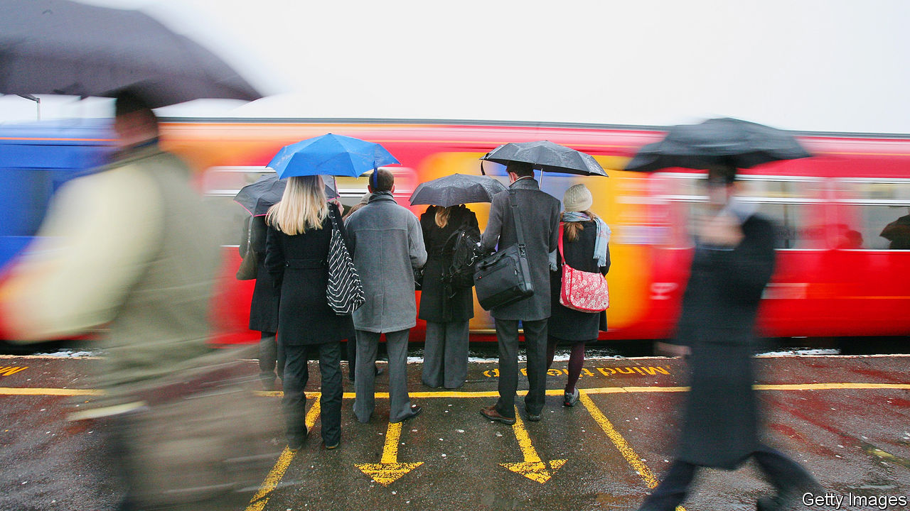
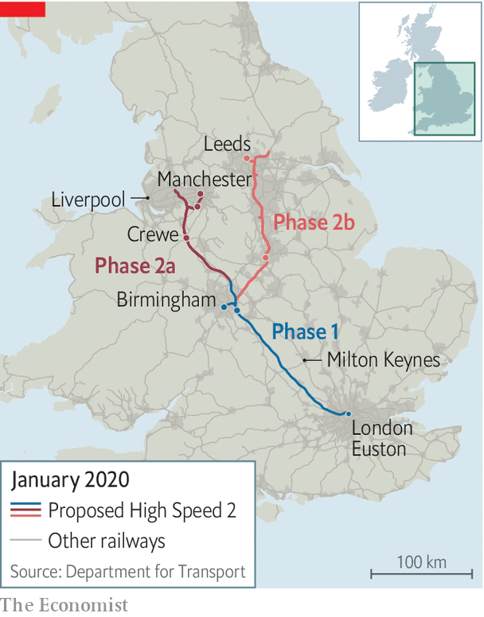

## Rail

# HS2 and the return of the fat controller

> Labour promised to renationalise the railways. The government is sort-of doing it anyway

> Feb 6th 2020

THE RUSH to board the 17.46 from London Euston to Crewe begins the moment the platform is announced. Passengers, many of them commuting the 33 minutes to Milton Keynes, run past the gates while station staff try to keep out of their way. The train’s eight carriages, in theory, each carry 70 passengers. But the London-Crewe line is Britain’s busiest rail service. It leaves Euston carrying, on average, more than twice as many passengers as it has capacity for. Sitting on the floor, Becky, a local government worker laments that, “It’s like this every day. I get a seat maybe once a week. And I pay five grand for this season ticket.”

At peak times 19% of London rail users are forced to stand. The problems stretch across Britain: 17% are seatless at peak times in Birmingham and 15% in Leeds. With a poor punctuality performance by international standards and a high cancellation rate, commuting by rail in Britain is often a miserable experience. The government is now set to try to relieve some of the suffering with a major expansion of Britain’s rail network and a reorganisation of the sector. More government money looks set to be coupled with more government direction. The fat controller is returning to the railway.

Britain’s railways have a physical geography that reflects the economy of the Victorian era and an ownership structure based on decisions taken in the early 1990s. Both now look set to be reformed. The government is expected to give the go-ahead to High Speed 2 (HS2), a new line from London to the Midlands and the north, while the Williams Review of the structure of the sector is due to report in the coming weeks.

After the Victorian boom, the railways went into a long decline. Traffic fell for half a century after the second world war. But over the past 25 years they have more than doubled: there were 1.8bn rail journeys in 2018-19, more than at any time since the early 1920s. But while in 1963 Britain had 17,500 miles of track, it now has under 10,000 miles.

That is the root cause of much of the commuter woe. According to the Railway Industry Association track utilisation is 60% higher in Britain than the EU average. According to Network Rail, the publicly owned manager of the track, around 70% of delays are the knock-on effects of congestion. The shrinkage of Britain’s network has also forced operators to run freight, intercity and commuter trains on the same stretches of track. The need to accommodate slower running stopping trains reduces the number of higher speed trains which can run on the same length of track. In mainland Europe, there has been a push to move freight and commuter trains onto different lines.

The core argument for HS2 was always about capacity, but in the late 2000s the then transport secretary Andrew Adonis (a real “rail geek”, according to transport officials) was determined to build a super high spec line rather than simply mirroring the existing West Coast Mainline. The result is HS2, which will run from London to Manchester and Leeds (see map).

The plan is ambitious. Eighteen trains an hour will run to and from London compared with a typical two to six an hour on continental high-speed lines. That volume of traffic requires a greater level of structural reinforcement and Britain’s new line will generally be in a sunken embankment rather than running at surface level. A certain macho enthusiasm to achieve greater speeds than France means the lines will have to be straighter to reduce the need for slowing on bends.

The project was greenlit in 2012 and placed under review last summer by Boris Johnson, partly because of opposition from MPS with constituencies the train would go through, and partly because of cost escalations. An initial estimate of £42bn a decade ago has now risen to around £100bn, or roughly 5% of GDP. The most recent official benefit-cost ratio estimate still suggests the project is value for money. Rail bosses argue that alternative schemes to increase capacity would not work in Britain. The double-decker trains used in the Netherlands and Italy are too wide for Britain’s track, and longer trains would mean building longer platforms all over Britain.

Perhaps as important as network expansion is industry structure. The government has taken back control of two of the franchises operated by private companies that ran northern and east-coast routes, but renationalisation is an interim measure. In the longer run, the government is likely to change the relationship between the state and the operating companies.

Britain’s model of railway ownership—large multi-year regional franchises—is unique in major countries. According to a former rail boss, the structure reflects the way the railways were seen in the run-up to privatisation in the early 1990s—as a sunset industry with declining passenger numbers and not much hope of a turnaround. The franchises were designed to attract bidders who would be able to manage decline while making some money rather than as components in a network vital to the economy.

Rail’s recent renaissance has changed all that. The industry expects the Williams Review to recommend a move from a franchise model to a concession one, as already used in London Overground and Merseyrail and is common overseas.

Under the concession model, private firms still manage trains but they do so for a fee and pass on the fare income to the government. The model should make it easier to maximise economic benefit to the country rather than operator profits. It could mean, for example, more trains at peak times and more co-ordination across routes. It has worked well in London and Merseyside. But with more control comes more financial risk. If a recession or a new technology, such as driverless cars, emerges as a serious competitor, taxpayers will bear the losses.

The problem will be matching up the rail geography of Britain to the political geography. In London and Merseyside an authority exists to run the concession process but it is hard to see who could manage the Transpennine route, which cuts across several local boundaries or the larger intercity network contracts. Whatever the size of his waistline, the transport secretary will be back in control.■

## URL

https://www.economist.com/britain/2020/02/06/hs2-and-the-return-of-the-fat-controller
