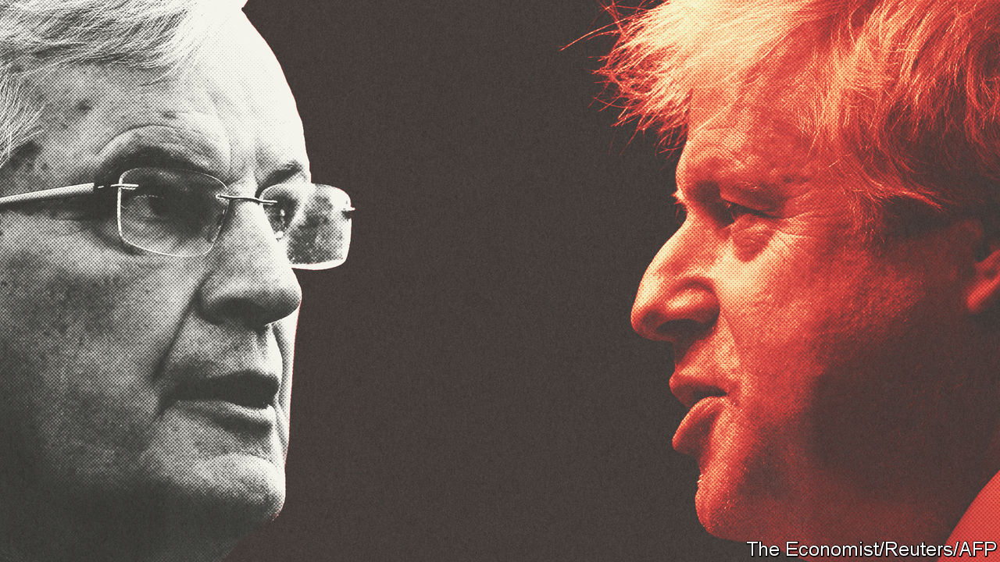

## EU-UK negotiations

# The risk of Britain leaving the EU with no trade deal remains high

> Compromise ought to be possible but is not guaranteed by year-end

> Feb 6th 2020BRUSSELS AND LONDON

IF BREXIT-WEARY BRITONS hoped they would be able to read about something other than deadlocked talks once they had left the EU, they were disappointed this week. The transition period into which Britain has gone lasts only until the end of the year, by which time a trade deal needs to be done. But when negotiations began on February 3rd, the differences between the two sides seemed as wide as ever.

It was Britain’s choice, insisted Michel Barnier, the EU’s chief negotiator, to have a more distant relationship than the EU had wanted. But he said the bloc was ready to offer a zero-tariff, zero-quota free-trade deal that is more generous even than Canada’s—with conditions.

The most contentious is a “level playing-field” designed to prevent Britain from undercutting its largest trading partner. This, says the EU, will require British observance of EU rules on state aid to companies and on environmental, workplace and labour standards. The EU also wants to maintain its access to British fishing waters. And it insists on a governance system for settling disputes that maintains a role for the European Court of Justice (ECJ).

Speaking in the old Royal Naval College, Greenwich, a monument to Britain’s seafaring power, Boris Johnson dismissed these demands in muscular terms. He wants a free-trade deal like Canada’s. But just as Canada is not bound by stringent level-playing-field conditions, Britain should not be. There was no need for any deal to involve accepting EU rules on competition, subsidies, social protection or the environment. Instead, he argued, Brussels should trust his promises to keep to the highest possible standards. The EU, already suspicious that Britain may not fulfil its obligations under the withdrawal treaty to impose border controls between Northern Ireland and Great Britain, is reluctant to rely on trust alone.

As for fish, Mr Johnson declared that the EU must accept British control of its own waters. Nor could post-Brexit Britain allow any ECJ jurisdiction over its laws. And if a Canada-style deal cannot be negotiated by year-end, he concluded, Britain would be happy to trade like Australia. That is a euphemism for having no-deal and instead trading on World Trade Organisation terms (in fact, Australia is trying to get its own free-trade deal with the EU).

There is only limited time in which to narrow such differences. That is because, against the EU’s advice, Mr Johnson is refusing even to consider extending the transition period beyond the end of the year. The withdrawal treaty allows him to ask for this by the end of June. But EU lawyers say that, if he misses this deadline, it will no longer be possible to get more time.

Yet a free-trade deal that takes in not only goods but also extras like services, data rules, public procurement, aviation, transport and security normally takes several years to agree (and more to ratify). When talks begin in March they will at first see more posturing than negotiating. EU diplomats do not expect real horse-trading to begin until June. As Mujtaba Rahman of the Eurasia Group consultancy says, the time-frame with just months left will dictate the terms of any deal, not the other way round. And that means a bare-bones agreement covering mostly trade in goods.

The big question is whether even this will now be possible. Much gloomy commentary suggests not; but there is a decent chance that it might. After all, both sides prefer a deal to no-deal. As Mr Johnson’s flexibility over the withdrawal treaty last year shows, he is willing to make big concessions to get agreement. Unlike Theresa May, his predecessor, he has a huge parliamentary majority, which means that he need not worry about Westminster MPs rejecting it. Even on fish, his offer of an annual agreement on catchable quotas points to some room for compromise.

As for the EU, its hard line on the level playing-field could yet soften. What matters, says a diplomat, is not forcing Britain to adhere religiously to EU rules but having a reliable enforcement mechanism if it strays. He calls this having a gun on the table that can be picked up and fired if need be. Even the role of the ECJ in a governance structure can be fudged: it must have the exclusive right to interpret the EU’s laws and thus police its side of any deal, but that need not imply intrusion into Britain’s.

Geopolitics would urge a deal, too. Nobody in the EU wants Britain to drift off across the Atlantic or towards Asia. And despite chatter by some of his more rabid allies, there is little sign that Mr Johnson favours either (though he is bullish about a trade deal with America). Failure to reach even a basic agreement would reflect badly on both sides. And it ought to be possible later to build on such a plain deal to cover the more complex issues left over.

A big worry is that both sides may be drawing the wrong conclusions from the tortuous negotiations on the withdrawal treaty. The EU reckons it won by being firm and united, and by using its superior weight to force successive British prime ministers into concessions. Mr Johnson believes that Mrs May failed because she was not ready to walk away from the table and into no-deal, partly because her own MPs would not let her. Brussels may be underestimating a newly empowered Mr Johnson’s willingness to accept no-deal, while the prime minister may be overestimating the EU’s fear of this outcome.

This is partly because, for both sides, the cost of no-deal has shrunk. The withdrawal treaty will remain in place to cover the first-round issues of money, EU citizens and averting a hard Irish border. Except for a few vulnerable sectors, the trade losses from moving from unfettered single-market access into a bare-bones deal for goods are not that much greater than those of switching to trade on WTO terms alone. If the political price for either side to reach an agreement starts to look too high, no-deal may start looking like a plausible alternative. That is the biggest reason why it might actually happen.■

## URL

https://www.economist.com/britain/2020/02/06/the-risk-of-britain-leaving-the-eu-with-no-trade-deal-remains-high
