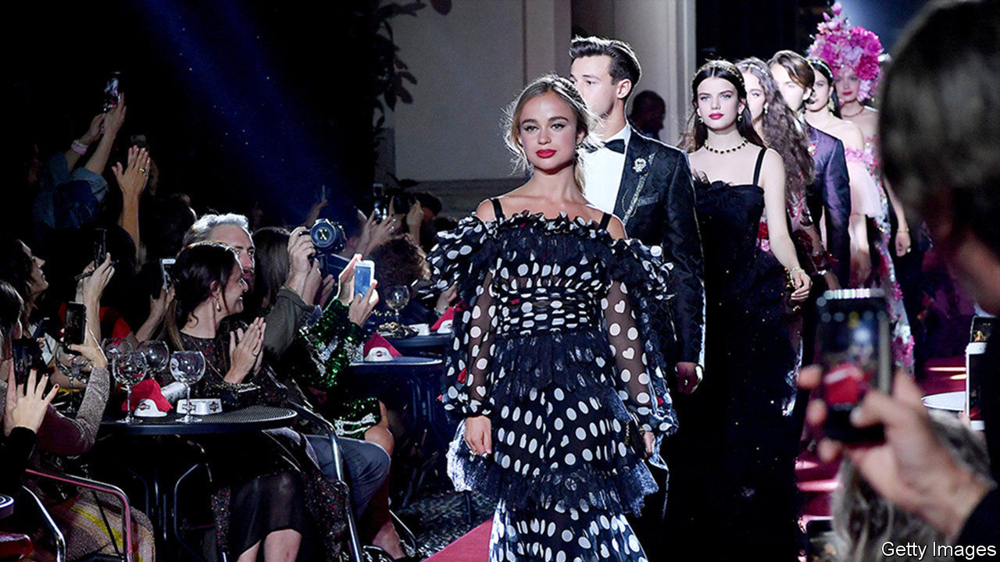

## Courting fame

# Why aristocrats are flocking to the creative arts

> Once they ran the empire, today they run Instagram accounts

> Feb 6th 2020

PETER CZERNIN is a successful Hollywood film producer who has been nominated for an Oscar. Yet the Internet Movie Database (IMDb) is more interested in his blood than his talent. “I was horrified to see that it said, ‘Peter Czernin is the heir to a baronial title’,” he says. “I don’t want to be defined by the fact that I’m the grandson of the Baron Howard de Walden.”

Prince Harry and Meghan Markle’s decision to choose Disney over ribbon-cutting startled their family and fans, but they are part of a broader trend. A genealogical audit of the modern House of Windsor reveals that 42% of King George V’s great-great-grandchildren—who are mostly young adults today—work in the arts and entertainment businesses.

It was not always thus. Just six of Queen Victoria’s 132 great-great-grandchildren landed in the creative industries, not that they would have recognised the term. Some ended up penniless; many more were in public service. Today’s lot are better off—the modern economy has been kind to those well-endowed with property—and tend to be enmeshed in a celebrity circus of professional creatives and Instagram icons. Lady Amelia Windsor, granddaughter of the Duke of Kent, is a model and social media influencer. Her brother, Lord Downpatrick, founded a fashion brand. The Lascelles family, descended from Mary, Princess Royal, is now thick with musicians and filmmakers. Other aristos have been muses to Giorgio Armani, made crystal jewellery and daubed graffiti.

Aristocrats presumably choose the creative arts because they offer pleasanter and more prestigious employment than most fields do, there is no clear definition of success, and the low pay and scant benefits common in the industry’s lower reaches are less troublesome to those whose existences are cushioned by wealth. Why the creative arts should choose aristocrats takes a bit more explaining.

It could be connections. Those help, particularly in the art-dealing business, which involves persuading one lot of rich people to sell their paintings and another lot to buy them. Princess Eugenie and Lady Helen Taylor are art dealers. Not all aristocrats are happy to admit the power of connections. “There are individuals who’ve assumed I live a particular lifestyle and have managed to obtain my role in the luxury industry thanks to help from my extended family,” says Zenouska Mowatt, who is 56th in line to the throne. She works at Halcyon Days, who make luxury enamelled goods and have three Royal Warrants.

But it may have more to do with what has happened to the creative arts. Success in the field depends on the ability to market oneself, and people with a bit of inherited stardust have a big advantage on social media. Sam Chatto’s 60,000 Instagram followers may be attracted by his ceramics, but the fact that he is Princess Margaret’s grandson probably adds to his charms.

Many younger aristocrats’ brands and businesses are intertwined with their families’. The Manners sisters, two models and a singer, daughters of the Duke of Rutland, use their popular social media accounts to promote events at Belvoir Castle, the family’s estate. Viscountess Weymouth’s recent stint on “Strictly Come Dancing”, a TV show, raised the profile of Longleat House, the family seat, along with aristocratic eyebrows. Viscountess Hinchingbrooke is an American blogger whose appearance on “An American Aristocrat’s Guide to Great Estates” and “Ladies of London” has boosted turnover at Mapperton House.

Sam Friedman, a member of the government’s social mobility commission, thinks aristocrats in the creative arts have some cultural significance. “These are people who are mediating really important stories about who the British are today.” Economically, though, their new occupations probably do not add up to much: the Earl of Burlington’s photography and his wife’s fashion business are not what’s keeping Chatsworth House standing. And whether what they do actually counts as work or not varies from case to case. “There are some,” says Mr Czernin, “who think ‘job’ is just a book in the Old Testament.” ■

## URL

https://www.economist.com/britain/2020/02/06/why-aristocrats-are-flocking-to-the-creative-arts
