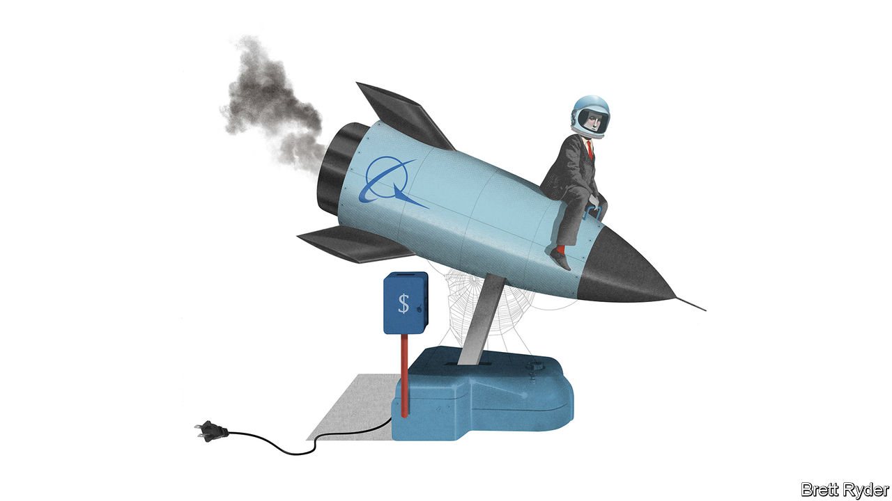

## Schumpeter

# Away from the headlines, defence is Boeing’s next problem

> It is missing out on a boom in America’s military spending

> Feb 8th 2020

AMID THE crisis over the 737 MAX it is easy to forget that there is more to Boeing than passenger jets. Its Minuteman intercontinental ballistic missiles, which John F. Kennedy called America’s “ace in the hole” during the Cuban missile crisis, and the B-52 bombers (“Big Ugly Fat Fellas”) that lumbered over Vietnam are not just part of America’s 20th-century iconography. These pieces of military hardware are still in use today. Boeing’s space business, which helped put Americans on the Moon, is again trying to fly them into orbit. With its huge commercial-aviation division in disarray, it should fall to Boeing’s venerable defence, space and security division (known as BDS) to bolster earnings and morale. Yet it, too, appears to be suffering from neglect: subscale, long in the tooth and in slow relative decline.

For most military contractors apart from Boeing, this is boom time in America. Defence budgets have increased since the start of Donald Trump’s presidency in 2017. Share prices are buoyant. Last year revenues at Lockheed Martin, Northrop Grumman and Raytheon rose by more than 10% on average, largely because of snazzy fighter-jet and missile contracts. At BDS they fell by 1%.

The reasons for BDS’s weakness were not MAX-related. They reflected a combination of factors, including the end of sales of C-17 transport aircraft and Boeing’s costly failure just before Christmas to dock its Starliner spacecraft at the International Space Station. Some revenue also went into Boeing’s relatively new services arm. Few analysts cared. As Ken Herbert of Canaccord Genuity, a financial firm, notes, the MAX crisis has sucked everyone’s attention away from other parts of the business. Still, deep-seated problems at BDS could weigh further on Boeing’s profitability and reputation even once it puts the MAX crisis behind it. As if he did not already have enough on his plate, David Calhoun, Boeing’s new boss, faces a strategic quandary.

Boeing has long proclaimed the merits of running defence and space alongside its commercial-aircraft business. Though the commercial side is bigger, their relative weights fluctuate in times of trouble. Last year, for instance, as a result of the MAX’s grounding, commercial-aviation’s share of group revenues fell from 57% to 42%. BDS’s share jumped to 34% from 26%. While the commercial arm suffered a huge loss, BDS made a decent profit. This shows how the structure can help smooth earnings. The company says that BDS showed its mettle in 2018 by winning highly contested defence contracts, such as a programme to provide trainer jets to the air force and aerial refuelling drones to the navy, which could be highly lucrative. Moreover, the almost 50-year-old F-15 fighter jet, one of its profitable warhorses, has been given a new lease of life. Late last month the air force said it would buy from Boeing its first new F-15EXs.

This account masks problems. Some were long overlooked while its passenger-jet business was booming. First, BDS is sub-scale. Its revenues last year were less than half those of Lockheed, and a bit smaller than those of Northrop and Raytheon. Its capital expenditure was a sixth of an average of the three. It is decades since Boeing won the most coveted sort of Pentagon contract, to design and build a new military aircraft from scratch. BDS has no role in the F-35 Joint Strike Fighter led by Lockheed, nor in Northrop’s long-range stealth bomber. Both could reap huge windfalls for their makers. Its lack of commitment to bold innovation is reminiscent of Boeing’s fateful decision to tweak the ageing 737, which ultimately contributed to the MAX’s tragic technical failures, because of pressure to keep up with Airbus, its biggest passenger-jet rival.

Second, it is poor at carrying out the projects it wins. This is a growing financial risk, because the Pentagon is offering fewer cushy “cost-plus” contracts, where it pays contractors an agreed premium over a project’s expenses. These are being replaced by fixed-price deals in which the armsmakers bear more risk. Soon after winning the trainer-jet and drone contracts in 2018, Boeing recorded a nearly $700m loss on them, suggesting it had underestimated development costs. It has also booked losses of more than $3.7bn on a long-overdue contract, potentially worth $44bn, to provide airborne tankers to refuel planes. The air force has criticised Boeing’s performance on the nine-year-old project.

Third, the MAX crisis compounds BDS’s problems. Defence contracts are lumpy, requiring high upfront spending for a large long-term pay-off. While Boeing is burning cash with the MAX, its ability to bid big in defence contracts is constrained. Last year the company pulled out of a contest worth at least $62bn to replace the Minuteman-series missiles, the sort of contract that used to be its bread and butter. Boeing insists its withdrawal had nothing to do with the MAX crisis. Analysts speculated that the cash commitment required to win this Ground-Based Strategic Deterrent contract may nevertheless have played a role in its decision.

If the MAX returns to the skies soon, as Boeing hopes, investors’ attention may turn to bigger-picture issues, including the future of the defence business, says Seth Seifman of JPMorgan Chase, a bank. One option is a break-up, but if nothing else, the bigger Boeing is, the less likely it will be allowed to fail. BDS’s main customer, America’s Defence Department, which frets about insufficient competition, would object to any weakening of BDS. So would many Boeing investors, who hope budgets for defence and space will keep rising if Mr Trump is re-elected. Yet Boeing may need to consider selective defence and space divestments, perhaps combined with targeted acquisitions. It is increasingly clear to everyone, including no doubt Mr Calhoun, that Boeing’s problems go beyond the MAX. The company is misfiring on many cylinders. The Big Ugly Fat Fella, a lovely moniker for a B-52, sounds less appealing when applied to Boeing itself.■

## URL

https://www.economist.com/business/2020/02/08/away-from-the-headlines-defence-is-boeings-next-problem
