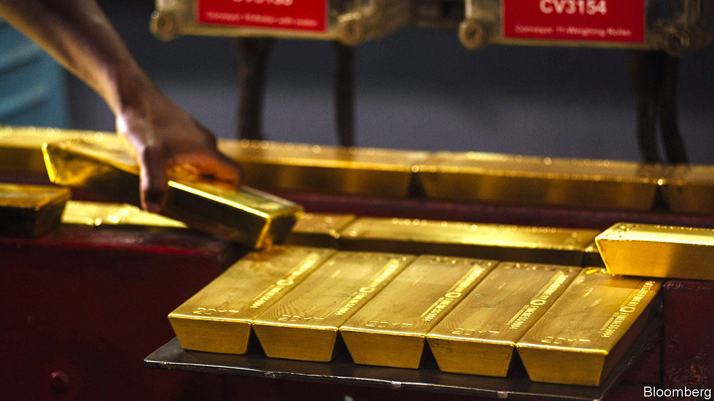
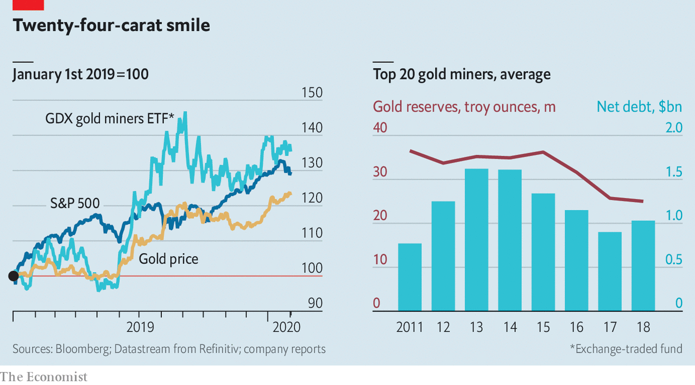

## Golden retrievers

# Gold companies try to restore their sparkle

> The mining industry’s glitterati have not dug themselves out of their hole quite yet

> Feb 6th 2020CAPE TOWN

FOR MUCH of the 2010s gold companies looked rather leaden. At roughly $300bn the world’s dozens of listed gold firms have a combined market value that is less than that of the maker of Nescafé Gold coffee. Yet when miners of all the Earth’s riches gathered in Cape Town on February 3rd-6th for their biggest investment jamboree of the year, those digging for the shiny stuff were aglitter. As economic uncertainty and low interest rates pushed gold prices up by 19% last year, the quickest rate since 2010, goldminers’ share prices surged, too—and twice as fast.

Mining the yellow metal is a thankless business. Gold executives must reinvest constantly just to sustain production—the average gold deposit is smaller and more rapidly depleted than many other ores. At the same time, they must return money to shareholders, pay taxes and royalties in countries where they operate and safely close ageing mines that used cyanide to leach gold from ore. For years many firms balanced these demands with the grace of a toddler bearing a tray of champagne. As they unveil their full-year earnings in the coming weeks, their investors are looking for signs of sure-footedness.

In the last big bull market for gold, from 2009 to 2012, companies splurged on big deals and loaded up on debt. A subsequent fall in prices exposed poor management, says Josh Wolfson of RBC Capital Markets, an investment bank. In the past five years gold companies’ return on equity was negative 5%, even as companies in the S&P 500 index averaged a positive return of 15%.

Now gold firms are benefiting from an amalgam of pricier gold and cheapish oil, which is an important input. But miners have also learned from past mistakes. Between 2013 and 2017 the aggregate net debt of the top 20 gold companies tracked byGDX, a specialised exchange-traded fund, fell by 42%. Costs to sustain production dropped by about 20% from 2012 to 2017, says Credit Suisse, a bank.

The industry has consolidated. Last year saw more than $33bn of mergers, acquisitions and joint ventures (JVs), according to Refinitiv, a data provider. That included two mega-deals. Barrick Gold of Canada paid $7bn, including net debt, for Randgold Resources, with mines across Africa. Newmont Mining, an American firm, purchased Goldcorp, another Canadian one, for $12bn. Many companies, including Barrick and Newmont, are at last shovelling more cash to shareholders.

Gold bosses must now prove that all the dealmaking was wise. Barrick’s new chief executive, Mark Bristow, earned investors’ trust as head of Randgold, which successfully weathered past declines in the gold price. There were too many mediocre managers and not enough good assets to go around, Mr Bristow says. Scale, he contends, will attract more non-specialist investors to the industry.

Mr Bristow has moved quickly to make his case for consolidation. He has trimmed Barrick’s head office and settled a long-running tax dispute with the government of Tanzania. When Barrick’s hostile bid for Newmont failed, he helped engineer a JV between the two, which is wringing savings from their vast assets in Nevada. Since some of the world’s most promising remaining deposits of gold also produce copper, Mr Bristow wants to dig up more of the red metal (demand for which should grow with the real economy, where it has a practical use).

The industry has not dug itself out of its hole quite yet. The miners’ recent spending restraint has also meant less money for all-important exploration. Since 2011 the reserves of the 20 biggest GDX firms have fallen by 36%, to 12,400 tonnes (worth $624bn at current prices). Analysts reckon that gold production may be about to peak, with declines forecast in the 2020s.

At the same time, investors increasingly attentive to firms’ environmental, social and governance metrics eye with suspicion energy-intensive businesses operating in places with a history of corruption and instability—or, as goldminers describe them, “complex jurisdictions”. Despite gold companies’ efforts to lower carbon emissions and behave more ethically, investors still see the grubby reputational risk of crude, minus the generous dividends.■

## URL

https://www.economist.com/business/2020/02/06/gold-companies-try-to-restore-their-sparkle
