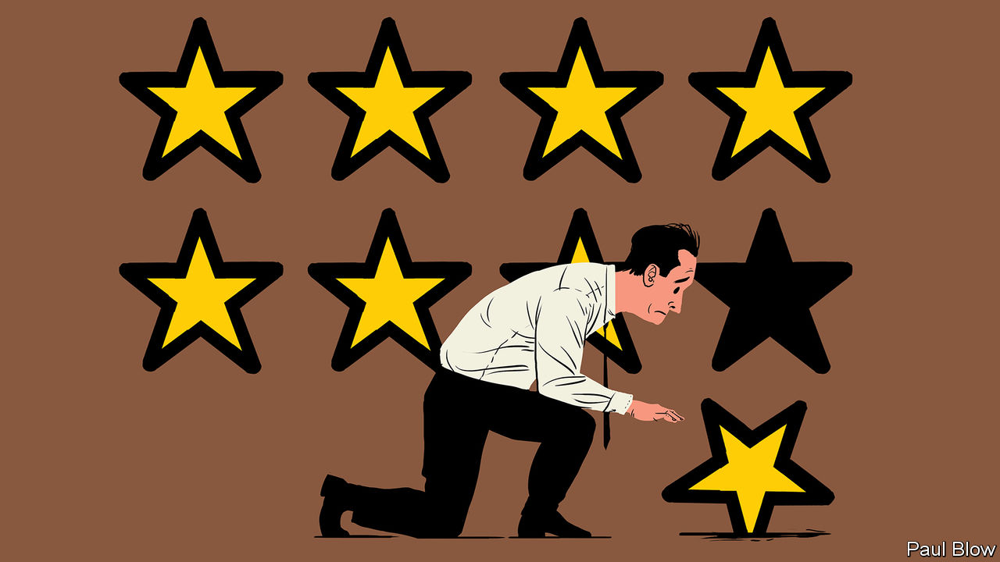

## Bartleby

# How modern workers are at the mercy of ratings

> I am Number 0.6

> Feb 6th 2020

A CLOSE FRIEND of Bartleby’s just got the news that their department was shedding 2.6 workers. At first sight, the concept of 0.6 of a worker sounds pretty odd. But workers who are freelance, on temporary contracts, or in part-time employment register in the headcount as less than a whole number.

Being classed as 0.6 of a worker seems dehumanising. Few people want to be thought of as just a number, let alone a fraction. In “The Prisoner”, a cult British television series from the 1960s, the hero, played by Patrick McGoohan, resigns from his job as a secret agent only to be abducted and taken to a village. He is only referred to as “Number 6” and his frequent escape attempts are frustrated.

Although he insists that “I am not a number, I am a free man”, the audience never learns his name. The programme has a very 1960s vibe—it focuses on the individual’s efforts to assert himself in the face of a repressive, conformist society. At one point, the title character declares: “I will not be pushed, filed, stamped, indexed, briefed, debriefed or numbered. My life is my own.”

These days many workers would sympathise. They feel pushed, filed, indexed and numbered. When they apply for a job, they may be assessed by artificial intelligence, which parses résumés for key words without which an applicant’s odds of an interview lengthen. Based on works like “Evidence-Based Recruiting” by Atta Tarki, who claims that scores in general-mental-ability tests have a strong 65% correlation with job performance, firms may ask candidates to take an intelligence test.

When they get a job, employees find the indexing and numbering continues. Workers at warehouses have to pick a certain number of items per hour; those at call-centres are assessed by software that monitors their hourly number of calls, and the amount of time spent on each one. Fall behind the target and you may feel unable to take a break. When their task is completed, employees are often rated again, this time by the customers.

Manufacturing workers have long faced these kind of numerical targets, as well as the need to clock in and out of work. The big change is that similar metrics and rating systems are spreading to more and more parts of the economy. Academics get rated by students; nurses may be judged on a “behaviourally anchored rating scale” which assesses how much empathy they showed to patients.

Ratings are at the heart of the gig economy, where workers are connected with employers and customers via the internet. Just as TripAdvisor ratings allow holidaymakers to assess hotels, Uber drivers get a score out of five. The same goes for ratings on services like TaskRabbit (for odd jobs) and Etsy (for arts-and-crafts sellers).

Such systems are understandable in parts of the economy where output is difficult to measure precisely. But they can be arbitrary. People might give an Uber driver a poor rating because they are in a bad mood or because they encountered unexpected traffic disruption (the drivers themselves also rate customers, which is meant to discourage abuse).

The result can be increased insecurity for gig-economy workers. Their income is uncertain when they are at the mercy of the assessment system. Even a tiny fall in their rating—of, say, 0.6—can harm their job prospects. A detailed study* of 65 gig-economy workers found that they relished their independence but it came with a host of personal, social and economic anxieties.

Even full-time workers may find themselves dependent on their score in one category or another. Businesses want to avoid accusations of hiring biases on grounds of gender or ethnicity; using “objective” rating systems can protect them from discrimination lawsuits. And employees need to be concerned about how they are rated.

Gianpiero Petriglieri of the INSEAD business school says that, since firms no longer offer jobs for life, everyone is an independent worker whether they like it or not. The key passage in your CV may not be the universities you attended, but your rating in categories like teamwork, innovation and adaptability.

Heaven forbid, the system even extends to journalists. Some publications reward writers based on the number of clicks their articles attract. Find out more in next week’s Bartleby column: “How the Kim Kardashian diet can boost your IQ and job prospects”.

* “Thriving in the gig economy”, by Gianpiero Petriglieri, Susan Ashford and Amy Wrzesniewski, Harvard Business Review, March-April 2018