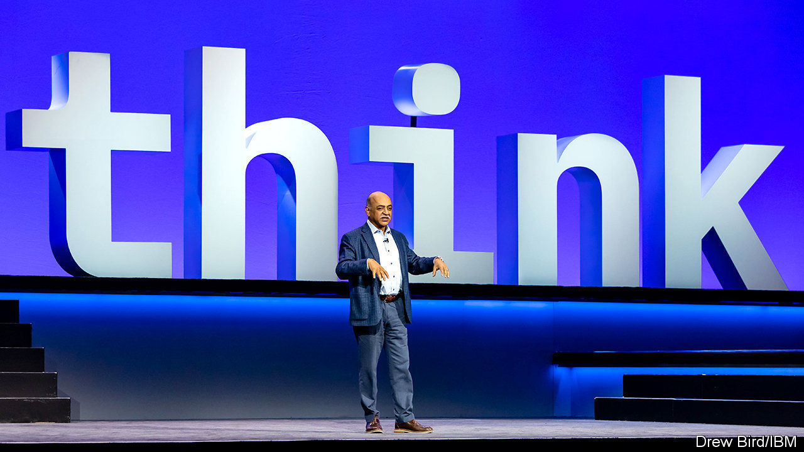

## Time for an update

# Talk of succession atop Big Tech grows louder

> Giants including Salesforce, Apple and Microsoft may get new bosses in the next year or two

> Feb 6th 2020

MOST BOSSES, even of multibillion-dollar businesses, are anonymous to anyone who is not their employee or an equity analyst. Except, that is, technology bosses—and not just founders like Amazon’s Jeff Bezos or Mark Zuckerberg of Facebook. Many bystanders are familiar with the bespectacled visages of Satya Nadella, who runs Microsoft, or Tim Cook, from Apple. Over the next year or so people may need to learn some new faces.

The first notable tech succession of the decade was announced on January 30th, when IBM said that Arvind Krishna will take over from Ginni Rometty, a rare female Big Tech boss, in April. Two days later Sandeep Mathrani was named as the chief executive of WeWork, a troubled pseudo-tech firm which rents office space. In December Google’s founders, Larry Page and Sergei Brin, handed control of Alphabet, the search firm’s parent company, to Sundar Pichai, who ran its core business.

More turnover is afoot. Marc Benioff, founder and co-CEO of Salesforce, which sells cloud-based business services, is expected to step down this year. Some Uber investors and executives wonder if Dara Khosrowshahi is the right person to bring the ride-hailing giant to profitability. Questions are even being raised about superstars like Mr Cook, who turns 60 in November and will then have run Apple for nearly a decade, and Mr Nadella, a 52-year-old who has been in the top job for six years. Who takes their place will say a lot about America Inc’s sexiest sector.

The names bandied about share a lot in common. For one thing, they are all male. Mr Cook’s heir-apparent is Jeff Williams, currently in charge of the iPhone-maker’s operations. Mr Nadella’s likeliest replacement is Kevin Scott, Microsoft’s chief technology officer, whose upcoming tome, “Reprogramming the American Dream”, looks like a book-length job application. Mr Benioff is expected to hand over his co-CEO role to Bret Taylor, Salesforce’s president and chief operations officer.

Ms Rometty’s departure leaves only two prominent female leaders in tech: Lisa Su at AMD, a chip-design firm (who was reportedly considered for the IBM job) and Safra Catz at Oracle (though Larry Ellison remains the power behind the throne at the business-software giant he founded). Microsoft has nurtured a generation of impressive female talent, including Lila Tretikov, a vice-president of its artificial-intelligence (AI) business. But none of these executives appears likely to succeed Mr Nadella unless he sticks around for a few years more.

Besides more men, Big Tech corner offices can expect more geeks. Whereas Ms Rometty and Mr Benioff came from sales, Mr Krishna (who oversees IBM’s cloud and AI business) and Mr Taylor (who worked as Facebook’s technology chief before he joined Salesforce) are engineers by trade. Mr Williams, too, has an engineering degree. Mr Scott is a computer scientist. All are also seasoned managers by now.

Each new CEO will face distinct challenges. Mr Krishna has to complete IBM’s pivot from conventional computing, such as mainframes and information-technology services, to AI and the cloud. Mr Taylor would have to integrate Salesforce’s recent acquisitions. Mr Williams’s main task would be to grow Apple’s services business as it sells fewer iPhones. Whoever takes over at Microsoft must ensure that Mr Nadella’s remarkable reinvention of the software-maker as a big-data and cloud-computing behemoth stays on course.

If Mr Benioff goes, only three of America’s ten biggest tech firms will be run by their creators: Amazon, Dell and Facebook. Mr Bezos and Michael Dell are in their 50s. Mr Zuckerberg is a stripling 35. Neither is going anywhere; Mr Dell tried retirement once before and it did not agree with him. They could nevertheless take some pointers from tech’s new chiefs, who tend to be less abrasive and more politic than flamboyant founders. Those are useful traits at a time of techlash from politicians and calls for cuddlier behaviour from woke consumers and employees.■

## URL

https://www.economist.com/business/2020/02/06/talk-of-succession-atop-big-tech-grows-louder
