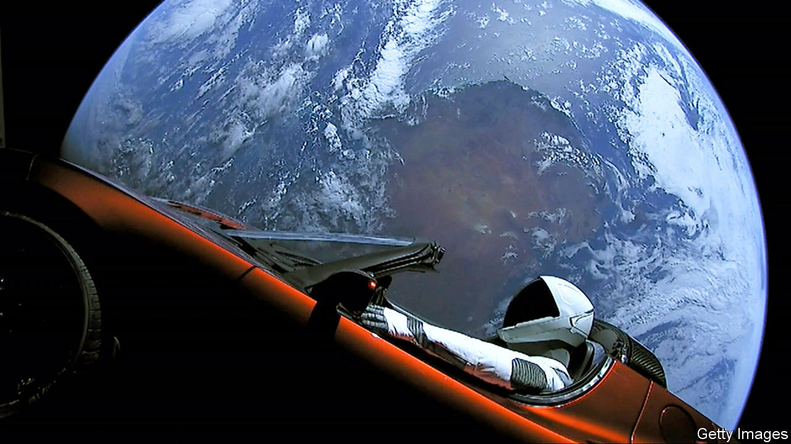

## Fast and furious

# Tesla gains $60bn in market value in a week

> And then sheds some $30bn in a day. Go figure

> Feb 6th 2020

SMALL STARTUPS’ market value has been known to soar by 50% in a few days. It is almost unheard of for $100bn companies to gain that much so fast. Unless you are Tesla. Since we wrote about Elon Musk’s electric-car firm’s performance last week, when it reported a quarterly operating profit of $359m, its market capitalisation swelled by nearly $60bn—never mind that it still lost money for the year as a whole and makes one car for every 30 produced by Germany’s Volkswagen (with a market capitalisation of $95bn). On February 5th it shed some $30bn. The reasons for the volatility remain as mysterious as Mr Musk’s mood swings.■

## URL

https://www.economist.com/business/2020/02/06/tesla-gains-60bn-in-market-value-in-a-week
