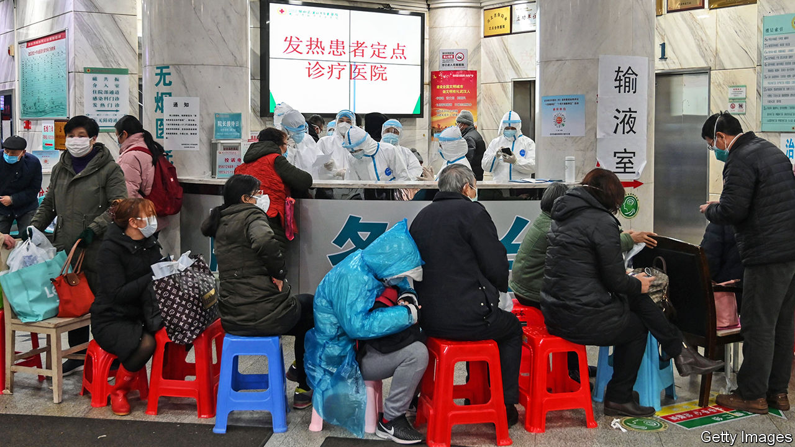

## Under observation

# A weak health-care system complicates China’s coronavirus battle

> More medical staff and better primary health-care facilities would help

> Feb 6th 2020BEIJING

THE DOCTORS who examined Rana Zhou’s parents decided that the couple had probably caught the coronavirus which has been sweeping their home city, Wuhan, and spreading globally. But they said they did not have enough test kits to be sure. Instead of finding them beds in a hospital, officials in their neighbourhood told them to go to one of many hotels which the government has requisitioned in order to monitor and isolate people with minor virus-related symptoms. But when her father’s fever worsened, staff said they could not take care of him. They told the pair they would have to return home.

It is a scary time to be ill in Wuhan. The city has one-third of all confirmed infections by the virus and three-quarters of the deaths caused by it. People there are barred from travelling elsewhere (similar rules apply across Hubei, a Syria-sized province of which Wuhan is the capital). Since late January military medics have been piling into the city. Soldiers are helping enforce its cordons. The army’s growing presence reassures many people, says a resident. But some find it unnerving.

With hospitals brimming, the local government has announced new rules. Rather than visiting hospitals, people who think they might have the virus should tell district officials about their symptoms and seek examinations at local clinics—facilities which, in normal times, many people eschew in favour of what they regard as the hospitals’ more professional care. Wuhan has opened makeshift hospitals in an exhibition centre and a sports arena to house patients who are only mildly ill from the virus. Elsewhere in China health services are also under strain, even if the pressure is less than in Hubei. Officials in many places have banned non-essential hospital visits to avoid contagion. But many people, afraid of catching the virus, now avoid hospitals anyway, except in emergencies.

China’s health system can cope better with shocks than in 2003 during the SARS outbreak. At that time, officials feared that the spread of the virus might be hidden because rural residents, lacking health insurance, would avoid hospitals. The government tried to allay such concerns by offering free treatment for SARS. Since then it has considerably expanded access to state-funded insurance schemes. More than 95% of Chinese are now covered. Out-of-pocket payments have fallen from about 60% of medical expenses to 30%.

But for poorer people, the costs can still be crippling. The government recently promised that it would pay for all treatment related to the new virus. That was too late for a pregnant woman infected in Wuhan. She died after her husband decided he could no longer afford the bill, according to a doctor there interviewed by Caixin, a magazine. The policy changed the next day.

The government has spent lavishly on infrastructure, but its investment in health care has failed to keep up. China says it has about 2.6 doctors for every 1,000 people, higher than the average for middle-income countries. But the World Health Organisation says half of China’s doctors do not have a bachelor’s degree. Among those in villages and small towns, only 10-15% do. Some practise traditional Chinese medicine, a form of treatment that has government approval but little scientific basis (stocks of an oral liquid based on such medicine have been flying off shelves since a recent report by Xinhua, an official news agency, that it can “suppress” the virus). There is also an acute shortage of nurses. The average in rich countries is three per doctor. In China it is only one.

China’s investment in health care has mostly gone to big hospitals in cities. Wuhan has about half of Hubei’s best medical facilities, but only about one-fifth of the province’s population. Far less attention has been paid to primary-care clinics, which in more developed systems handle minor ailments and escalate the rest to specialists. Only about 5% of China’s registered doctors serve as general practitioners. The average in the OECD, a club mostly of rich countries, is 23%. After Wuhan imposed a lockdown in late January, panicky residents converged on large hospitals seeking reassurance. The queues would have promoted cross-infection, says Xi Chen of Yale University.

Public anger about health care, including the gouging of patients by hospitals, has triggered occasional violence against doctors. In late January a man attacked medical staff in Wuhan after his father-in-law died from the virus. But the system’s public image may have improved during the current crisis. Many people praise doctors’ willingness to join the fight in Hubei, despite high rates of infection among medical workers there. They will need such support in the struggle ahead. ■

## URL

https://www.economist.com/china/2020/02/06/a-weak-health-care-system-complicates-chinas-coronavirus-battle
