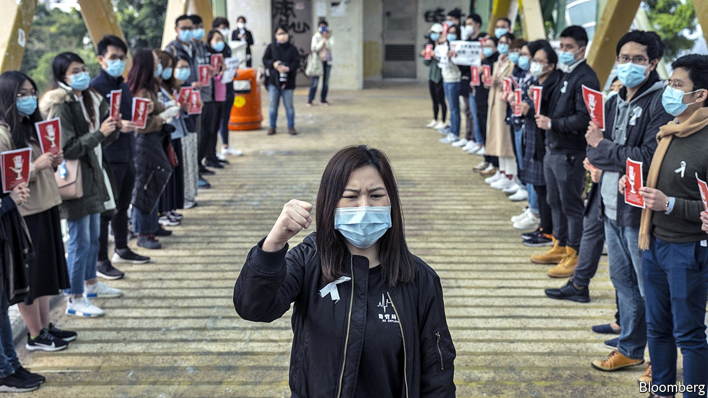

## Keep out

# The coronavirus is fuelling tensions in protest-racked Hong Kong

> An unprecedented strike by medical staff is piling pressure on the government

> Feb 6th 2020HONG KONG

“THERE IS NO reason for measures that unnecessarily interfere with international travel and trade.” So declared the World Health Organisation’s chief, Tedros Adhanom Ghebreyesus, on February 3rd after several countries, to prevent the spread of the coronavirus, had closed their borders with China or (like America and Australia) announced that foreign citizens who had recently visited China would be barred from entering. Yet many people in Hong Kong want the territory to seal itself off from the Chinese mainland. Their demands are putting new political pressure on the territory’s leader, Carrie Lam, after months of pro-democracy unrest.

As The Economist went to press, 21 people in Hong Kong had been detected with the virus, of whom seven were from the mainland. Six of the others were Hong Kong residents who caught it while travelling in China. They included a man whose death, attributed to the virus, was announced on February 4th. It was the first such fatality in the territory and only the second outside the Chinese mainland (the other was in the Philippines). The remaining eight cases involved infections that occurred in Hong Kong itself.

Mrs Lam has responded with ever-tighter controls. On January 27th visitors from Hubei, the province where the virus was discovered, were banned from entering Hong Kong. On January 30th six of 14 border checkpoints were closed. Hong Kongers who had travelled to Hubei were ordered into quarantine centres. The mainland’s government also imposed restrictions, stopping the issuing of permits for tourist trips to Hong Kong. The number of mainlanders arriving at border posts other than the airport fell by 90% compared with two weeks earlier. Mrs Lam said that closing the border entirely would be “discriminatory”, but four days later she announced that remaining entry points, apart from the airport, two road bridges and a cruise terminal, would be closed from February 4th. On February 5th she announced that anyone arriving from the mainland would be quarantined for 14 days and the cruise terminal would be shut.

For some Hong Kongers, these measures have not been enough. On February 3rd around 3,000 non-essential medical staff working in public hospitals went on indefinite strike—the biggest such action in the health system’s history. Their demands include the full closure of the border. The following day their ranks swelled to 7,000. They have vowed to continue their strike, despite Mrs Lam’s measures.

She is in murky political water. The strikers belong to a recently formed union with links to activists who have been at the forefront of the anti-government unrest that has roiled the territory since June. Other pro-democracy unions have threatened to join them, including one for bus drivers.

The central government, however, would not be happy with a total ban. It accused America of sowing fear when it became the first country to bar foreign travellers coming from China. China’s acting ambassador to Israel compared such controls to the turning away of Jewish refugees during the Holocaust. The embassy later apologised, saying there was “no intention whatsoever to compare the dark days of the Holocaust with the current situation”.

But many Hong Kongers are fearful. Memories are still fresh of SARS in 2003, a disease caused by another coronavirus discovered in China. That outbreak infected about 1,750 people in Hong Kong and killed almost 300. Mrs Lam, not least, will be mindful of events that year. Public anger over the government’s perceived hesitancy in handling SARS fuelled unrest caused by a proposed national-security bill. The crisis eventually prompted the central government to replace Tung Chee-hwa, Hong Kong’s first post-colonial leader.

Mrs Lam appears to have retained the central government’s backing during the past few months of turmoil on Hong Kong’s streets. But in a territory where distrust of the government runs deep, it is unlikely that her response to the new coronavirus will boost her abysmal ratings at home. ■