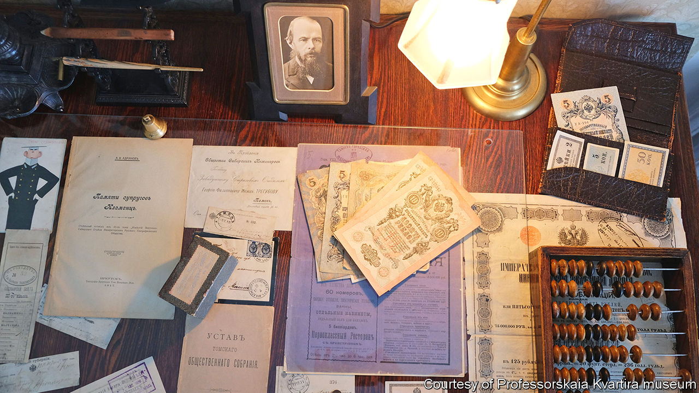
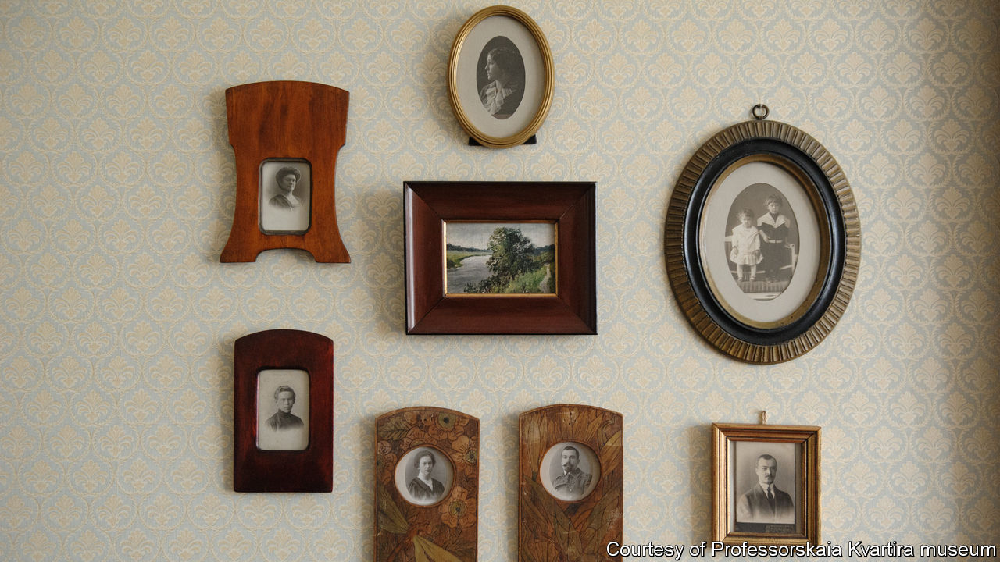
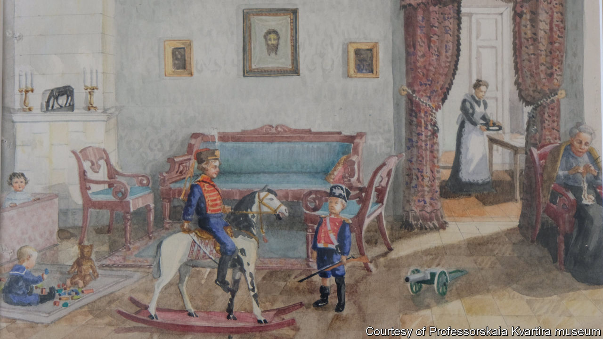

## The vagaries of memory

# A museum in Russia for a man who never existed

> The communists destroyed so much that even an imaginary past appeals to Russians

> Feb 8th 2020TOMSK

ENTER AN ELEGANT two-storey Art Nouveau house in Tomsk, a Siberian university town, walk up a solid wooden staircase and step into the measured world of an early 20th-century university professor.

The visitor to this private museum is invited to look through old family albums, sit at the professor’s desk and sniff a perfume made for the 300th anniversary of the imperial Romanov dynasty in 1913 (rebranded “Red Moscow” after the revolution). You can put on the professor’s pince-nez and leaf through his 1909 wall calendar. A cup of tea from a period china set and an authentically warming schnapps poured by a considerate guide at the end of the tour completes your immersion in a world that has not been touched by the Bolshevik revolution, the second world war or the Soviet Union’s collapse. You half expect the professor to shuffle back in.

There is only one catch. There was no professor. Both he and his apartment were created about a year ago by a businessman from Novosibirsk who had bought the flat in an old wooden house for his son, a student at Tomsk university, and furnished it with objects he had collected over 20 years.

In countries where old homes and objects often stay in the same family, such a project might come across as false or redundant. In Russia, where family histories were cut to shreds by the 20th century’s man-made disasters, holding on to the past is a fixation. “We try to preserve a past that can disappear at any moment,” says Katerina Kirsanova, the museum’s curator.

Tomsk, bypassed by the trans-Siberian railway and spared the architectural excesses of 20th-century modernisation, suffered in the early years of the 21st century when unscrupulous businessmen set many of its protected buildings ablaze (sometimes with residents inside) to grab land in the historic centre. The professor’s building was also damaged in a fire in which a student died. Its conversion into a museum is not so much a tribute to the continuum of history, as a testament to its constant disruptions.

## URL

https://www.economist.com/europe/2020/02/08/a-museum-in-russia-for-a-man-who-never-existed
