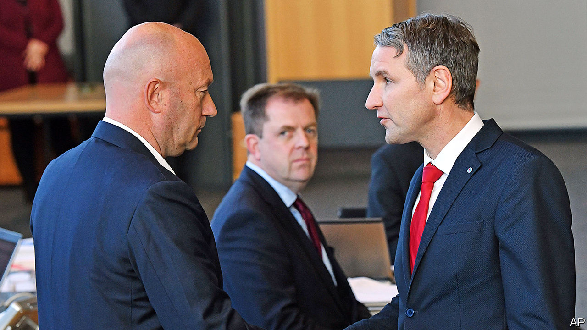
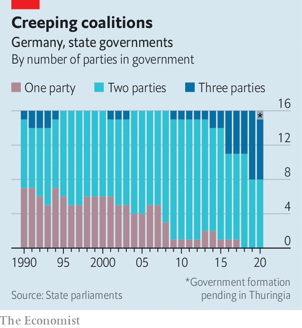
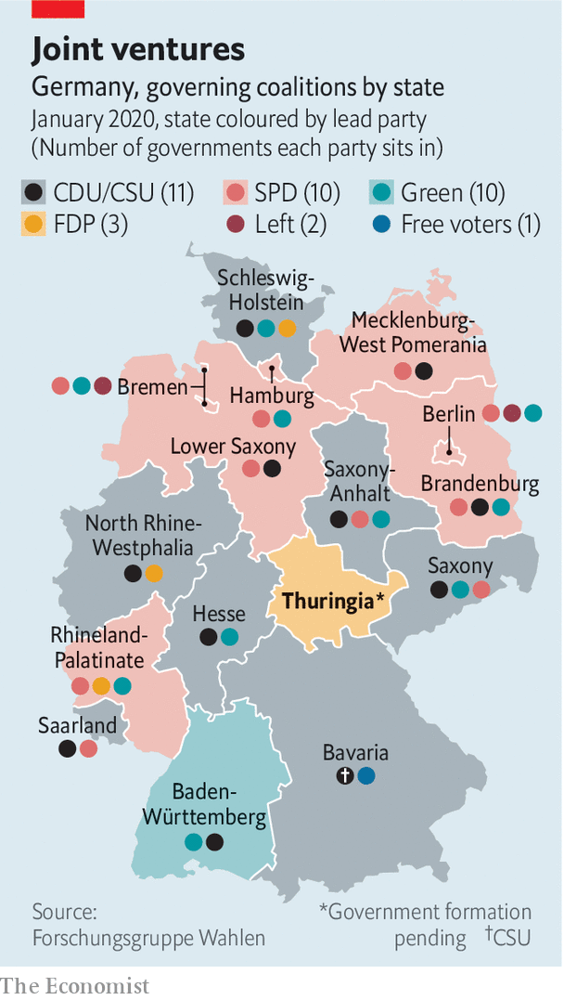

## The splintering states

# A pact with the far right in Thuringia rattles German politics

> By propping up a state premier, Alternative for Germany win a publicity coup

> Feb 6th 2020BERLIN

NEVER LET anyone say a handful of votes changes nothing. Last October, had Germany’s liberal Free Democrats (FDP) won 74 fewer votes in an election in the east German state of Thuringia, they would not have entered its parliament. Bodo Ramelow, the popular state premier, might have had the numbers to renew his left-wing coalition. And Thomas Kemmerich, the FDP’s leader in Thuringia, would not have scandalised the country on February 5th by leaning on the votes of the far-right Alternative for Germany (AfD) to win a parliamentary ballot to succeed Mr Ramelow.

No German state premier has ever been elected on the back of AfD support. As demonstrators chanted anti-fascist slogans outside the state parliament in Erfurt, and MPs inside jeered, Mr Kemmerich vowed to maintain the firewall against the AfD, whose branch in Thuringia is especially noxious (its race-baiting leader, Björn Höcke, pictured right with Mr Kemmerich, runs the party’s extremist “Flügel” wing).

The reaction was swift and savage. Angela Merkel, the chancellor, called the stitch-up a “bad day for democracy”, saying that it broke with the values of the centre-right Christian Democratic Union (CDU). The Social Democrats (SPD), junior partner in the national government, denounced the vote as a low point in post-war German history. On February 6th Mr Kemmerich bowed to the inevitable and offered to resign, calling for fresh elections. It was anyway unclear how the FDP, with just five out of 90 seats, could have run a government.

Yet Thuringia is just the most extreme example of the fragmentation of German politics. For decades the country’s big-tent Volksparteien (“people’s parties”) guaranteed stability and a certain predictability. West German governments tended to swing between centre-left (the SPD) and, more often, centre-right (the CDU, plus their Bavarian sister party, the CSU), with the FDP usually acting as kingmaker. In the 1970s the CDU/CSU and SPD together commanded over 90% of the national vote.

This cosy picture was to be triply disrupted. First came the Greens, founded in 1980, who quickly morphed from hirsute radicals into a party of government. Reunification in 1990 brought in the former eastern communists, who later merged with west German leftists to form Die Linke, Mr Ramelow’s party. The biggest jolt was the rise of the AfD, which began in 2013 as an anti-euro party but soon curdled into xenophobic populism. Today there are six parties in parliament, and the decline of the Volksparteien means three of the four governments Angela Merkel has led since taking office in 2005 are “grand coalitions” of the CDU/CSU and SPD; two faltering giants leaning on each other for support. On current polling they attract barely 40%.

Fragmentation is at its starkest in Germany’s unusual federal system. Thirty years ago seven of its 16 Länder (states), which have powers in education, policing and infrastructure, were ruled by single parties; all but one of the rest had two-party coalitions. Today almost half are governed by three (see chart). There are a head-spinning 13 coalition combinations in the 16 states (see map). Eastern Germany is particularly afflicted, thanks to the strength there of the untouchable AfD. Saxony, Saxony-Anhalt and Brandenburg are all run by “Kenya” CDU-SPD-Green coalitions (the parties’ colours match the Kenyan flag), fragile and unloved contraptions erected solely to keep the AfD out of office.

Federalism has its uses. States can serve as laboratories for unusual coalitions. Today’s tie-ups between the Greens and CDU in Baden-Württemberg and Hesse, for instance, are dry runs for a potential national government. But ideologically disparate coalitions often struggle to govern effectively, voters cannot predict how they will rule and they can gum up works in the Bundesrat, Germany’s upper house, which is made up of state government representatives. Moreover, uniting to stop the AfD has served merely to confirm its anti-elite argument, says Thomas Poguntke of the Institute of German and International Party Law and Party Research in Düsseldorf.

There is another difficulty in a system where politics in one state inevitably resonates in another. It is CDU policy never to work with Die Linke or the AfD in government. Yet some party grandees thought the CDU in Thuringia should grit its teeth and prop up Mr Ramelow, an avuncular, charismatic type who has run the state competently since 2014. Ms Kramp-Karrenbauer feared that approving such a deal would embolden conservative CDU members in states like Saxony or Saxony-Anhalt to ask why they should not be allowed to cosy up to the AfD. But avoiding that headache merely created another one: now she must mop up the mess created by her Thuringian colleagues, who have exposed the CDU to charges of collaboration with extremists. As state politics fragments and polarises further, tensions between parties at federal and state level seem bound to worsen.

After briefly lifting Mr Kemmerich to victory in Thuringia, the AfD was quick to crow that it had made itself indispensable to building conservative majorities. That argument looks somewhat less convincing now that its rumoured deal with the FDP has ended in disarray. Even so, there are several instances of the CDU and the AfD quietly co-operating at municipal level. Many analysts have long assumed the CDU’s anti-AfD cordon sanitaire would eventually buckle in one state or another. Thuringia may not have reached that level, but it shows more clearly than ever the dangers of Germany’s political fragmentation—and all thanks to those 74 votes. ■

## URL

https://www.economist.com/europe/2020/02/06/a-pact-with-the-far-right-in-thuringia-rattles-german-politics
