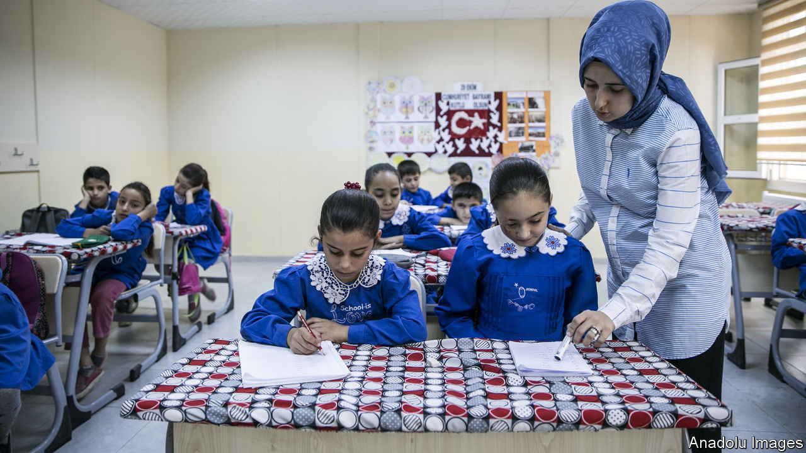
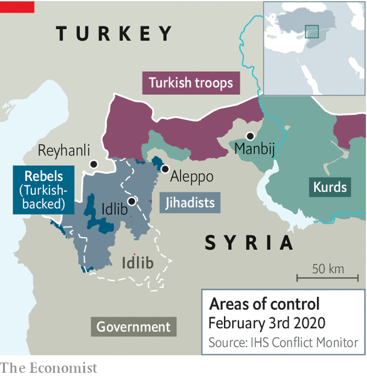

## The new Turks

# Syrians are putting down roots in Turkey

> But trouble knocks at the gates

> Feb 6th 2020REYHANLI

TEN YEARS ago it was just a big, sleepy village, says Mohammed Duveydar, a doctor from neighbouring Syria, as he looks out onto Reyhanli’s busy main street. When he visited before the war locals would turn in early and wake up before dawn. But habits changed after the refugees came. Reyhanli, a short walk from the border, now sealed off by a concrete wall, remains a poor and conservative town, but seems to have a bounce in its step. Since the start of the war next door, its population has nearly tripled, to about 250,000. Syrians, most of them natives of devastated Idlib, now outnumber Turks. The main streets are thick with shops. Young people, Syrian and Turkish alike, stay up late into the night, inhaling cups of coffee or narghile smoke at newly opened cafés. Some Turkish girls have started wearing the Islamic headscarf the Syrian way, says a teenager. Some Syrian women have started wearing it like the Turks.

Refugees from Syria’s war were greeted with open arms when they began arriving in Turkey nine years ago. No longer. Polls show that over 80% of Turks want the 3.6m refugees their country hosts to go home. President Recep Tayyip Erdogan’s government has drafted plans to resettle up to half of them in areas wrested by its troops from Kurdish insurgents in an offensive last year. (That no longer seems feasible: Turkey nabbed only a third of the area it wanted.) But despite hardening attitudes, the refugees are putting down roots, especially in border towns like Reyhanli, picking up Turkish habits and spreading their own. Most have no intention of going home, whatever the situation in Syria. Over 110,000 Syrians, including Mr Duveydar, have received Turkish citizenship.

Syrians do not have it easy in Turkey. With some exceptions, they have no right to own property or to work. Most work illegally, while the authorities turn a blind eye. Thousands have been deported. But quietly, so as to avoid a nativist backlash, the government is helping Syrians make themselves at home. Access to education has improved. The government has been phasing out special refugee learning centres, where most courses are taught in Arabic, placing the pupils in Turkish schools.

Tensions in Reyhanli peaked in 2013, when car bombs killed 52 people in the town centre. Some locals responded by attacking Syrian shops, forcing hundreds of people to flee. Security has since improved, as have relations between locals and newcomers. But a fresh crisis is knocking at the town’s gates. In neighbouring Idlib, regime and Russian forces have unleashed a bloody offensive against Turkish-backed Syrian rebels and foreign jihadists. Hundreds of thousands of people displaced by the fighting have massed near the border.

Desperate to avoid another wave of refugees, Mr Erdogan’s government has pledged to stop the regime advancing. On February 2nd, after shelling killed eight Turkish soldiers deployed to Idlib under an agreement with Russia, Turkey responded with air and artillery strikes against Syrian positions. Three days later, Mr Erdogan warned that “Turkey would have to take matters into its own hands” unless regime forces pulled back by the end of February.

The stand-off has already strained Turkey’s relations with Russia, which backs the regime, but which Mr Erdogan has courted as a strategic partner. During a visit to Ukraine on February 3rd, Mr Erdogan accused the Russians of negligence. He said Turkey did not recognise Russia’s annexation of Crimea, which he correctly called illegitimate. He also greeted Ukrainian troops with a nationalist slogan that irks the Kremlin.

Yet there is a limit to how far Turkey’s leader can go. Confrontation with the Syrian regime in Idlib is manageable. Confrontation with Russia is dangerous. After Turkey shot down a Russian warplane in late 2015, Moscow imposed heavy sanctions and cut Turkey off from its proxies in Syria. It was only after Mr Erdogan apologised and made a series of concessions to Russia that the rapprochement between the two countries began. Turkey will try to stop the offensive in Idlib. But it will probably not risk conflict with Russia. And indeed, Russia does not want a war with Turkey, a NATO member. Meanwhile, Syria may have to brace for more bloodletting, and Reyhanli for more refugees. ■

## URL

https://www.economist.com/europe/2020/02/06/syrians-are-putting-down-roots-in-turkey
