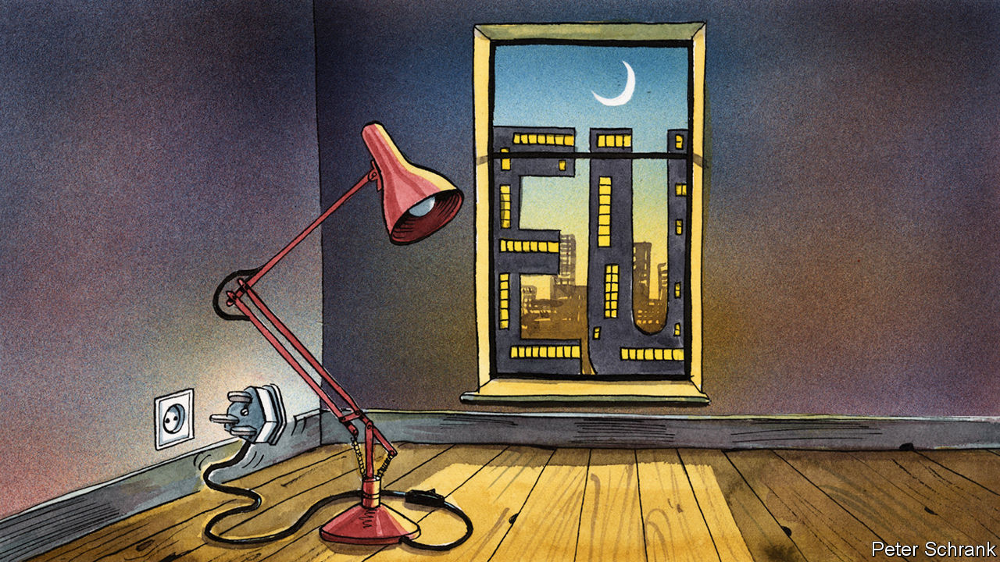

## Charlemagne

# The parable of the plug

> How plugs explain the potential and limits of the EU’s strange superpower

> Feb 6th 2020

THE BRITISH plug is a marvel of design. Its insulated prongs make electric shocks nigh on impossible, even if it is hanging out of the socket. Shutters cover the live holes on the socket until the earth is engaged, meaning even the most adventurous toddlers struggle to electrocute themselves. Yank out the cable and the live wires will disconnect before the earth, further reducing the chance of anyone being fried. It is probably the safest plug on the planet (unless trodden on). Yet apart from Britain and a few countries that lived under its imperial rule, the Great British plug is spurned for flimsy, sometimes dangerous two-prong affairs.

As sales of British plug adaptors suggest, it takes more than good design for standards to be adopted globally. For such influence, an alchemy of regulatory clout and market power that Britain simply does not possess is required. But it is a blend that the EU has learned to master. Everything from timber production in Indonesia to internet privacy in Latin America is now settled by a bunch of bureaucrats, diplomats, MEPs and lobbyists in the middle of Belgium. This has been dubbed the “Brussels effect” by Anu Bradford of Columbia Law School, in a new book of the same title, which explains how the EU quietly has become a regulatory superpower.

The EU, no superpower in the traditional sense, pulls this off in three ways. First, the EU’s market is so enormous—roughly a fifth of global GDP at market exchange rates—that producers cannot ignore the continent, no matter how onerous its regulation. Second, in contrast to America where light-touch regulation is the goal, Brussels revels in making its rules exacting. It prides itself on having the toughest regulations on everything from privacy to the environment. So if a company wants to sell the same product everywhere, rather than wasting money on having lots of different versions, it has to meet European standards. These two factors combine to introduce a third way of influencing global regulation, as companies sometimes lobby their domestic governments to raise their regulations to European levels, lest a rival gain an advantage by producing shoddy stuff solely for their home market.

In this way, the Brussels effect has turned the EU into a self-perpetuating policy machine. While more countries and global businesses find themselves sucked into its regulatory tractor beam, one country is trying to escape. Boris Johnson’s British government is cherishing divergence at a time when convergence with the EU’s rules is the order of the day. Britain wants to build relationships with countries outside of Europe. Often, though, these same countries are moving in the opposite direction. Increasingly, globalisation resembles Europeanisation. Britain can try to go it alone in its own regulatory sphere, but it will probably prove as popular as its three-pronged plugs.

The latest manifestation of this Brussels effect comes in the form of another type of plug. The European Commission is pondering how to compel phone companies to come up with a universal plug for their chargers. Apple, which uses its own design for its charger cables, is mithering about the change. Critics fear phone companies may end up stuck with outdated chargers until regulators grant permission to change. But Apple’s complaints are likely to be in vain, leaving the company with a choice: abide by the law only in the EU, or change its plug in all markets. The latter option is probably less costly. And unlike its British cousin, this type of plug could well go global, whether it is a good idea or not.

Brussels can bend the likes of Apple to its will, but being only a regulatory superpower has limits. When America killed Qassem Suleimani, an Iranian commander, earlier this year, the commission president, Ursula von der Leyen, summoned her team. Weirdly, the commissioners responsible for such things as demography, youth and health had to have their say on the prospect of war in the Middle East. When it comes to soft power and tweaking plug design, the EU reigns. In terms of hard power, the EU is left resembling Oasis guitarist Noel Gallagher’s description of his brother Liam: “a man with a fork in a world of soup”.

Even where Brussels does run the show, the upside is not obvious. Brussels increasingly sets the rules for the internet. But it is still large American companies that make the money (and the American government which reaps the tax revenue). Indeed, whereas Facebook and Google are big enough to digest whatever regulation they are force-fed, smaller European firms may end up choking. Aside from providing lobbyists with a healthy living and keeping overpriced restaurants in Brussels’ European quarter in business, the benefits of this arrangement are sometimes unclear.

Such advantages are not only limited but may also be short-lived. The EU’s regulatory dominance is a recent affair. And the blocks upon which the EU built this power are shuddering. The EU is still one of the world’s biggest markets, but its share of the global economy is likely to fall in the coming decades. As it shrinks, so does the incentive to follow Brussels’ diktats.

Technological change may further weaken the EU’s power. Producing a complicated widget to different standards costs lots of money as manufacturing must be rejigged. If 3D printing becomes the norm, the costs of abiding by both European and other standards might well fall. In some areas, high standards may become a curse, rather than a virtue. With artificial intelligence, companies under sketchier regulatory regimes may build an insurmountable lead via unethical experimentation. “What today amounts to the Brussels effect may one day be described as the Beijing effect,” warns Ms Bradford. Such shifts may be some way off. Countries are increasingly forced to pick a sphere of influence. When the other choices are an erratic America and an undemocratic China, the EU has something to offer. But hegemony rarely lasts and the EU’s regulatory supremacy is unlikely to be an exception. Even the highest standards can end up ignored. Just look at the British plug. ■

## URL

https://www.economist.com/europe/2020/02/06/the-parable-of-the-plug
