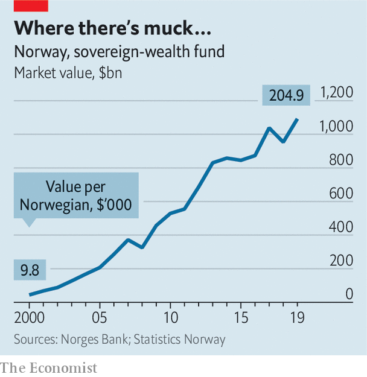

## Green tomorrow

# Why every Norwegian ecowarrior has 200,000 petrodollars

> Climate-friendly startups in Norway are bankrolled by the state oil fund

> Feb 8th 2020OSLO

SEVERAL TIMES a year neighbours in Norway get together to sweep leaves, trim bushes, weed flowerbeds and fix up their communal areas. These occasions belong to a tradition called dugnad (communal volunteering). Cilia Holmes Indahl says Norway now needs dugnad on a much bigger scale to turn it into a greener society. Ms Holmes Indahl is the 30-year-old boss of Katapult, a group of companies that invest in technology firms with green aims. Katapult organises an annual three-day “future fest” in Oslo, a mix of tech conference and Burning Man.

Many young Norwegian greens want to wean their country off oil. Technology startups are proliferating in Oslo, helped by generous subsidies from the government. The startups have names like “Douchebags” and “Monster”. They meet in rooms called “Creative Cocoon” or “Bug Fixer”. They sit in open-plan offices in trendily converted factories, surrounded by fruit bowls and bean bags, clad in the obligatory black sweatshirts and beanies. Last year Oslo came third in a ranking of the world’s most talent-competitive cities by INSEAD, a European business school. Engineering graduates used to flock to the lucrative oil sector; these days oil majors have trouble recruiting talent.

Yet although Innovation Norway, a state-owned agency, has in recent years done a good job of promoting startups, Norway’s economy will remain dominated by oil for the foreseeable future. Petroleum has transformed the country since it was discovered at the Ekofisk oilfield in the North Sea in 1969. Norway is one of the world’s largest oil exporters. Hydrocarbons account for half its exports and 19% of GDP. And another oil rush is beginning. Johan Sverdrup, a giant new oilfield in the North Sea, could earn Norway an estimated $100bn over the next 50 years.

Sveinung Rotevatn, the 32-year-old newly appointed minister of climate and the environment, admits that Norway is a paradox—one of the world’s leaders in the use of renewable energies and technologies, but also a fossil-fuel giant. Almost all Norway’s electricity comes from renewable sources. Heating with oil will be banned this year. Half of newly registered cars are electric (Norway is one of Tesla’s biggest markets). Oslo was the first city in the world to set a ceiling every year for its greenhouse-gas emissions. In late 2018 it removed nearly all parking spaces from the city centre, replacing them with benches, bicycle docks and more pavements. In October last year Norway’s $1.1trn sovereign-wealth fund, the world’s largest, established in 1990 to prepare the country for a post-oil future, announced that it would sell all its shares in companies dedicated to oil and gas exploration.

Is Norway doing enough to prepare for that post-oil future? Some argue that it should do more. “The government is deeply embedded in old industries, but has shown no interest in investing directly in tech firms,” says Trond Riiber Knudsen, chief executive of TRK, an Oslo-based investment firm. The state owns a third of the shares on the Oslo stock exchange, including large stakes in Telenor, the country’s biggest telephone operator; Norsk Hydro, its biggest aluminium producer; Yara, its biggest fertiliser-maker; and DNB, its biggest bank. It also controls some non-listed giants such as Statkraft, a power generator, which if listed would be the third-biggest company on the stockmarket. However, the state has not fussed when several successful technology firms were sold to foreigners. In 2010 Cisco, an American tech titan, paid $3.3bn for Tandberg, a Norwegian maker of videoconferencing kit. In 2016 a Chinese group bought Opera, a Norwegian software company.

Ivar Horneland Kristensen, boss of the federation of trade and services, argues that the government should pay more attention to the services sector. Services account for 55% of GDP. According to Mr Horneland Kristensen, Norway faces four challenges. It needs to reduce its focus on oil and gas, increase its productivity through the use of technology, decarbonise the economy to meet the goals of the Paris agreement on climate change and create 25,000 jobs a year so that laid-off oil workers remain gainfully employed.

Norway has profited from its wise decision to save the principal and invest the returns of its oil riches. But the sheer size of its sovereign-wealth fund—more than $200,000 for every citizen—encourages dependency. Fully 20% of Norwegians rely on welfare, and that does not include pensions. Norway spends 4.3% of GDP on incapacity benefits, the second-highest in the OECD after Denmark. Youngsters have never known a country without oil riches. They are used to excellent free schools and universities as well as free health care. But for how long?

“There is no future for oil,” insists Mathias Mikkelsen, the 29-year-old CEO of Memory, a startup that developed an app to track time at work. Oil is the new coal, so clever investors are putting their money elsewhere, says Inge Berge, CEO of Wastefront, which, backed by Innovation Norway, is building a factory to recycle tyres. Yet both Mr Mikkelsen and Mr Berge benefited from the ecosystem for startups financed by oil wealth—and would have a much tougher time building their companies without it. ■

## URL

https://www.economist.com/europe/2020/02/08/why-every-norwegian-ecowarrior-has-200000-petrodollars
