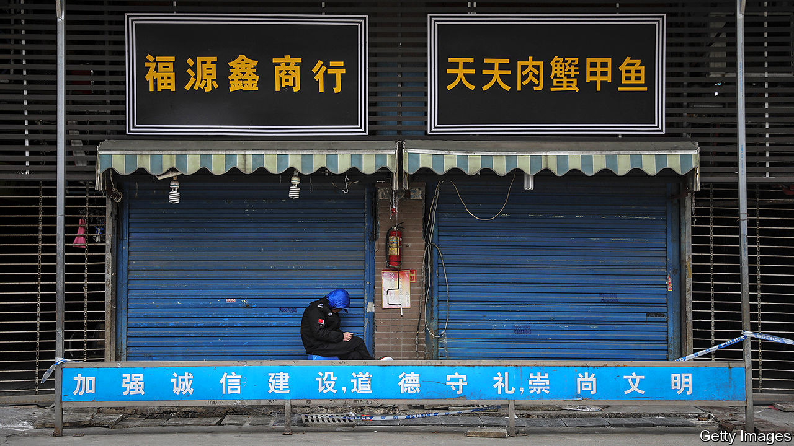

## Viral injections

# Companies warn of an economic crisis as China battles coronavirus

> The government steps up support, not to boost growth but to ensure social stability

> Feb 6th 2020SHANGHAI

RARELY HAVE plans in China fallen apart so swiftly and so publicly. On January 12th the leaders of Hubei declared that the province’s GDP would grow by 7.5% this year. They made no mention of a new virus fast spreading through its towns and cities. But less than two weeks later it could not be ignored. They placed the province under quarantine, hemming in over 50m people and rendering this year’s flashy growth target almost certainly unreachable.

The lurch from confidence to anxiety has echoed throughout China. In the months before the coronavirus outbreak, the stockmarket had rallied and businesses had been upbeat, not least because China and America had struck a trade deal. But optimism has crumbled as officials have begun to fight the epidemic.

The Chinese stockmarket has fallen by 10% since January 20th. Factories and offices were supposed to reopen in recent days after the new-year holiday. Most provinces have ordered them to stay shut until at least February 10th. Farmers have warned that their chickens might starve because roadblocks have snarled their feed supplies. Few people dare venture out, hitting restaurants and hotels especially hard. In an interview that attracted much attention before being censored, the founder of Xibei, a restaurant chain, said that if the lockdown persisted for a few months, vast numbers could lose their jobs. “Wouldn’t that be an economic crisis?” he asked.

Analysts have rushed to lower their economic forecasts. The consensus had been that GDP would expand about by 6% year-on-year in the first quarter. Now several expect a 4% pace, the slowest since China began publishing quarterly figures in 1992.

Usually, the further into the future you peer, the greater the uncertainty. But as past epidemics have shown, China’s officials can be fairly confident that growth will rebound to its pre-virus trajectory next year. It is the next couple of months that are the black hole. Three unknowns cloud the outlook: how long it takes to contain the virus; when the government relaxes its heavy-handed restrictions on daily life; and how long after that people resume the whirl of activity that normally makes the Chinese economy so vibrant.

This near-term uncertainty presents a challenge for economic policy. Even if growth plummets, a big stimulus package might be dangerous medicine. Given the lag in spending, the boost from projects announced today could kick in just as the economy gathers steam of its own, leading to overheating. Instead, measures to help people and firms through the rough patch are more sensible. These can be pared back when the recovery eventually arrives. Getting them right, though, is not easy.

Officials are combining temporary cash support with market interventions and forbearance. On February 3rd the central bank injected 1.2trn yuan ($172bn) into the financial system by purchasing treasury bonds from banks that promise to buy them back within 14 days. Banks will probably suffer from rising loan defaults in the coming weeks; this gives them more cash to work with in the near term. The central bank can extend the support if needed.

Officials are also meddling in the stockmarket (or, as they would say, managing it). Regulators have told brokers to bar clients from short selling, so as to limit downward pressure, according to Reuters. State media have also played cheerleader, saying that big state-owned insurance companies were primed to scoop up undervalued stocks. Share prices still dropped by 8% on February 3rd. But that was largely a catch-up with the Hong Kong market, which had been open the previous week. Trading has since stabilised, suggesting that the tactics are working.

Finally, officials have been orchestrating forbearance on various fronts. Shanghai was due to raise companies’ social-security contributions on April 1st. That has been delayed by three months, saving firms an estimated 10bn yuan. In Beijing officials have encouraged landlords to cut their commercial tenants’ rents, in exchange for subsidies. And regulators have called on banks nationwide to roll over loans to companies that would otherwise lack the cash buffers to survive.

Even as the death toll mounts, some officials are already thinking about the economic distortions that have arisen in the course of the battle against the epidemic. Hospitals face shortages of masks, gowns and gloves. At the government’s urging, producers have increased output. But as Liu Shangxi, an adviser to the finance ministry, has noted, they will suffer from severe overcapacity after the crisis passes. The government should thus be ready, he argues, to compensate them.

Such proposals are a far cry from the bold plans that Hubei’s leaders laid out only a few weeks ago. Yet the priority these days is not to gee up growth but to ensure that society remains stable as the quarantines drag on. China’s grim new reality is that everything, even economic policy, revolves around beating the virus. ■