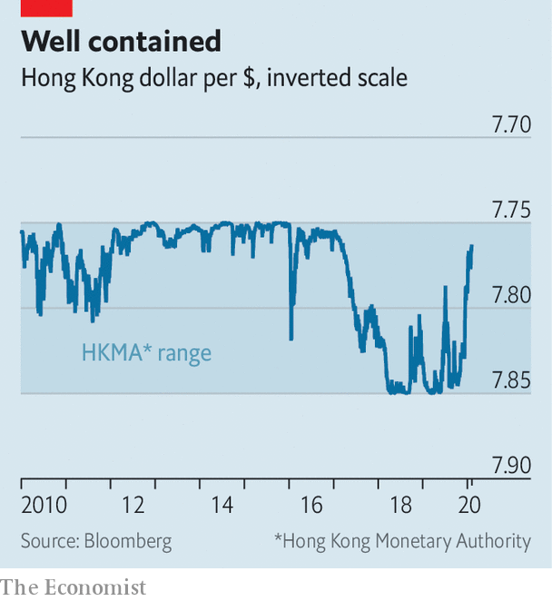

## A train of troubles

# Just how stable is Hong Kong’s economy?

> The financial centre faces protests, a trade war, and now the coronavirus

> Feb 6th 2020HONG KONG

“I WANTED TRAVELLERS to arrive and know exactly which city they were in,” wrote Andrew Bromberg, an architect, to explain his design for West Kowloon station, where high-speed trains arrive in Hong Kong from mainland China. The platforms are deep underground, but passengers can enjoy the city’s skyline through 4,000 glass panes suspended from the station’s tilted roof. The more adventurous can go up to the rooftop for a better view.

But not anymore. The station and its rooftop are cordoned off. Four of the 21 people in Hong Kong that have been infected with the Wuhan coronavirus arrived in the city by high-speed rail. The station has now been closed, alongside ten of the other 13 entry points from the mainland.

These closures may or may not slow the spread of the disease. But they will certainly hamper an economy already debilitated by months of fierce anti-government protests. Figures released on February 3rd showed that GDP shrank by 2.9% year-on-year in the last quarter of 2019, when the protests reached a peak. Worse may be to come. Analysts at UBS, a bank, expect a fall of over 6% in the first quarter of this year compared with the same period last year.

In other economies rocked by the virus, such as mainland China, Thailand and Singapore, the central bank has let the currency depreciate, easing financial conditions. But Hong Kong is different. Its currency has been tied to the American dollar since 1983 and confined to a narrow trading band of HK$7.75–7.85 to the dollar since 2005. If it falls to the weak side, the Hong Kong Monetary Authority (HKMA) is obliged to sell as many American dollars as people want to buy for HK$7.85. That has stopped the currency falling further (see chart).

But will it always do so? Even before the protests erupted or the virus mutated, some observers began to wonder if the peg would endure. According to Hong Kong’s mini-constitution, its autonomy and even the existence of its own currency is guaranteed only until 2047, which is within the duration of a 30-year mortgage. Hong Kong, many fear, is destined to become just another Chinese city—and they do not have their own currencies. Even if it remains semi-detached politically, its economy is increasingly attached to China’s. Why should its financial conditions remain tethered to America’s?

In the forward-looking world of financial markets, that question leads naturally to another: if Hong Kong’s currency regime is destined to change some day, how hard would Hong Kong fight for it today, if the markets tested its will? Such a test is not too hard to envisage. In December, property prices fell by 1.7%, compared with the previous month, and are now almost 5% below their peak. If those falls gained momentum, speculative capital might quit the market and the city. A collapse in property prices would also test the banking system. Its assets are worth 845% of Hong Kong’s GDP (although only 30% of its total loans are spent on Hong Kong property development or home purchases). And many of the deposits on the other side of its balance-sheet are held by non-residents, who might prove flighty in a crisis.

According to its defenders, Hong Kong’s currency peg is “virtually impregnable”. The HKMA’s foreign-exchange reserves amount to $440bn, twice as much as the money supply, narrowly defined to include banknotes and the banks’ claims on the monetary authority. The banks would run out of Hong Kong dollars before it ran out of American ones.

Why then is it only “virtually” impregnable? For one thing, there are broader definitions of money supply. A war chest of $440bn may be large compared with banks’ deposits at the HKMA. But it is small compared with customers’ deposits with banks (HK$6.9trn, equivalent to $880bn). If every depositor wanted to convert their holdings into American dollars, there would not be enough to go around.

Such conversions would also have broader economic implications. Every Hong Kong dollar sold to the monetary authority disappears. All else equal, it then becomes dearer for the banks to borrow the diminishing number of Hong Kong dollars that remain. These high interest rates make holding the currency more lucrative and short-selling it more costly. But insofar as households and firms still need to borrow in Hong Kong dollars, these high interest rates also hurt the economy. How much pain would Hong Kong be willing to take?

The peg’s downfall may be imaginable. But is it probable? One place to look is the options market, where investors can hedge against the risk of the currency moving outside the band. For about 40% of the period from June 2005 to July 2018, option prices implied that the odds of the peg breaking were above 10%, suggests a recent study by Samuel Drapeau, Tan Wang and Tao Wang of Shanghai Jiao Tong University. But for most of that time markets were betting on the currency strengthening past HK$7.75 to the dollar, not weakening past HK$7.85.

Bearish bets became more popular last year during the worst of the protests. But the speculation was not as fierce as it had been in 2016, after China clumsily devalued the yuan. Capital outflows picked up in the third quarter of last year, diminishing Hong Kong’s foreign-exchange reserves. But reserves have stabilised since, helped by a truce in the trade war between America and China. Hong-Kong dollar deposits are lower than they were six months ago, but still higher than they were a year ago.

Any signs of sustained capital outflows are, then, “embryonic”, says Alicia Garcia Herrero of Natixis, a bank. If capital is leaving, its speed of departure is reminiscent of one of Hong Kong’s quaint trams, not one of its bullet trains.■

## URL

https://www.economist.com/finance-and-economics/2020/02/06/just-how-stable-is-hong-kongs-economy
