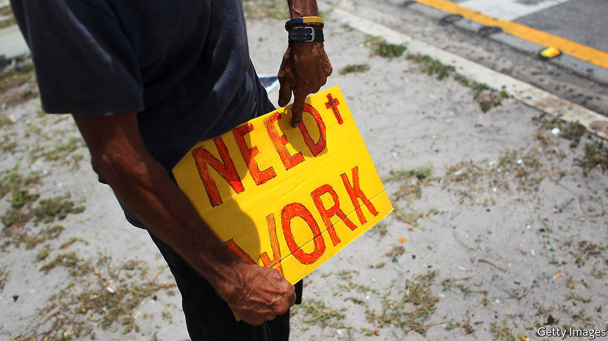
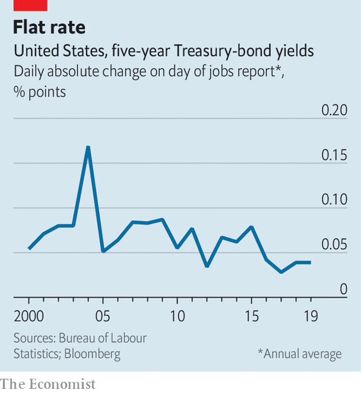

## Knocking off work

# Traders lose interest in America’s jobs report

> Markets react less to jobs data than they did before the financial crisis

> Feb 6th 2020

BY 9.30PM ON the first Friday of the month, the bars in Marunouchi, Tokyo’s financial district, used to empty out as foreign-exchange traders returned to their desks. London’s investment bankers, back from lunch, would be sharp and alert, helped by a rare early night. All awaited perhaps the world’s most important data release: America’s jobs report.

The release—which includes figures on non-farm employment, the unemployment rate and wages—often generated sizeable market moves. On average, five-year Treasury yields moved by 0.17 percentage points on the day of the report in 2004. The four biggest daily moves that year occurred after a release. Since then, though, market reaction has cooled (see chart). In 2019 yields barely budged, moving by less than 0.04 percentage points on publication. What explains the lack of excitement?

Before the financial crisis jobs data were thought to give a good signal about the likely actions of the Federal Reserve, which is tasked with ensuring maximum employment and stable inflation. The more people in jobs, the thinking was, the closer America got to full employment. A tighter labour market would push up wages and consumer prices. (In other words, what economists call the Phillips curve, which plots inflation against the unemployment rate, sloped downwards.) That made it more likely that the Fed would raise interest rates, making dollar assets more attractive. As most financial assets are priced in dollars, the data took on worldwide significance. Hence Marunouchi’s emptying bars.

The reason for the subsequent lack of interest is that falling unemployment is no longer a good guide to the Fed’s actions. Inflation has been unusually quiescent. The unemployment rate has fallen from 9% in 2011 to 3.5%, the lowest rate in 50 years. If the usual Phillips-curve relationship held, a rise in inflation would have followed. In fact, it has fallen: personal-consumption expenditure inflation, the Fed’s preferred measure, has slipped from 2% to 1.6%. At first that prompted Fed officials to think that there was more slack in the labour market than they had assumed. Lately it has caused them to doubt that the amount of slack is knowable at all, and to wait for inflation to pick up rather than predicting it based on jobs data.

As a result markets no longer expect strong payroll numbers to be followed by interest-rate rises. Traders still pay attention to the wage figures in the report, though. In February 2018 a larger than expected pickup in average hourly earnings, together with a flat unemployment rate, led to a spike in bond yields and a stockmarket sell-off. But pay growth has lost momentum since, even as unemployment has fallen. Ahead of this month’s jobs report, due on February 7th, after The Economist went to press, traders might be forgiven for choosing to stay at the bar. ■