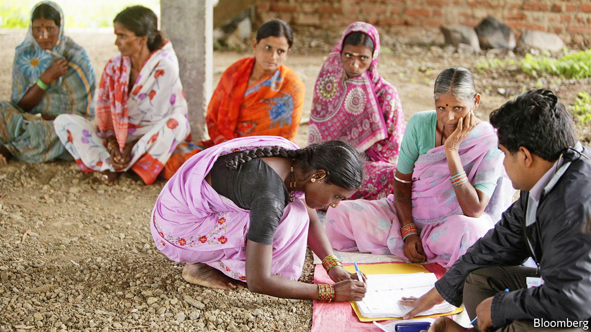

## Small change

# Ujjivan is a rare bright spot in Indian finance

> Its shares are up 50% since an IPO in December

> Feb 6th 2020BANGALORE

A DOZEN WOMEN dressed in saris sit on benches at the branch of the Ujjivan Small Finance Bank on Koramangala 80 Feet Road, awaiting disbursements of tiny loans. The money is needed for school fees, to finance home businesses or, in a couple of cases, bigger ventures that will have employees and assets. One is hoping to produce pickles; another wants working capital for a welding shop.

Ujjivan (“uplift” in Sanskrit) was founded in 2005 to bring the group-lending techniques being pioneered in rural microfinance to urban slums. The Koramangala branch is now one of 552 in India. This growth, and the extension of the ideas underpinning microfinance to loans for small rather than tiny businesses, reflect how the approach is maturing. Samit Ghosh, the founder, has held senior roles in Citibank and HDFC Bank, both of which played big parts in transforming Indian retail banking for the middle classes and above. Yet, despite that pedigree, raising a few hundred thousand dollars as seed capital was, he says, the hardest task of his career.

How times have changed. Many of India’s largest banks are on a perpetual hunt for fresh capital or a government bail-out; Ujjivan, which as a condition of its banking licence was forced to list its shares in December, was flooded with eager investors. Its share price is up 50% since then, doubtless a source of joy to its 17,000 employees, who all hold stock.

What drew investors was its stunning growth. It now has 5m clients and $1.8bn in assets. Around 70% of its lending is administered through groups, with members receiving an average loan of under $500. The rest goes to individuals in chunks that are three times as large. The women in saris have been solid borrowers. Losses are only 0.3% of assets per year, return on assets is 2.5% and return on equity 20%. Reinvested profits have enabled remarkable loan growth: assets are up by almost half in the past year. Few lenders in India produce returns anywhere close; among them are Equitas and AU Small Finance, which have similar histories and clients.

Perhaps the most important factor behind this success is the size of the potential market—300m people who are just above very poor, says Nitin Chugh, who took over as chief executive from Mr Ghosh in December. The competition comes from loan sharks, who charge at least 4% a month—60% a year—and sluggish state banks. Ujjivan charges 22% a year for group microfinance, 18% for micro- and small businesses, and 12% for housing. This, of course, is still steep. The spread between its lending and funding costs is 11%. For many large banks, the figure is less than 3%.

Inevitably, that will contract, if only because Ujjivan’s success attracts competition. But for now the costs inherent in making small loans might put rivals off. Nine of the 11 bankers in Ujjivan’s Koramangala branch spend their days straining to make 15-20 sales calls to customers who may not understand banking. Better methods may, however, be coming, particularly because of the adoption of technology.

India’s government has created identification cards and payment networks that make opening accounts easier. Ujjivan is in the midst of a serious effort to make that digitised network work for the illiterate—a large if unquantified proportion of its customers—in ways that both broaden the bank’s appeal and reduce its costs. Already, its app’s voice-recognition feature can understand and speak in nine languages, which will soon increase to 14 and then 22. This will work in tandem with a picture-based interface that allows customers to conduct electronic transactions without needing to read.

Ujjivan’s success stands in stark contrast to much of the rest of India’s financial system, which is in a slow-boil crisis, with answers being demanded from large banks, regulators and politicians. But the rise of an innovative lender engaged with poorer customers suggests there are grounds for optimism, albeit arising from the country’s slums, not its leaders. ■

## URL

https://www.economist.com/finance-and-economics/2020/02/06/ujjivan-is-a-rare-bright-spot-in-indian-finance
