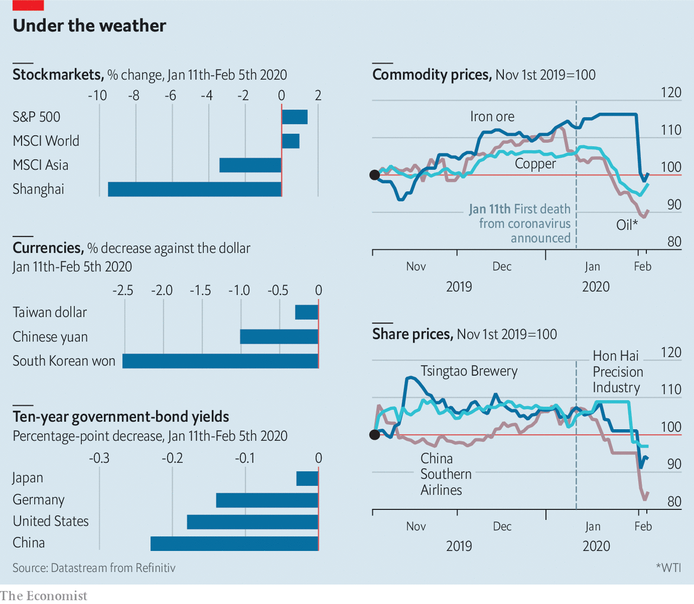

## Contagion effects

# What the coronavirus means for financial markets

> The prices of assets most exposed to China have suffered

> Feb 8th 2020

GLOBAL SHARE prices have so far been relatively immune to the spread of coronavirus. But assets most exposed to China have suffered. Currencies of economies integrated with its supply chains have weakened. Prices of commodities, of which China is usually a big buyer, have slid. Share prices of both manufacturing and consumer-facing companies operating in China have fallen, as factories stay shut and people stay home.■

## URL

https://www.economist.com/finance-and-economics/2020/02/08/what-the-coronavirus-means-for-financial-markets
