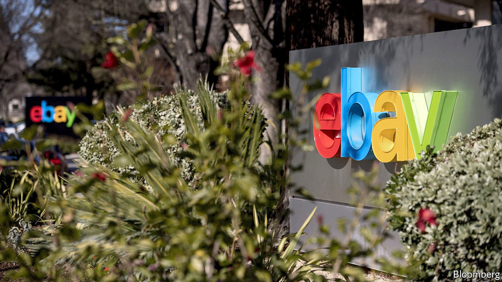

## Market making

# Why Intercontinental Exchange wants to buy eBay

> Explaining a new and weird putative corporate combination

> Feb 6th 2020NEW YORK

THE HIGH STREET and Wall Street feel like very different places. One is lined with soft-lit storefronts showing tempting goods, to entice the customer in. The other is home to rows of gleaming skyscrapers, with snooty receptionists and fiercely guarded lift banks, in order to keep the riff-raff out. But the core purpose is similar. Both are venues for interested parties to get together and trade things—be they Dior suits or shares in Microsoft.

On February 4th the Wall Street Journal reported that Intercontinental Exchange (ICE), a company that owns various financial-markets platforms including the New York Stock Exchange (NYSE), was in talks to buy eBay, an online marketplace for used goods. The deal would value eBay at around $30bn, roughly $2bn more than its market capitalisation before the news broke. Its share price jumped 9%.

The news baffled financial analysts. Christopher Harris of Wells Fargo, a bank, said the deal would go beyond ICE’s “core competency”. ICE’s investors were similarly befuddled. Its share price fell by 7% on the news of the potential deal.

They have a point. ICE was set up in 2000 to run a commodity-futures exchange. It now runs 12 exchanges worldwide and operates six clearing-houses, entities that manage counterparty risk for financial transactions. These involve armies of—mostly—savvy participants and are characterised by abundant liquidity, high transaction volumes and low transaction costs. By contrast, the market for used goods involves amateur buyers and sellers operating under uncertainty about quality, price and authenticity.

ICE has also proven adept at making marketplaces that do not work very well more efficient, though. Since buying NYSE in 2013 ICE has cut its expenses, revamped its outdated trading platform and renovated its historic headquarters.

EBay, for its part, is in a difficult spot. The platform has lagged behind those of Amazon or Walmart. Under pressure from Carl Icahn, an activist investor, it spun off PayPal, an online-payments business, in 2015. Back then the combined firm was worth $80bn, around $45bn of which was in PayPal and the rest in eBay. Today PayPal is valued at $140bn; eBay is worth a little less than it was in 2015.

Activists have not left eBay alone. Elliott Management and Starboard Value, two activist funds, pushed for it to spin-off StubHub, a ticket reseller, and its classifieds business. EBay later acquiesced, selling its ticket business and giving the activists board seats. But shortly after that Devin Wenig, its long-standing chief executive, stepped down, citing differences with the new board. The firm has yet to find a permanent replacement.

Whether the deal goes ahead is still unclear. ICE has acknowledged its approach, but both companies say they are not in formal talks. That ICE took an interest at all, though, is curious. Helped by better data and whizzy algorithms, some retail platforms are already exhibiting financial-market characteristics, such as dynamic pricing. That a financial-markets behemoth wants to muscle into retail suggests that it too sees a future in which the high street looks more like Wall Street. ■

## URL

https://www.economist.com/finance-and-economics/2020/02/06/why-intercontinental-exchange-wants-to-buy-ebay
