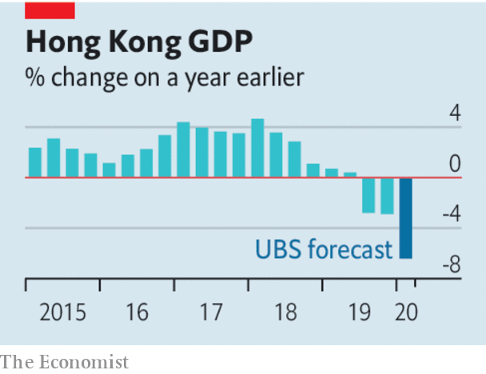

## Three strikes

# Hong Kong’s economy is in peril, but its financial system is not

> Its property market and finance industry are somewhat insulated from local worries

> Feb 6th 2020

AS THEY REPAY their debt to society, many Hong Kong prisoners are put to work making useful items like road signs, uniforms, furniture—and the surgical masks that now obscure the faces of almost everyone on the city’s subdued streets. To help stop the spread of the Wuhan coronavirus, which has infected over 28,000 people worldwide, prisoners will now be employed round the clock, boosting mask production by as much as 60%.

That, sadly, is one of the few economic ventures that is still expanding in this thrice-struck city. Its GDP shrank last year for the first time in a decade, thanks to the trade war and anti-government protests. The coronavirus now poses a third threat. Some economists have slashed their growth forecasts for Hong Kong by more than for the mainland (see [article](https://www.economist.com//finance-and-economics/2020/02/06/just-how-stable-is-hong-kongs-economy)).

Hong Kong’s economic fate is of international concern. Vast sums of global capital flow in and out of its asset markets and its border-straddling banks. Some speculators now fret about its financial resilience, noting its exorbitant property market, where prices have tripled in ten years, and top-heavy banking system, which has assets worth 845% of GDP. As protests intensified last year, bets against Hong Kong’s currency, which has been firmly pegged to the dollar since 1983, became unusually popular. The city’s monetary officials proclaimed no reason to worry. But that is the kind of thing you have to say only when others suspect that it is not entirely true.

The fear about Hong Kong’s domestic economy is warranted. Much of the city’s livelihood depends on the economic virtues of openness and propinquity. It excels as both an entrepot and a rendezvous, where people from far-flung places can gather in jam-packed proximity. It thrives on human interaction. But so does the virus. Thus efforts to impede the disease, such as discouraging visitors and gatherings, also paralyse the economy.

Unfortunately the government lacks authority just when it needs it. By so gravely mishandling the recent social unrest, it lost the public’s trust. It now struggles to convince people that it is doing all it should to stop the disease. Some hospital workers have gone on strike, demanding a complete closure of the border with the mainland (see [article](https://www.economist.com//china/2020/02/06/a-weak-health-care-system-complicates-chinas-coronavirus-battle)). Others are furious about the shortage of masks. A more credible government might advise people that they do not need to wear one unless they are ill. But such advice would be scorned in Hong Kong. It has run out of masks because its government has run out of trust.

These justifiable fears for Hong Kong’s local economy do not, however, extend to its banks or its currency. Precisely because its property market and its financial system have become partially divorced from its local economy, they are somewhat insulated from domestic travails. And its banks have grown so big partly because they serve mainland firms with global ambitions, whose fortunes are decided outside Hong Kong. Most lenders are well-capitalised and mortgage lending is tightly controlled.

Hong Kong’s currency peg is also heavily fortified. Foreign-exchange reserves are twice as large as the money supply, narrowly defined. In principle, the banks would run out of Hong Kong dollars to sell to the monetary authority before it would run out of American dollars with which to buy them. In practice, interest rates would spike long before then.

That would make holding the currency more rewarding and betting against it more expensive. It would also inflict pain on the economy. For the peg to survive, the government would have to endure the agony longer than speculators could endure the expense. During the Asian financial crisis in 1997 (when overnight interest rates briefly reached 280%), Hong Kong showed how far it was willing to go. The peg’s survival back then has made it more likely to survive future tests, too. Hong Kong has built a reputation for competence and integrity with international investors. What a shame that the government has squandered its reputation for those very qualities with its own population.■

## URL

https://www.economist.com/leaders/2020/02/06/hong-kongs-economy-is-in-peril-but-its-financial-system-is-not
