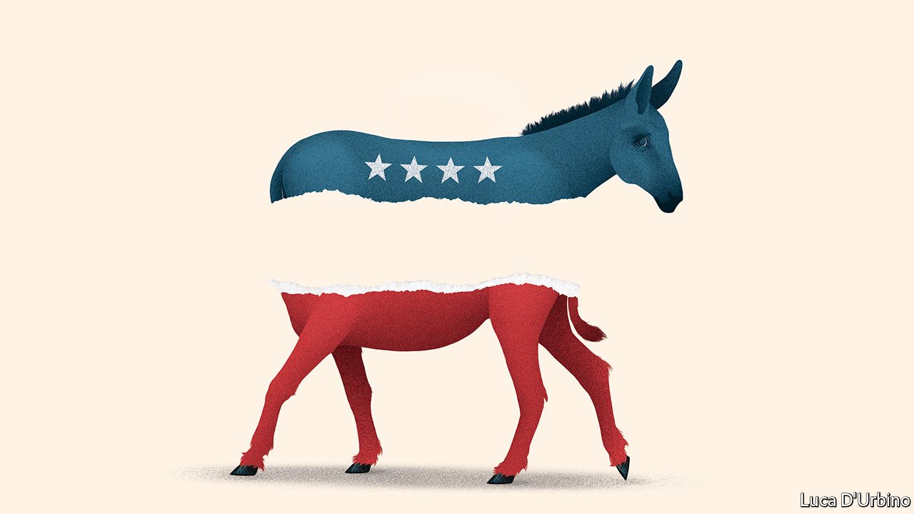

## America’s presidential election

# The Democratic primaries will be a contest between radicals and repairers

> The repairers have the better case

> Feb 6th 2020

IT WAS A devastating contrast. As the Iowa caucus turned into a fiasco (Democrats blamed the software), President Donald Trump hailed an “American comeback” in the state-of-the-union message and basked in his acquittal by the Senate over impeachment. With the economy roaring and his approval ratings ticking up, Mr Trump looks likelier than ever to triumph in November. Compare that with the Democrats after Iowa, in which no candidate won the backing of much more than a quarter of caucusers.

Democrats agree that ending Mr Trump’s bombastic tenure is their priority. But their champions, now trudging round New Hampshire eking out votes before next week’s primary (see [article](https://www.economist.com//united-states/2020/02/08/waiting-for-bernie-in-new-hampshire)), are starkly divided over what to offer Americans in his place. The left argues that America has stopped working for most people and thus needs fundamental restructuring. Moderates recommend running repairs. A lot rests on which side prevails—the radicals or the repairers.

Any of the front-runners could yet end up as the nominee: the radicals, Bernie Sanders and Elizabeth Warren; or the repairers, Pete Buttigieg and Joe Biden (despite his bad day in Iowa). So at a pinch could Michael Bloomberg, another repairer, who is spending gargantuan sums before Super Tuesday next month. But on every count the repairers have the better of the argument. They are more likely to beat Mr Trump, to achieve things and, most important, to do what America needs.

It is striking that all of the plausible nominees are campaigning to the left of President Barack Obama in 2012 and Hillary Clinton in 2016 (see [Briefing](https://www.economist.com//briefing/2020/02/08/the-shambolic-iowa-caucuses-did-little-to-unite-the-democrats)). They all have ambitious plans on climate change; and, with the exception of Mr Bloomberg, are sceptical of free trade. Nevertheless, Mr Sanders, who calls himself a democratic socialist, and Ms Warren, a capitalist, are distinctly more militant in both style and substance.

This is partly a matter of degree, as health policy shows. All Democrats want the number of Americans without health insurance, which has risen from 27m to 30m under Mr Trump, to be reduced, ideally to zero. The repairers would expand Obamacare’s market-based system until everyone was covered. Mr Sanders and Ms Warren, by contrast, would nationalise health insurance, revolutionising health care, a $3.8trn business accounting for 18% of GDP and which employs 16.6m people.

There is also a fundamental difference about the role of government. Take labour rights, for instance. All Democrats evoke a mythical golden age when people were rewarded fairly for a day’s work. The reformers would increase minimum wages to, say, $15 an hour and spend more on education and retraining. The radicals would force any largish firm to put workers on its board—Ms Warren would give their representatives 40% of the seats, Mr Sanders 45%. Mr Sanders would require firms to transfer 20% of their equity to workers’ trusts. Both would create a system of federal charters to oblige firms to operate in the interests of all stakeholders, including workers, customers and the local community as well as shareholders. Such a government-mandated shift in corporate power has never occurred in the United States.

This radicalism is based on three misconceptions. The first is that Mr Trump showed in 2016 that you win elections through the fervour of your base rather than making a coalition. That is unlikely to work for Democrats in 2020. Presidential elections tend not to be kind to candidates who pitch their camp far from the political centre. Voters perceived Hillary Clinton as more extreme than Donald Trump in 2016, and it did not end well for her. In a 50:50 country, marginal handicaps matter.

Mr Trump would have fun with Mr Sanders, who wishes to double federal spending overnight and, perhaps more important to the president, honeymooned in the Soviet Union. It was no accident that in his state-of-the-union message Mr Trump pointed to Juan Guaidó, the Venezuelan opposition leader who was his guest for the evening, and reminded Congress that “socialism destroys nations”. Few voters are hankering to own the means of production in suburban Philadelphia or Milwaukee, where the presidential election will probably be decided.

Another misconception is that a radical who did get into the Oval Office would accomplish much. Some Democrats say that the intransigence of the Republican Party means an approach built around compromise is worthless. The pursuit of incremental change, they reckon, is an admission of defeat at the outset. They are right that the two parties in Congress have forgotten how to work together. Today’s Senate is likely to accomplish less than any other in the past half-century. Their idea is to take on Mr Trump’s reality-TV populism with red-blooded economic populism. That might thrill activists and terrify Wall Street, but it would be both unproductive and self-defeating. Democrats believe in the role of government. They are condemned to try to make it work, not demonstrate that it cannot.

The last misconception, and the most important, concerns the substance of what the radicals would like to achieve. Ms Warren takes her faith in government to extremes. If she had her way, the state would break up, abolish or impose fresh regulations on about half of the firms owned by shareholders or private-equity groups. Mr Sanders would go even further. Both candidates treat private capital as if it operates with sinister intent, even as they embrace the state as if it were benign, capable and efficient. That is naive. Just as thriving businesses at their best invigorate and enrich, so government at its worst can be capable of heartless cruelty and indifference.

There are moments when the United States has required something like a revolution—before the civil war, say, or in the years running up to the passage of the Civil Rights Act. This is not one of them. Unemployment is as low as it has been since the mid-1960s. Nominal wages in the lowest quartile of the income scale are growing by 4.6%. Americans are more optimistic about their own finances than they have been since 1999.

Instead America needs repairing—lowering the cost of housing and health care; moving to a low-carbon economy; finding a voting system that rewards consensus, not partisanship. For that, national politics needs to become boring again, not to be an exhausting, outrage-spewing fight between Mr Trump and the most extreme candidate the Democratic Party can muster. ■

Dig deeper:Sign up and listen to Checks and Balance, our new [newsletter](https://www.economist.com//checksandbalance/) and [podcast](https://www.economist.com//podcasts/2020/04/24/checks-and-balance-our-weekly-podcast-on-american-politics) on American politics

## URL

https://www.economist.com/leaders/2020/02/06/the-democratic-primaries-will-be-a-contest-between-radicals-and-repairers
