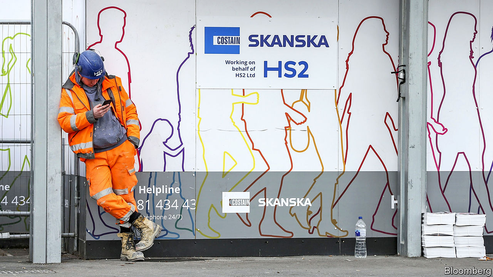

## Investing in rail

# Why HS2 should go ahead

> Britain is poised to decide whether to build an expensive new railway

> Feb 8th 2020

Editor's note: On February 11th, Boris Johnson, Britain’s prime minister, gave HS2 the green light. In a leader last week we explained why this is the right thing to do

FOR THE country that invented railways, Britain has shown remarkably little interest in them lately. New networks have been built around Europe in the past few decades, but the only significant stretch of track laid in Britain in a century is the 67-mile (107km) HS1 railway that links London to the Channel Tunnel. Indeed, the country has half as much track as it had in 1963. Yet while Britain has an almost American reluctance to invest in railways, its commuting patterns are European: 10% of journeys are by rail, compared with 9% in Germany and less than 1% in America. The result is a lot of angry commuters.

Britain’s big problem is that, because it has built no new high-speed lines, it runs fast intercity trains on the same track as slow commuter ones. Long gaps have to be left between slow and express trains. The need to make way for high-speed trains thus limits the number of commuter services, and vice versa.

Eight years ago, the government decided to rectify this by building a new 345-mile railway from London to the north of England. Though branded as High Speed 2, its principal job was to boost capacity rather than speed. At the time, this newspaper argued against it. Although we supported the idea of investment in train capacity, we believed that there were better projects to spend money on than HS2.

Spooked by the costs—now put at around £100bn, against an original estimate of £42bn—and by the fury of 21 Tory MPs whose rural constituencies the track would slice through, the government is considering cancelling the project. A final decision was due as The Economist went to press. We now believe the line should go ahead—not because £8bn has already been spent, but because the circumstances have changed.

Rail is an increasingly important part of the transport mix. Climate change is putting a premium on carbon-efficiency. At the same time, passenger numbers have exceeded forecasts. The government had expected passenger volumes to increase by 17-21% in the decade from 2011; actually, they were up by 24% within just seven years and are expected to go on growing at a similar clip. The costs of other, cheaper ways to boost capacity, such as double-decker carriages and longer trains, have increased, along with the cost of engineering wider tracks and higher tunnels, and of buying more property around stations. Meanwhile interest rates are so low these days that the government can borrow long-term for virtually nothing.

The benefit-to-cost ratio (BCR) calculated for HS2, at around one, is hardly a ringing endorsement. But just as the costs of big transport projects are often underestimated, so are their long-term benefits. The extension to London’s Jubilee tube line, for instance, was approved with a BCR of less than one, but recent analysis suggests that it has been more like 1.75. And that includes only the revenues that go directly to the railway, not the economic consequences of the revival of London’s Docklands area, which the tube line made possible.

The main point of HS2, similarly, is its impact on the cities and towns along its route and beyond. Boris Johnson, the prime minister, is on a mission to boost growth in northern and western areas left behind by the country’s lopsided, London-centred pattern of growth. On its own HS2 won’t make that happen, but doing so without a new railway would be tough. The success of the “Northern Powerhouse” rail scheme, to link the north’s big towns, depends on it.

This is a tricky decision for Mr Johnson. It will be the biggest financial call of his time in office. His party is divided over the issue. HS2 will dog his premiership if it goes wrong. But if he wants his vision of Britain to work, he needs it.■

Sign up to our fortnightly climate-change newsletter [here](https://www.economist.com//theclimateissue/)

## URL

https://www.economist.com/leaders/2020/02/08/why-hs2-should-go-ahead
