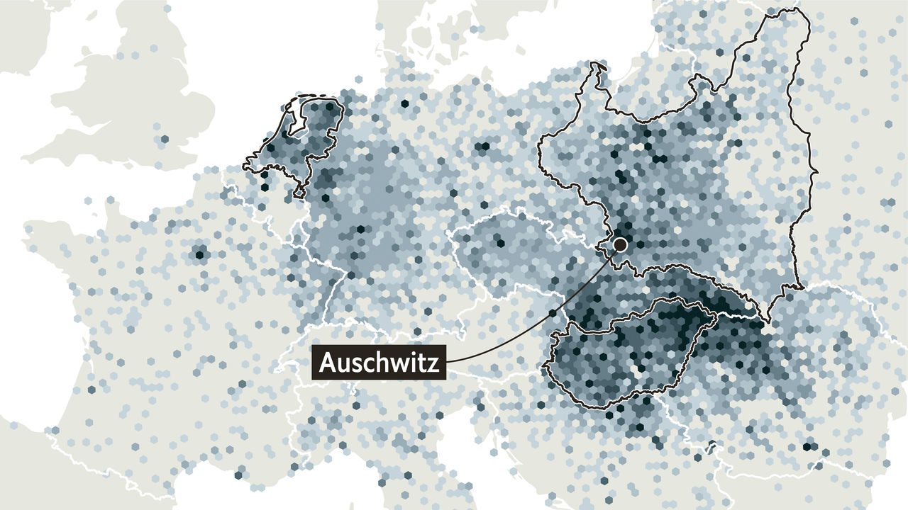
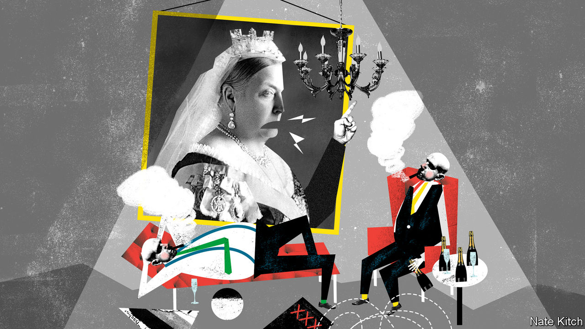
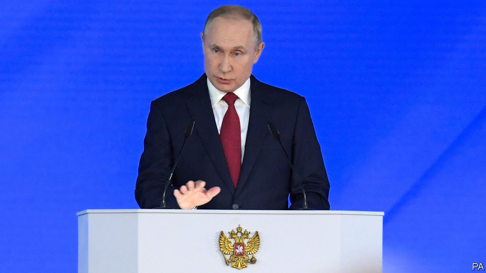
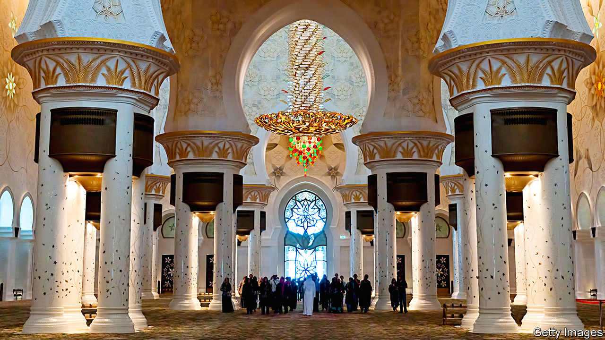

## On the Holocaust, #MeToo, diplomacy, Russia, mosques, Portugal, sporting metaphors

# Letters to the editor

> A selection of correspondence

> Feb 8th 2020

Letters are welcome and should be addressed to the Editor at [letters@economist.com](https://www.economist.com/mailto:letters@economist.com)

The Graphic detail section on the Holocaust ([January 25th](https://www.economist.com//graphic-detail/2020/01/25/archivists-are-racing-to-identify-every-jewish-holocaust-victim)) illustrated the great job archivists and others have done in identifying the victims and preserving the documentation. For most west European countries nearly all the victims have been identified; it is in some of the other Nazi-occupied territories that many casualties are still unknown. Post-war lists of those who were identified have been linked, for example, to Nazi-registration records. This has enabled memorial sites, such as the Dutch Digital Jewish Monument, to commemorate murdered Jews in context, such as their last location, household and occupation.

Around 73% of the Jewish population in the Netherlands did not survive the Nazi persecution. Slightly over half of that 73% died in Auschwitz and about a third perished in Sobibor, a lesser-known camp. But who survived and who did not varied significantly across the Netherlands; there is a huge variation in death rates in different locations.

Those differences in local death rates raise interesting questions about who was most at risk of persecution and why. But answering those questions requires analysing the retrieved data with advanced quantitative techniques. Yet within Holocaust literature, studies that use statistical methods are still unusual. We might be able soon to learn each victim’s name, but lag behind in our understanding of the Holocaust.

PETER TAMMESSenior research associatePopulation Health SciencesBristol Medical School

I was saddened to see Bagehot referring to the #MeToo movement as exposing “the seamy underbelly of the sexual revolution” ([January 11th](https://www.economist.com//britain/2020/01/11/gertrude-himmelfarb-and-the-politics-of-virtue)). Sexual abuse is not an offshoot of the sexual revolution. The Victorians’ adherence to “moral values”, lauded in Bagehot’s tribute to Gertrude Himmelfarb, were contradicted by the underside of life experienced by women, rich and poor, long before the swinging Sixties. The only underbelly #MeToo has exposed is the use of privilege to abuse with impunity.

JUDY STANLEYScarsdale, New York

Violent conflict remains stubbornly resistant to resolution (“Not your average diplomats”, [January 25th](https://www.economist.com//international/2020/01/23/conflict-resolution-relies-increasingly-on-diplomatic-back-channels)). Half of all peace agreements collapse within seven to 12 years of being signed. One-third of peace deals never make it from being agreed to being implemented. Since the mid-1990s, most conflicts have been recurrences of old disputes rather than new ones.

One cause of these disappointing facts and failures is an imbalance at negotiating tables. Deals are being struck by the beneficiaries of conflict that emphasise short-term incentives, rewards and commitments. Effective conflict resolution requires more attention to longer-term solutions for the silent majority at the grassroots who pay the highest price during conflict and who have the most to gain from peace. That means fewer backroom peace deals agreed solely by elites, and more agreements that involve all groups and communities.

SIMON GIMSONVice-presidentInterpeaceGeneva

You were rightly hesitant to draw any clear-cut conclusions about Vladimir Putin’s future plans based on the constitutional amendments he recently proposed (“Glued to the throne”, [January 18th](https://www.economist.com//leaders/2020/01/16/how-vladimir-putin-is-preparing-to-rule-for-ever)). The amendments don’t tell us who will occupy which high office in the Russian state after Mr Putin steps down as president in 2024. But perhaps we’re reading this crystal ball all wrong. If the Russian nomenklatura is anything like the big-business class in Russia, many will have a foreign passport or long-term foreign residence. These cosmopolites are now out of the game.

Real competition was eliminated from Russian elections years ago by preventing disfavoured candidates from even running, much less winning. This is the “Soviet restaurant” method of political popularity. When only one item on the menu is available, it will by default be the most popular.

WILLIAM SPIEGELBERGERVienna

You assert that Russian economic growth has been “brought to an end by corruption, uncompetitiveness, the end of the oil boom and Western sanctions following the annexation of Crimea in 2014”. This would seem to be an exaggeration. The latest IMF projections show Russian GDP growth rising from 1.1% in 2019, to 1.9% in 2020 and 2% in 2021. Despite the factors you mention, it is nonetheless modest growth, and no doubt the envy of countries like France, Germany and Italy.

MARTIN GILMANProfessor of economicsHigher School of EconomicsMoscow

Many mosques built by Arab autocrats could be described as vulgar, but not in the case of the Sheikh Zayed mosque in Abu Dhabi (“Mine’s bigger than yours”, [January 11th](https://www.economist.com//middle-east-and-africa/2020/01/09/why-muslim-leaders-like-building-grand-mosques)). Size aside, the mosque is generally characterised by exquisite good taste and an architectural vision that seamlessly blends modern technology with the best of Islamic tradition. It is a remarkable achievement that transcends the motivations of the obscenely rich sheikhs of the United Arab Emirates. A similar disjuncture between self-serving autocratic motivation and genuine artistic merit was also associated with many of the celebrated architectural achievements of the past. Think Angkor Wat, the Alhambra, the Taj Mahal.

REG WHITAKERVictoria, Canada

America is not Britain’s “oldest ally” (“Declarations of independence”, [January 18th](https://www.economist.com//britain/2020/01/16/johnson-trump-and-the-future-of-the-atlantic-alliance)). The oldest military alliance in the world is between Britain and Portugal, dating back to the Treaty of Windsor in 1386. Although seemingly irrelevant today, the alliance was instrumental during the Napoleonic wars and the fleeing in 1807 of the Portuguese monarchy to Brazil, leading to its subsequent independence. The treaty was invoked both during the second world war and the Falklands conflict to allow British refuelling in the Azores.

BENJAMIN JOHNSONLondon

Upon hearing a third sports metaphor in as many minutes last week, I wondered whether the usefulness of such tropes in the workplace has played out. So it was with amusement that I read your comparison of an English football club to the royal family (“Losing the title”, [January 25th](https://www.economist.com//britain/2020/01/25/the-remarkable-similarities-between-queen-elizabeth-and-alex-ferguson)). I want to know Bartleby’s thoughts on the subject. Perhaps he can huddle with Johnson, draw up a game plan, and tackle this topic in a column. I’m confident he will knock it out of the park.

RYAN JUENGERCosta Mesa, California

The comparison of Sir Alex Ferguson, a former manager of Manchester United, to the queen, current manager of the monarchy, was fantastic. Sir Alex famously referred to a particularly tense period of his tenure as “squeaky-bum time”. I am sure the queen has an equally telling if not more elegant turn of phrase to describe the current position of the monarchy.

ZACK GOLDBERGLondon

## URL

https://www.economist.com/letters/2020/02/08/letters-to-the-editor
