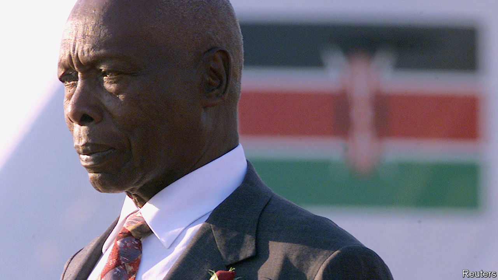

## Après Moi

# The legacy of Daniel arap Moi still haunts Kenya

> The former strongman was responsible for repression, corruption and ethnic favouritism

> Feb 6th 2020NAIROBI

DANIEL ARAP MOI was in many ways an accidental president. Though he had been number two to Jomo Kenyatta, independent Kenya’s first leader, the Kikuyu elite looked down on him. They saw the former teacher from the Kalenjin group as a modest man with much to be modest about. But when Kenyatta’s death in 1978 led to a struggle for power among Kikuyu bigwigs, the pragmatists settled on Mr Moi, believing they could manipulate him from behind the scenes.

For a while it worked. Charles Njonjo, the powerful attorney-general, mentored Mr Moi, teaching him how to be an English gentleman. He took him to services at All Saints’ Cathedral in Nairobi, the Kenyan capital, and showed him how to pray like an Anglican: kneel here during the Eucharistic prayers, sing lustily from the hymnal. Meanwhile, Mr Moi got better at courting popular support, introducing a school milk programme (for which he is still praised) and releasing some political detainees.

But things changed in 1982, when Mr Moi pushed through a revision to the constitution that made Kenya a one-party state. That, in part, led to a coup by air-force personnel, which the president crushed. He ordered the arrest of the entire air-force staff, all 2,100 men. Some were never seen again. His earlier modesty went, and so too did Njonjo.

Ruthlessness came easily to Mr Moi. Opponents were locked up in underground torture chambers. A popular foreign minister, Robert Ouko, was killed in one of Mr Moi’s residences in 1990. His security forces brutally put down a Somali insurgency in the north. Hundreds of men were reportedly forced to lie on the ground at an airstrip in the town of Wajir before being shot in the back of the head.

To the public he presented a different face. His slogan was “nyayo” (footsteps) because he promised to follow in the hallowed footsteps of Kenyatta. In many ways he did, most notably when it came to tribalism—but instead of going to Kikuyus, the plum posts and money went to Kalenjins. (When the Kikuyus finally retook the presidency in 2002, many vowed that they would never give it back to the Kalenjins.)

While neighbouring Uganda, Ethiopia and Somalia fell into civil wars, Mr Moi presided over nearly a quarter-century of relative stability in Kenya. He never got bored of pointing this out. “Are you tired of peace?” he asked before stepping down. But during his rule the economy often stagnated and corruption spread. Investigations after he left office showed that as much as $4bn may have gone to his family and allies. Though not flashy, he acquired vast amounts of farmland in the Rift Valley.

The West tolerated Mr Moi’s repression, seeing him as a bulwark against communism in Africa. But when the cold war ended, America and its allies pressed him to restore a multiparty system. He did, and won two elections in 1992 and 1997 after the opposition failed to unite behind a single candidate. A good thing too, said some Western diplomats, who thought that no one else could hold Kenya’s more than 40 tribes together. “Après Moi, le déluge” was a popular joke.

Many were surprised when Mr Moi stood down in 2002, as required by the constitution. On his way out, though, he tried to select a pliant successor. His choice, Uhuru Kenyatta (Jomo’s son), was trounced in that year’s election and his party, which had ruled since independence in 1963, collapsed. His car was pelted with mud after he formally handed power to his vice-president-turned-opponent, Mwai Kibaki, who won the election.

Mr Moi’s legacy is still contested in Kenya. Moi day, a national holiday he created for himself, was scrapped in 2010—then reinstated by the high court in 2017. Recently Mr Moi asked for the day to be rebranded as “Huduma day”, a day of service. In many ways the Moi era continues. Corruption and ethnic favouritism still poison Kenyan politics. Most of today’s top politicians served under him (including Mr Kenyatta, who became president in 2013). That is one reason why, despite his atrocities, there has been no shortage of eulogies. ■

## URL

https://www.economist.com/middle-east-and-africa/2020/02/06/the-legacy-of-daniel-arap-moi-still-haunts-kenya
