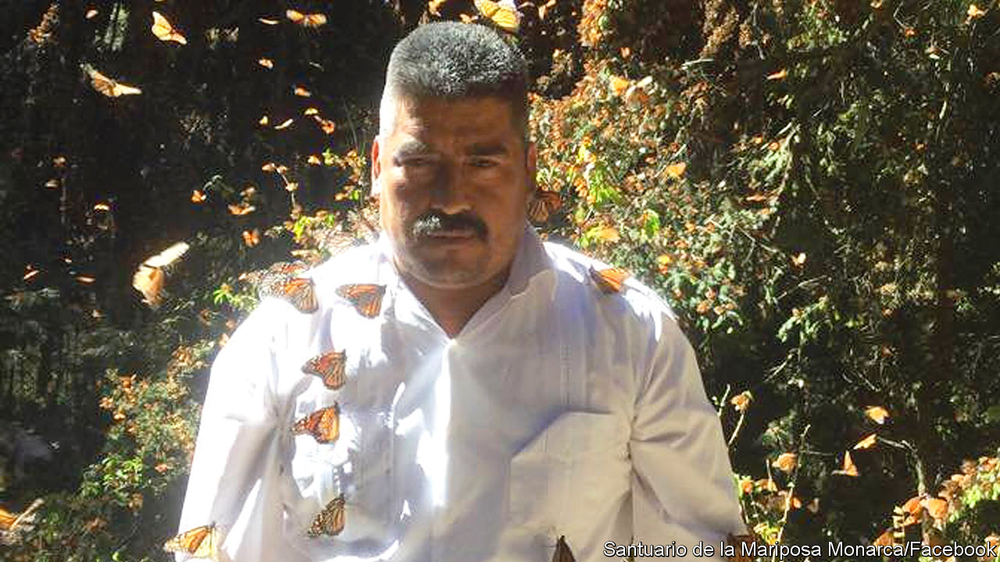

## Logger turned saviour

# Homero Gómez was apparently murdered on January 13th

> The protector of Mexico’s overwintering Monarch butterflies was 50

> Feb 8th 2020

EVERY YEAR, in early autumn when the chill begins, clouds of bright orange Monarch butterflies rise from the flowers on which they have been feasting in eastern Canada, and head south. They overfly the American Midwest and Texas until, below them, lie the scattered stone houses and corrugated shacks of El Rosario and Ocampo, in the western Mexican state of Michoacán. There, after an astonishing flight of around 4,500 kilometres, they descend to mountain forests of oyamel pine, their favourite tree; and on these they hang to rest and overwinter, so many thousands of them that the branches are weighed down and the trees seem draped with orange leaves. About half of all Monarchs come to this exact, remote place every year, and always from around the same day: November 2nd, Día de Muertos, the day of the dead.

For two decades no one welcomed them more eagerly than Homero Gómez, manager of El Rosario’s Butterfly Sanctuary. In the videos he tweeted daily he stood among them as they arrived, a big moustachioed man in a white guayabera, his arms spread wide as if he longed to fly himself. They greeted him too, settling on his head, his chest and even his nose, basking. They were his darlings, his little voyagers—and also angels, the souls of the local dead returning home. So his grandfather said, and so ran the legends of the indigenous Purépecha, who saw ancestral spirits in their colours. Nothing else so neatly explained why they always came back to this particular place, flexing their marigold wings as if they knew that was the flower of the dead, at this particular time.

Yet he also loved them for more down-to-earth reasons. He had built the El Rosario Sanctuary into the largest reserve for Monarchs in Mexico and, therefore, the biggest in the world, and every video was an appeal for more visitors in the four months the Monarchs were there. “Gran espectáculo”, cried his tweets; “Open daily, 8-5”. Visitors could take a guided tour for 50 pesos, or go on horseback for 100; buy their own butterfly wings in the shop, or have their wedding photos taken, with Monarchs attending, under the trees. In good seasons about 140,000 people came, and from November to March the villagers had money in their pockets.

They had few other ways to make it. Before the reserve people simply cut and sold wood from the forest, and grew maize on plots of cleared communal land to which, under the ejido system set up in 1912 after the revolution, they had no rights of ownership. He did the same. His parents, bringing up ten children, were timber merchants, and he—though he studied agronomy at Chipango University—ended up as a logger, felling the butterflies’ oyamel pines. When the reserve was first proposed, he was fiercely against it. As the natural straight-talking leader of the ejidatarios, he wanted compensation if they were going to save any trees.

But then, around 2000, he changed his mind. He had always marvelled at the butterflies, like everyone else; with a memory as exact as a Monarch’s, he remembered the very date, January 9th 1975, when as a four-year-old he had first brushed close to one. And now, with over-cutting, their forest was fast diminishing. He wanted both to preserve and extend it, planting new trees even on the maize plots and growing more in nurseries. Most of the 260 other ejidatarios thought him crazy, but he talked them round. True, the butterflies did not stay long; but then he himself ran a poinsettia-growing business that did almost all its trade on Christmas Eve. The reserve did not make anyone rich; he still had to struggle to support a wife and four children, and the plaster was still peeling off his sitting-room walls from among the china birds and butterflies. But it gave quite a boost to a poor spot in Michoacán.

Over the years, powered by his enthusiasm, El Rosario prospered. It weathered even the terrible snowstorm of March 2016 when butterflies froze on the pines—though, he was quick to say, the great majority survived. Volunteers helped to plant at least 1m new trees, reforesting 150 hectares. The World Wildlife Fund gave money and bright blue jackets for the guides. State and national officials, on the other hand, once they had banned logging there, did very little beyond coming to get their pictures taken and their salaries justified in a pleasing cloud of Monarchs.

But he faced increasingly dangerous enemies. Illegal loggers, many tied to narcotraficantes and often armed, came at night to take out timber or to clear the ground for avocados, which made big money. He organised patrols of ejidatarios to keep constant watch: at four in the afternoon, every day, ten men would go into the forest, walking ceaselessly, in silence and without lanterns, all night long to intercept intruders. He swore that if they did not stop cutting down trees he would beat them to a pulp, and worse.

This was risky talk. He told some family members about death threats, though he reassured others that no one had troubled him recently. Nonetheless when his body was found in a holding pond, after he had been to celebrate a patronal festival in Ocampo, few people thought it was just a death by drowning. There were signs of a blow to the head; and some days later one of his guides, Raúl Hernández, was found dead too, battered by something sharp. They were two more in the tally of around 1,600 murders in Michoacán, almost 35,000 in Mexico as a whole, with journalists and activists picked out, in a little over a year.

In El Rosario, at peak season, the trees and the air still thronged with butterflies. There could never, he thought, be too many. But in Mexico there were far too many days of the dead. ■

## URL

https://www.economist.com/obituary/2020/02/08/homero-gomez-was-apparently-murdered-on-january-13th
