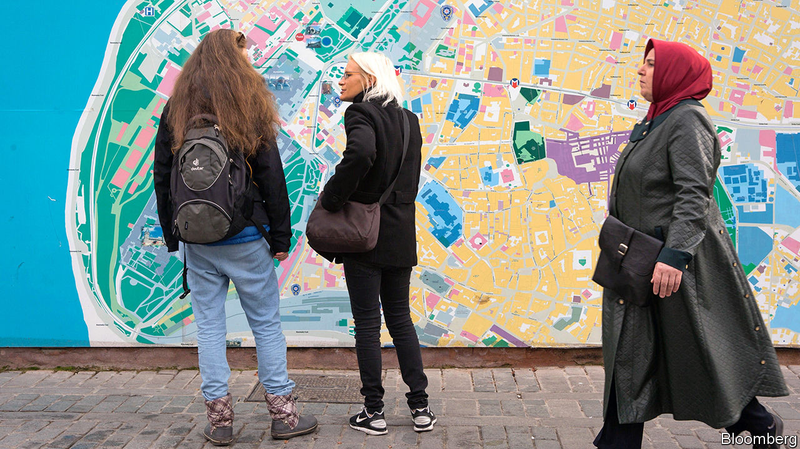

## Neuroscience

# Growing up in a city weakens the brain’s navigational skills

> Country folk can find their way more easily

> Feb 6th 2020

RURAL FOLK can blame Aesop—of the moralising fables—for centuries of stories that mock them as bumpkins. The ancient Greek storyteller’s tale of the Country Mouse and the Town Mouse was only the first to emphasise their supposed simpler tastes and habits when compared with more sophisticated urbanites. So listen for the cheers from Somerset to Kansas as neuroscientists announce that, in fact, it is city living that can dull the wits—at least when it comes to finding one’s way in the world.

Growing up in a city, a vast global survey has found, has a lifelong negative impact on a person’s ability to navigate. When looking for a half-remembered restaurant in a poorly-lit side street, it seems Country Mouse would be a more useful companion.

In the new study, posted to the online repository bioRxiv, scientists led by Antoine Coutrot at Nantes University in France and Hugo Spiers at University College London describe how they used a dataset gathered from 4m players of a computer game called “Sea Hero Quest”, which tests way-finding skills by asking players to memorise a map showing the location of checkpoints and then measuring how well players can steer a boat to find them, guided only by their mental map.

The game was released in 2016 and all players have since been asked for basic information about themselves, including their age, gender, home country, and whether or not they grew up in a city.

From that database, Dr Spiers and his colleagues examined a subset of 442,000 players from 38 countries: those who had answered all the questions and who had played the game until they reached the later levels. He found that the strongest indicator of a high score was a player’s age—older people performed relatively poorly, which chimes with what researchers know about age-related cognitive decline. But the benefit of rural living was strong enough to offset some of that. Data from American players showed that a 70-year-old who grew up in the countryside had the navigational abilities of an average 60-year-old across the dataset.

The gap between the navigation skills of rural and city people was largest in America (about six times wider than for Romania), and the researchers think they know why. They gave each country a complexity score by analysing how the streets were laid out in its largest cities. And they found that countries dominated by simple layouts of grid-based cities (most common in America and Argentina) dragged down navigation skills more than growing up in a city based around more complicated networks of streets, such as Prague.

The study does not show why cities have this impact on people growing up in them. It cannot rule out that an external factor, such as the effect of air pollution on a developing brain, might play a role. But Dr Spiers says that the brain’s navigational abilities probably weaken in the less challenging city environment because they are not being used as much. Although cities may appear more elaborate, they also feature more clues to help residents find their way, such as numbered streets. As many city-dwellers on a visit to the countryside can attest, one field tends to look much the same as another, so there are fewer external landmarks to help guide the way.

Neuroscientists already know that living and working in more complex environments can influence the function and structure of the brain. Brain scans of London taxi drivers who have gained an encyclopaedic memory of the city’s streets by learning “The Knowledge” show that they tend to have an enlarged hippocampus—a region of the brain acting as a neural GPS, sensing position and trajectory on an internal map of the environment.

The detrimental effect of city living on navigation (taxi drivers aside) is probably most acute in people under 16-18, Dr Spiers says, because their still-developing brains respond and change the most according to external stimuli. And while people who live in cities with young children should not be alarmed, the study does raise some interesting ideas for urban planners: keep their city designs not so simple perhaps. And for everyone else, it might be an idea to turn off Google Maps.■

## URL

https://www.economist.com/science-and-technology/2020/02/06/growing-up-in-a-city-weakens-the-brains-navigational-skills
